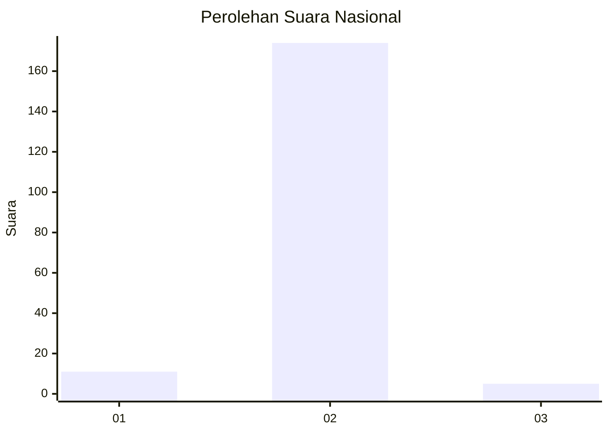
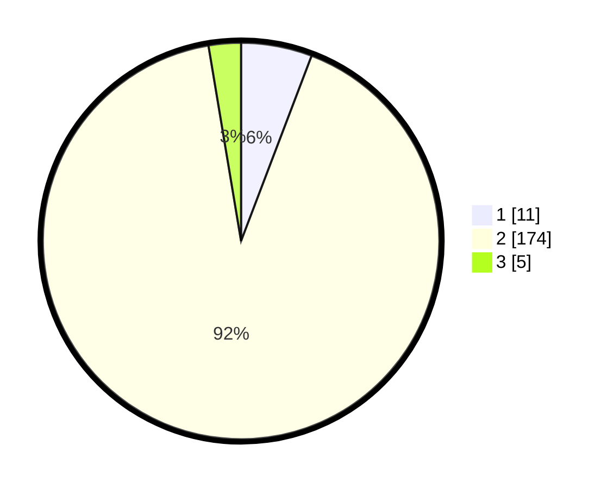

# Hasil

## Grafik

## Tabel

| No. | Nama Paslon    | Suara | Suara (raw) | Persentase |
|:--- |:-------------- | -----:| -----------:| ----------:|
| 1   | ANIES MUHAIMIN | 11    | [11][p-1]   | 5,79       |
| 2   | PRABOWO GIBRAN | 174   | [174][p-2]  | 91,58      |
| 3   | GANJAR MAHFUD  | 5     | [5][p-3]    | 2,63       |

[p-1]: https://github.com/gigit-pemilu/pemilu-2024/blob/main/pilpres/hitung-suara/sub/61-kalimantan-barat/sub/09-sekadau/sub/02-sekadau-hulu/sub/2003-nanga-menterap/sub/004-tps/sub/paslon-1.txt
[p-2]: https://github.com/gigit-pemilu/pemilu-2024/blob/main/pilpres/hitung-suara/sub/61-kalimantan-barat/sub/09-sekadau/sub/02-sekadau-hulu/sub/2003-nanga-menterap/sub/004-tps/sub/paslon-2.txt
[p-3]: https://github.com/gigit-pemilu/pemilu-2024/blob/main/pilpres/hitung-suara/sub/61-kalimantan-barat/sub/09-sekadau/sub/02-sekadau-hulu/sub/2003-nanga-menterap/sub/004-tps/sub/paslon-3.txt

## Foto C Plano

https://sirekap-obj-formc.kpu.go.id/bc51/pemilu/ppwp/61/09/02/20/03/6109022003004-20240215-143109--c0d7bd72-762e-4819-98dc-950945704537.jpg

https://sirekap-obj-formc.kpu.go.id/bc51/pemilu/ppwp/61/09/02/20/03/6109022003004-20240215-143408--78525377-e40d-426c-9987-39c1951db476.jpg

https://sirekap-obj-formc.kpu.go.id/bc51/pemilu/ppwp/61/09/02/20/03/6109022003004-20240215-142118--ec805570-4f78-4c73-87e2-1e75c1923c55.jpg

## Metadata

| Key        | Value               |
| ---------- | ------------------- |
| Time Stamp | 2024-02-16 11:00:29 |

