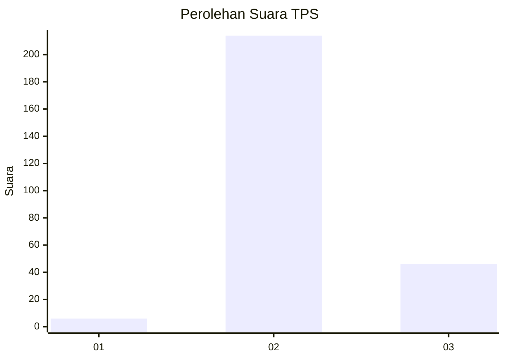

# Hasil

## Grafik

## Tabel

| No. | Nama Paslon    | Suara | Suara (raw) | Persentase |
|:--- |:-------------- | -----:| -----------:| ----------:|
| 1   | ANIES MUHAIMIN | 6     | [6][p-1]    | 2,26       |
| 2   | PRABOWO GIBRAN | 214   | [214][p-2]  | 80,45      |
| 3   | GANJAR MAHFUD  | 46    | [46][p-3]   | 17,29      |

[p-1]: https://github.com/gigit-pemilu/pemilu-2024-61-kalimantan-barat/blob/main/pilpres/hitung-suara/sub/61-kalimantan-barat/sub/09-sekadau/sub/02-sekadau-hulu/sub/2006-tinting-boyok/sub/002-tps/sub/paslon-1.txt
[p-2]: https://github.com/gigit-pemilu/pemilu-2024-61-kalimantan-barat/blob/main/pilpres/hitung-suara/sub/61-kalimantan-barat/sub/09-sekadau/sub/02-sekadau-hulu/sub/2006-tinting-boyok/sub/002-tps/sub/paslon-2.txt
[p-3]: https://github.com/gigit-pemilu/pemilu-2024-61-kalimantan-barat/blob/main/pilpres/hitung-suara/sub/61-kalimantan-barat/sub/09-sekadau/sub/02-sekadau-hulu/sub/2006-tinting-boyok/sub/002-tps/sub/paslon-3.txt

## Foto C Plano

https://sirekap-obj-formc.kpu.go.id/f9ce/pemilu/ppwp/61/09/02/20/06/6109022006002-20240215-011332--33ac95b4-e1fd-43e2-8cc0-d20e5c4aa127.jpg

https://sirekap-obj-formc.kpu.go.id/f9ce/pemilu/ppwp/61/09/02/20/06/6109022006002-20240215-041544--93a0bd3e-2d1a-4619-96dd-5e2e14ddeee0.jpg

https://sirekap-obj-formc.kpu.go.id/f9ce/pemilu/ppwp/61/09/02/20/06/6109022006002-20240215-011755--6007799a-6dd3-43b0-abd4-bdc8969f52c7.jpg

## Metadata

| Key        | Value               |
| ---------- | ------------------- |
| Time Stamp | 2024-02-25 18:00:00 |

