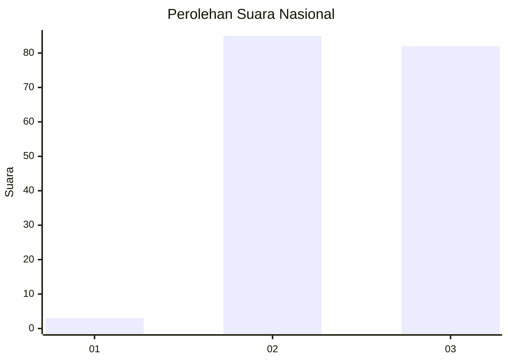
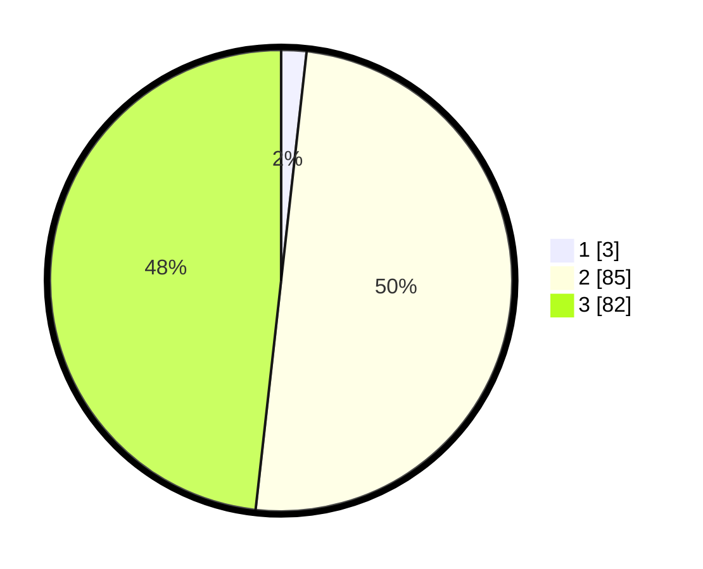

# Hasil

## Grafik

## Tabel

| No. | Nama Paslon    | Suara | Suara (raw) | Persentase |
|:--- |:-------------- | -----:| -----------:| ----------:|
| 1   | ANIES MUHAIMIN | 3     | [3][p-1]    | 1,76       |
| 2   | PRABOWO GIBRAN | 85    | [85][p-2]   | 50,00      |
| 3   | GANJAR MAHFUD  | 82    | [82][p-3]   | 48,24      |

[p-1]: https://github.com/gigit-pemilu/pemilu-2024/blob/main/pilpres/hitung-suara/sub/61-kalimantan-barat/sub/09-sekadau/sub/02-sekadau-hulu/sub/2010-tapang-perodah/sub/002-tps/sub/paslon-1.txt
[p-2]: https://github.com/gigit-pemilu/pemilu-2024/blob/main/pilpres/hitung-suara/sub/61-kalimantan-barat/sub/09-sekadau/sub/02-sekadau-hulu/sub/2010-tapang-perodah/sub/002-tps/sub/paslon-2.txt
[p-3]: https://github.com/gigit-pemilu/pemilu-2024/blob/main/pilpres/hitung-suara/sub/61-kalimantan-barat/sub/09-sekadau/sub/02-sekadau-hulu/sub/2010-tapang-perodah/sub/002-tps/sub/paslon-3.txt

## Foto C Plano

https://sirekap-obj-formc.kpu.go.id/3262/pemilu/ppwp/61/09/02/20/10/6109022010002-20240215-092339--bf04ac2d-2b68-46dd-b3a8-008ba8acd0e5.jpg

https://sirekap-obj-formc.kpu.go.id/3262/pemilu/ppwp/61/09/02/20/10/6109022010002-20240215-092446--38c63bc9-c6ed-4ea9-af30-01a24dd93321.jpg

https://sirekap-obj-formc.kpu.go.id/3262/pemilu/ppwp/61/09/02/20/10/6109022010002-20240215-092552--b09af71e-1caf-4a5c-8378-94bbb8f7d450.jpg

## Metadata

| Key        | Value               |
| ---------- | ------------------- |
| Time Stamp | 2024-02-25 15:00:00 |

