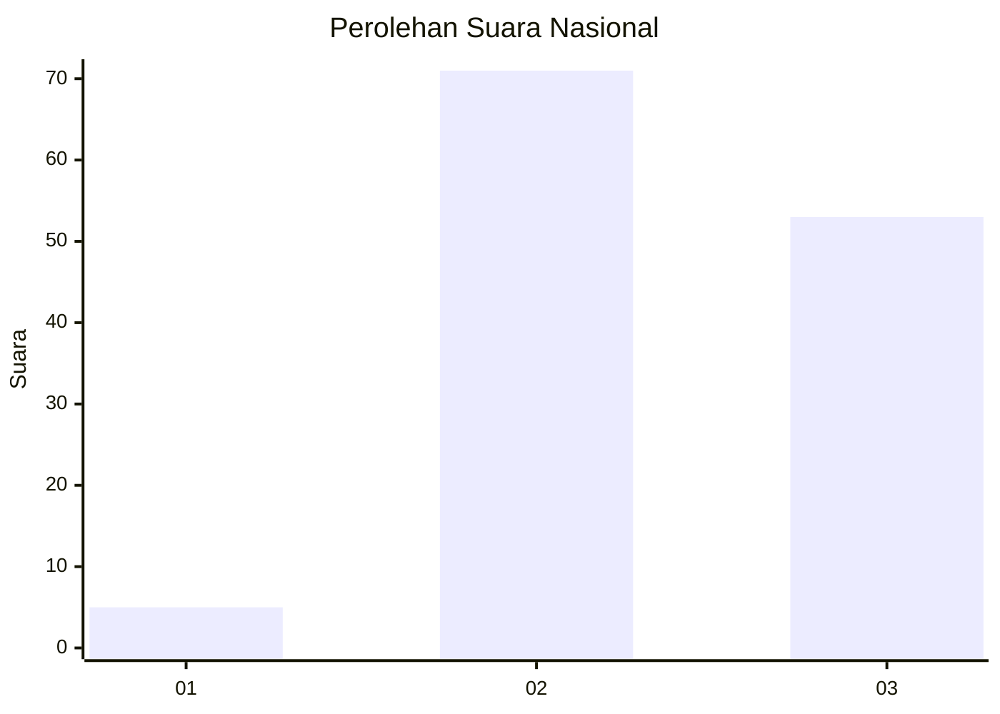
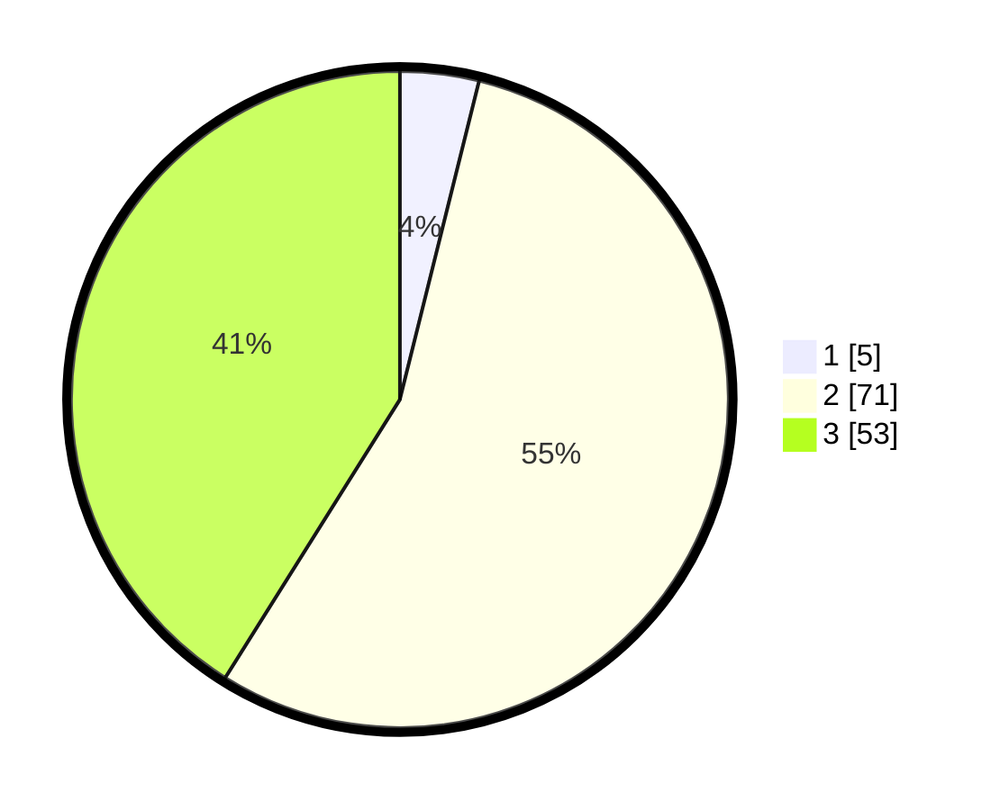

# Hasil

## Grafik

## Tabel

| No. | Nama Paslon    | Suara | Suara (raw) | Persentase |
|:--- |:-------------- | -----:| -----------:| ----------:|
| 1   | ANIES MUHAIMIN | 5     | [5][p-1]    | 3,88       |
| 2   | PRABOWO GIBRAN | 71    | [71][p-2]   | 55,04      |
| 3   | GANJAR MAHFUD  | 53    | [53][p-3]   | 41,09      |

[p-1]: https://github.com/gigit-pemilu/pemilu-2024/blob/main/pilpres/hitung-suara/sub/61-kalimantan-barat/sub/09-sekadau/sub/04-nanga-mahap/sub/2006-tembaga/sub/011-tps/sub/paslon-1.txt
[p-2]: https://github.com/gigit-pemilu/pemilu-2024/blob/main/pilpres/hitung-suara/sub/61-kalimantan-barat/sub/09-sekadau/sub/04-nanga-mahap/sub/2006-tembaga/sub/011-tps/sub/paslon-2.txt
[p-3]: https://github.com/gigit-pemilu/pemilu-2024/blob/main/pilpres/hitung-suara/sub/61-kalimantan-barat/sub/09-sekadau/sub/04-nanga-mahap/sub/2006-tembaga/sub/011-tps/sub/paslon-3.txt

## Foto C Plano

https://sirekap-obj-formc.kpu.go.id/bff0/pemilu/ppwp/61/09/04/20/06/6109042006011-20240217-132859--b2ca69d0-4398-467d-85ef-96048259530a.jpg

https://sirekap-obj-formc.kpu.go.id/bff0/pemilu/ppwp/61/09/04/20/06/6109042006011-20240217-133043--4dc664ce-ff77-4a22-aaae-453882d739ce.jpg

https://sirekap-obj-formc.kpu.go.id/bff0/pemilu/ppwp/61/09/04/20/06/6109042006011-20240217-133210--ed0e09d0-9b74-4d64-b897-147f75434b0b.jpg

## Metadata

| Key        | Value               |
| ---------- | ------------------- |
| Time Stamp | 2024-02-24 22:31:28 |

