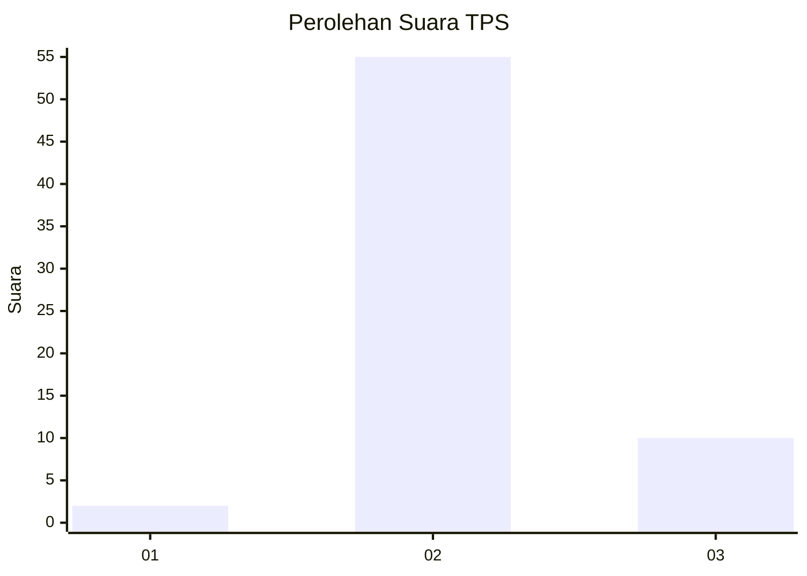
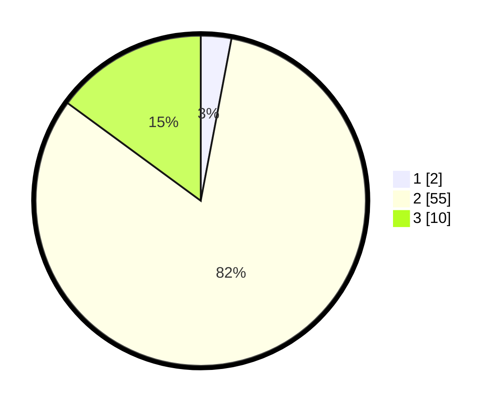

# Hasil

## Grafik

## Tabel

| No. | Nama Paslon    | Suara | Suara (raw) | Persentase |
|:--- |:-------------- | -----:| -----------:| ----------:|
| 1   | ANIES MUHAIMIN | 2     | [2][p-1]    | 2,99       |
| 2   | PRABOWO GIBRAN | 55    | [55][p-2]   | 82,09      |
| 3   | GANJAR MAHFUD  | 10    | [10][p-3]   | 14,93      |

[p-1]: https://github.com/gigit-pemilu/pemilu-2024-61-kalimantan-barat/blob/main/pilpres/hitung-suara/sub/61-kalimantan-barat/sub/09-sekadau/sub/06-belitang-hulu/sub/2006-kumpang-ilong/sub/007-tps/sub/paslon-1.txt
[p-2]: https://github.com/gigit-pemilu/pemilu-2024-61-kalimantan-barat/blob/main/pilpres/hitung-suara/sub/61-kalimantan-barat/sub/09-sekadau/sub/06-belitang-hulu/sub/2006-kumpang-ilong/sub/007-tps/sub/paslon-2.txt
[p-3]: https://github.com/gigit-pemilu/pemilu-2024-61-kalimantan-barat/blob/main/pilpres/hitung-suara/sub/61-kalimantan-barat/sub/09-sekadau/sub/06-belitang-hulu/sub/2006-kumpang-ilong/sub/007-tps/sub/paslon-3.txt

## Foto C Plano

https://sirekap-obj-formc.kpu.go.id/531b/pemilu/ppwp/61/09/06/20/06/6109062006007-20240217-182302--9f2d2744-4e90-4280-91d8-d04a12ca506e.jpg

https://sirekap-obj-formc.kpu.go.id/531b/pemilu/ppwp/61/09/06/20/06/6109062006007-20240217-182329--2c89188f-6932-48c3-8fdf-4a1303cb0fa4.jpg

https://sirekap-obj-formc.kpu.go.id/531b/pemilu/ppwp/61/09/06/20/06/6109062006007-20240217-182555--fbf6a33e-1164-48ae-9e65-d06831bbb38b.jpg

## Metadata

| Key        | Value               |
| ---------- | ------------------- |
| Time Stamp | 2024-02-25 16:00:00 |

