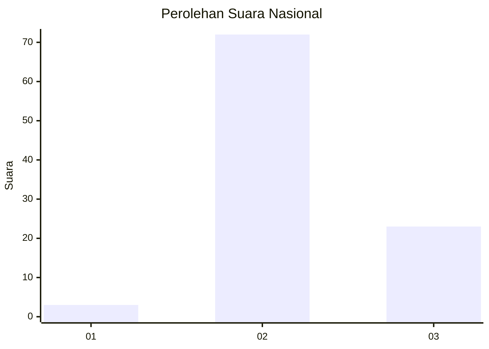
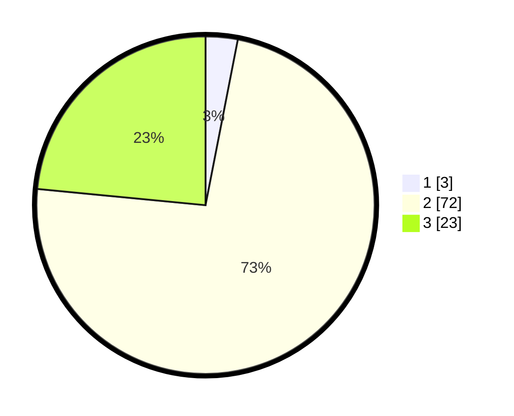

# Hasil

## Grafik

## Tabel

| No. | Nama Paslon    | Suara | Suara (raw) | Persentase |
|:--- |:-------------- | -----:| -----------:| ----------:|
| 1   | ANIES MUHAIMIN | 3     | [3][p-1]    | 3,06       |
| 2   | PRABOWO GIBRAN | 72    | [72][p-2]   | 73,47      |
| 3   | GANJAR MAHFUD  | 23    | [23][p-3]   | 23,47      |

[p-1]: https://github.com/gigit-pemilu/pemilu-2024/blob/main/pilpres/hitung-suara/sub/61-kalimantan-barat/sub/09-sekadau/sub/07-belitang/sub/2001-nanga-ansar/sub/001-tps/sub/paslon-1.txt
[p-2]: https://github.com/gigit-pemilu/pemilu-2024/blob/main/pilpres/hitung-suara/sub/61-kalimantan-barat/sub/09-sekadau/sub/07-belitang/sub/2001-nanga-ansar/sub/001-tps/sub/paslon-2.txt
[p-3]: https://github.com/gigit-pemilu/pemilu-2024/blob/main/pilpres/hitung-suara/sub/61-kalimantan-barat/sub/09-sekadau/sub/07-belitang/sub/2001-nanga-ansar/sub/001-tps/sub/paslon-3.txt

## Foto C Plano

https://sirekap-obj-formc.kpu.go.id/ad19/pemilu/ppwp/61/09/07/20/01/6109072001001-20240217-204244--d0afe98e-c637-4380-950b-e8227ed0b7cf.jpg

https://sirekap-obj-formc.kpu.go.id/ad19/pemilu/ppwp/61/09/07/20/01/6109072001001-20240217-204839--de82658d-a057-4e5e-b3f5-b4d8702b6958.jpg

## Metadata

| Key        | Value               |
| ---------- | ------------------- |
| Time Stamp | 2024-02-19 06:16:00 |

