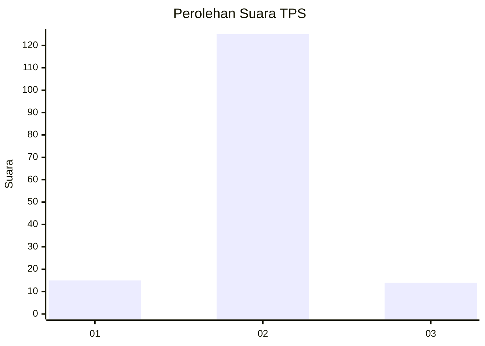
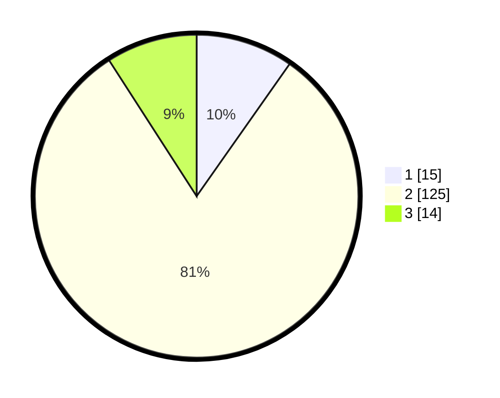

# Hasil

## Grafik

## Tabel

| No. | Nama Paslon    | Suara | Suara (raw) | Persentase |
|:--- |:-------------- | -----:| -----------:| ----------:|
| 1   | ANIES MUHAIMIN | 15    | [15][p-1]   | 9,74       |
| 2   | PRABOWO GIBRAN | 125   | [125][p-2]  | 81,17      |
| 3   | GANJAR MAHFUD  | 14    | [14][p-3]   | 9,09       |

[p-1]: https://github.com/gigit-pemilu/pemilu-2024-61-kalimantan-barat/blob/main/pilpres/hitung-suara/sub/61-kalimantan-barat/sub/10-melawi/sub/01-belimbing/sub/2001-pemuar/sub/003-tps/sub/paslon-1.txt
[p-2]: https://github.com/gigit-pemilu/pemilu-2024-61-kalimantan-barat/blob/main/pilpres/hitung-suara/sub/61-kalimantan-barat/sub/10-melawi/sub/01-belimbing/sub/2001-pemuar/sub/003-tps/sub/paslon-2.txt
[p-3]: https://github.com/gigit-pemilu/pemilu-2024-61-kalimantan-barat/blob/main/pilpres/hitung-suara/sub/61-kalimantan-barat/sub/10-melawi/sub/01-belimbing/sub/2001-pemuar/sub/003-tps/sub/paslon-3.txt

## Foto C Plano

https://sirekap-obj-formc.kpu.go.id/2c3a/pemilu/ppwp/61/10/01/20/01/6110012001003-20240214-234215--808742cc-cc46-43b0-8435-efee8b9de53e.jpg

https://sirekap-obj-formc.kpu.go.id/2c3a/pemilu/ppwp/61/10/01/20/01/6110012001003-20240214-234346--4ad86103-d53d-4bb2-9100-507652b99003.jpg

https://sirekap-obj-formc.kpu.go.id/2c3a/pemilu/ppwp/61/10/01/20/01/6110012001003-20240214-234502--6316bcd3-6bd8-48ff-9c3a-3a216c6e437f.jpg

## Metadata

| Key        | Value               |
| ---------- | ------------------- |
| Time Stamp | 2024-02-16 21:01:00 |

