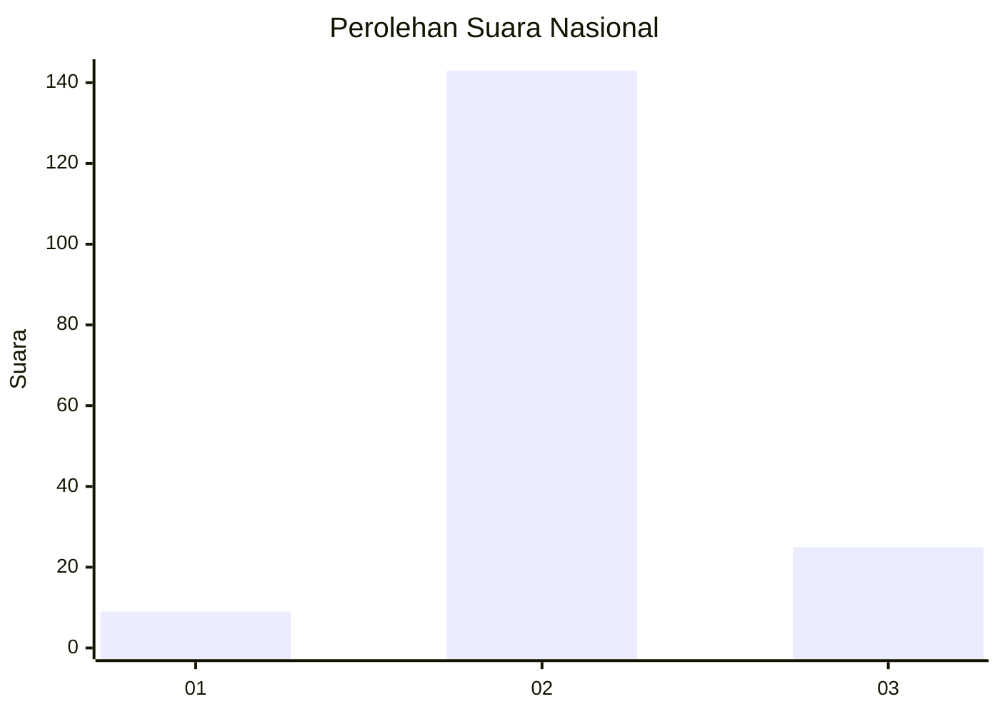
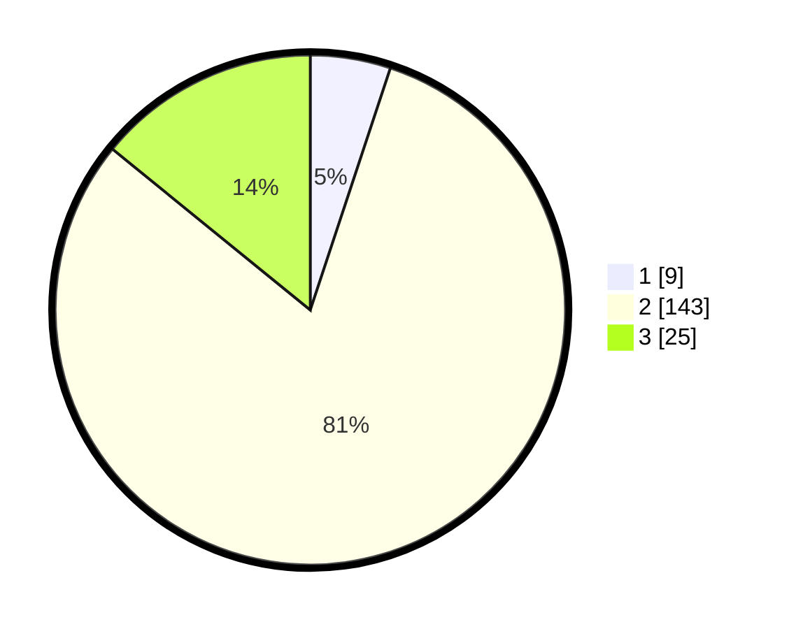

# Hasil

## Grafik

## Tabel

| No. | Nama Paslon    | Suara | Suara (raw) | Persentase |
|:--- |:-------------- | -----:| -----------:| ----------:|
| 1   | ANIES MUHAIMIN | 9     | [9][p-1]    | 5,08       |
| 2   | PRABOWO GIBRAN | 143   | [143][p-2]  | 80,79      |
| 3   | GANJAR MAHFUD  | 25    | [25][p-3]   | 14,12      |

[p-1]: https://github.com/gigit-pemilu/pemilu-2024/blob/main/pilpres/hitung-suara/sub/61-kalimantan-barat/sub/10-melawi/sub/01-belimbing/sub/2001-pemuar/sub/004-tps/sub/paslon-1.txt
[p-2]: https://github.com/gigit-pemilu/pemilu-2024/blob/main/pilpres/hitung-suara/sub/61-kalimantan-barat/sub/10-melawi/sub/01-belimbing/sub/2001-pemuar/sub/004-tps/sub/paslon-2.txt
[p-3]: https://github.com/gigit-pemilu/pemilu-2024/blob/main/pilpres/hitung-suara/sub/61-kalimantan-barat/sub/10-melawi/sub/01-belimbing/sub/2001-pemuar/sub/004-tps/sub/paslon-3.txt

## Foto C Plano

https://sirekap-obj-formc.kpu.go.id/792a/pemilu/ppwp/61/10/01/20/01/6110012001004-20240215-004055--830f8d3f-7037-4dc2-9901-ee965bcc2bce.jpg

https://sirekap-obj-formc.kpu.go.id/792a/pemilu/ppwp/61/10/01/20/01/6110012001004-20240215-004107--8a0a6b97-cf5a-4ffe-8e7a-09b33c56a31c.jpg

https://sirekap-obj-formc.kpu.go.id/792a/pemilu/ppwp/61/10/01/20/01/6110012001004-20240215-004113--9a71b77f-b926-4128-bdda-0a6b84e70961.jpg

## Metadata

| Key        | Value               |
| ---------- | ------------------- |
| Time Stamp | 2024-02-16 21:01:00 |

