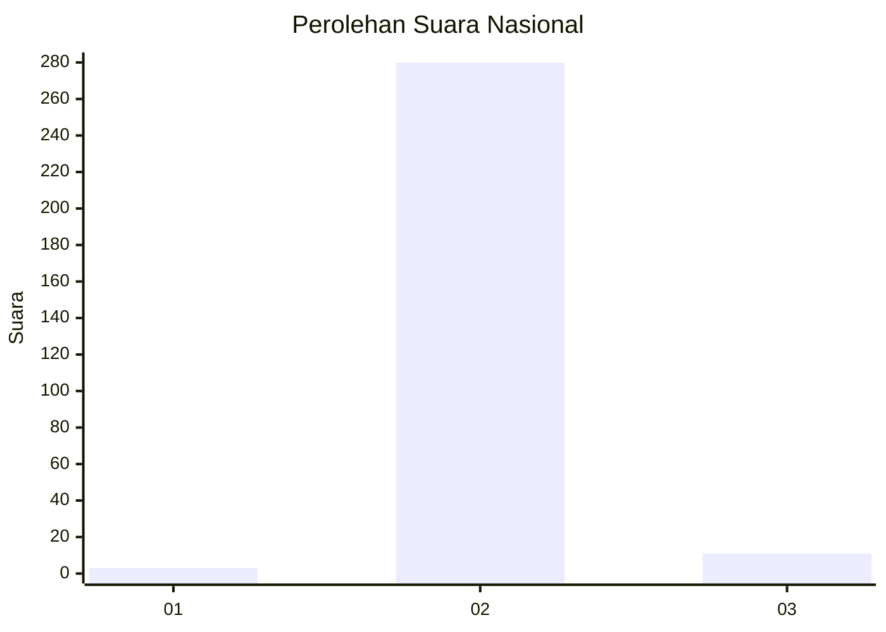
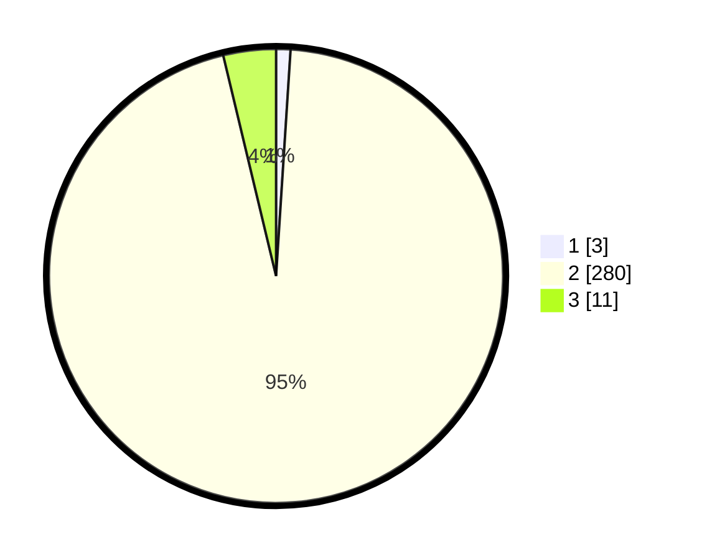

# Hasil

## Grafik

## Tabel

| No. | Nama Paslon    | Suara | Suara (raw) | Persentase |
|:--- |:-------------- | -----:| -----------:| ----------:|
| 1   | ANIES MUHAIMIN | 3     | [3][p-1]    | 1,02       |
| 2   | PRABOWO GIBRAN | 280   | [280][p-2]  | 95,24      |
| 3   | GANJAR MAHFUD  | 11    | [11][p-3]   | 3,74       |

[p-1]: https://github.com/gigit-pemilu/pemilu-2024/blob/main/pilpres/hitung-suara/sub/61-kalimantan-barat/sub/10-melawi/sub/01-belimbing/sub/2009-langan/sub/001-tps/sub/paslon-1.txt
[p-2]: https://github.com/gigit-pemilu/pemilu-2024/blob/main/pilpres/hitung-suara/sub/61-kalimantan-barat/sub/10-melawi/sub/01-belimbing/sub/2009-langan/sub/001-tps/sub/paslon-2.txt
[p-3]: https://github.com/gigit-pemilu/pemilu-2024/blob/main/pilpres/hitung-suara/sub/61-kalimantan-barat/sub/10-melawi/sub/01-belimbing/sub/2009-langan/sub/001-tps/sub/paslon-3.txt

## Foto C Plano

https://sirekap-obj-formc.kpu.go.id/67bb/pemilu/ppwp/61/10/01/20/09/6110012009001-20240215-112342--2617ec21-7a6b-4965-a1e2-3315e10043c4.jpg

https://sirekap-obj-formc.kpu.go.id/67bb/pemilu/ppwp/61/10/01/20/09/6110012009001-20240215-112552--b2d379e5-8850-41f1-b3d8-4fc8cee4c00b.jpg

https://sirekap-obj-formc.kpu.go.id/67bb/pemilu/ppwp/61/10/01/20/09/6110012009001-20240215-112708--2f8f83f2-6588-47f6-aee2-829f049a8cdd.jpg

## Metadata

| Key        | Value               |
| ---------- | ------------------- |
| Time Stamp | 2024-02-15 18:00:26 |

