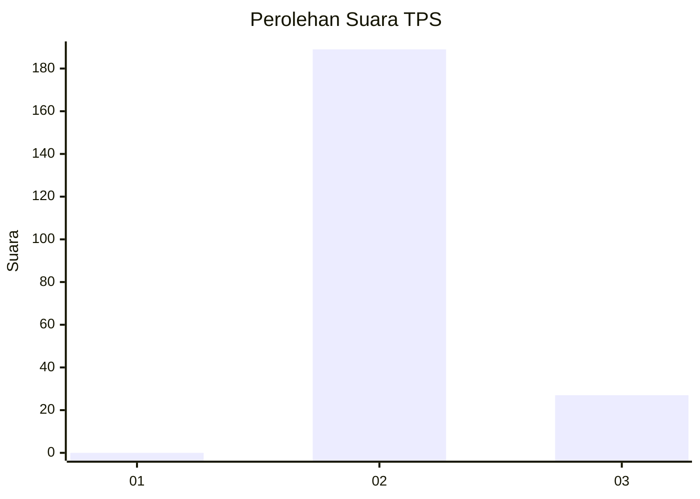
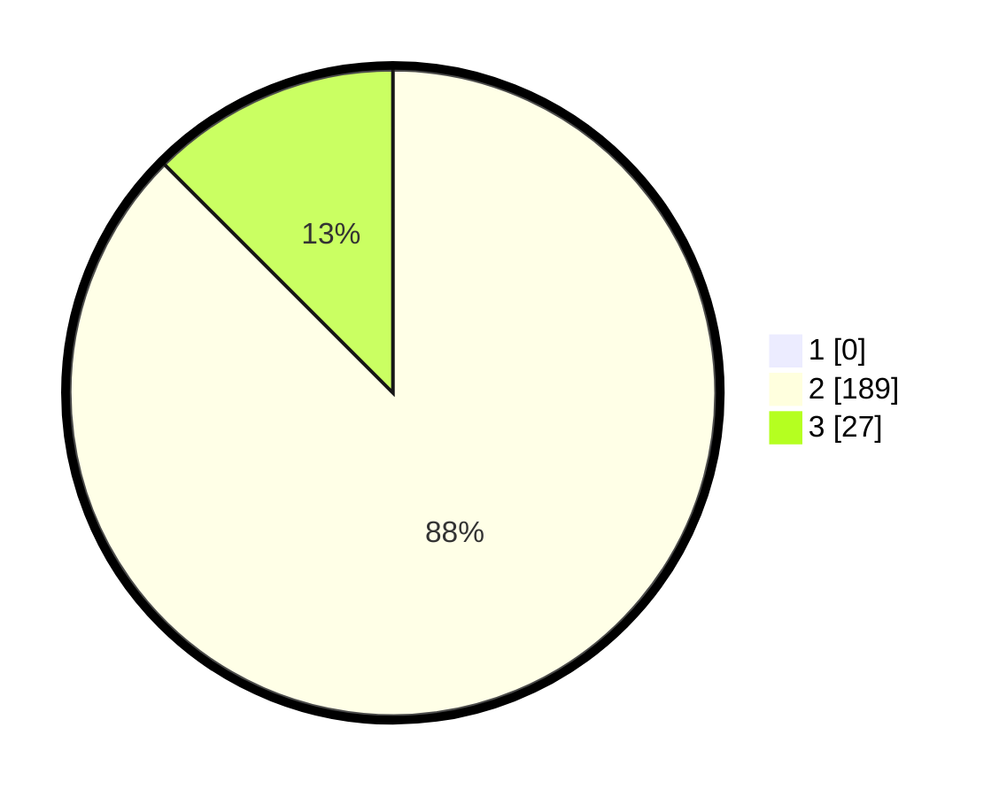

# Hasil

## Grafik

## Tabel

| No. | Nama Paslon    | Suara | Suara (raw) | Persentase |
|:--- |:-------------- | -----:| -----------:| ----------:|
| 1   | ANIES MUHAIMIN | 0     | [0][p-1]    | 0,00       |
| 2   | PRABOWO GIBRAN | 189   | [189][p-2]  | 87,50      |
| 3   | GANJAR MAHFUD  | 27    | [27][p-3]   | 12,50      |

[p-1]: https://github.com/gigit-pemilu/pemilu-2024-61-kalimantan-barat/blob/main/pilpres/hitung-suara/sub/61-kalimantan-barat/sub/10-melawi/sub/01-belimbing/sub/2010-batu-buil/sub/002-tps/sub/paslon-1.txt
[p-2]: https://github.com/gigit-pemilu/pemilu-2024-61-kalimantan-barat/blob/main/pilpres/hitung-suara/sub/61-kalimantan-barat/sub/10-melawi/sub/01-belimbing/sub/2010-batu-buil/sub/002-tps/sub/paslon-2.txt
[p-3]: https://github.com/gigit-pemilu/pemilu-2024-61-kalimantan-barat/blob/main/pilpres/hitung-suara/sub/61-kalimantan-barat/sub/10-melawi/sub/01-belimbing/sub/2010-batu-buil/sub/002-tps/sub/paslon-3.txt

## Foto C Plano

https://sirekap-obj-formc.kpu.go.id/a387/pemilu/ppwp/61/10/01/20/10/6110012010002-20240218-194623--47bf98de-447a-4efa-80a7-6674ddf128b2.jpg

https://sirekap-obj-formc.kpu.go.id/a387/pemilu/ppwp/61/10/01/20/10/6110012010002-20240215-034224--a421606b-8e1f-432e-b52a-6d13ae6ede42.jpg

https://sirekap-obj-formc.kpu.go.id/a387/pemilu/ppwp/61/10/01/20/10/6110012010002-20240218-195932--821127f0-5768-4d0a-b41a-ad2db0c3ae57.jpg

## Metadata

| Key        | Value               |
| ---------- | ------------------- |
| Time Stamp | 2024-02-19 06:16:00 |

