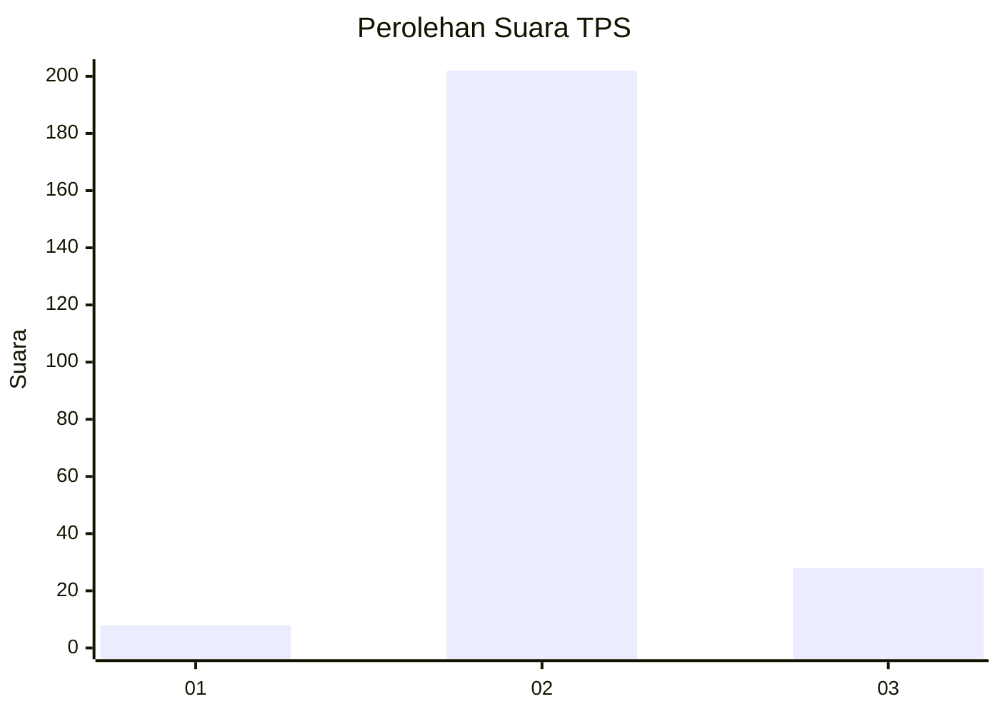
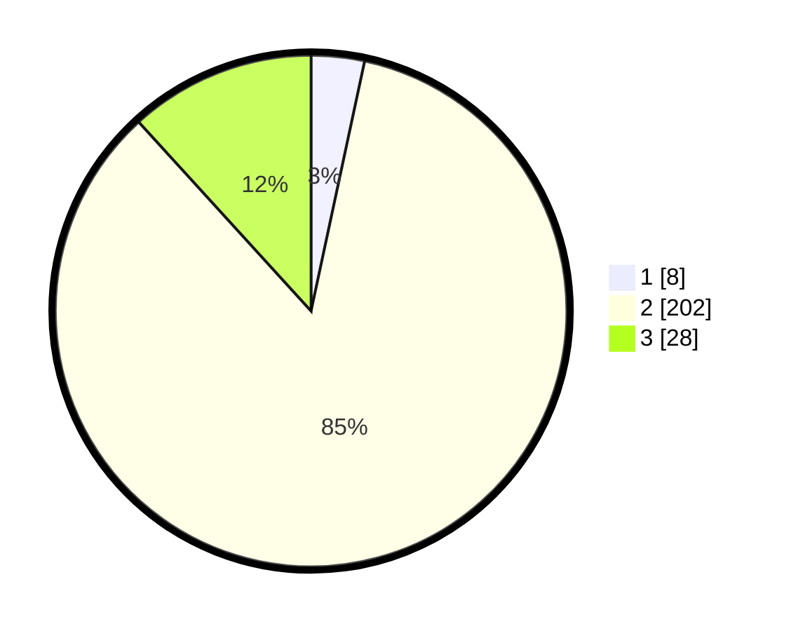

# Hasil

## Grafik

## Tabel

| No. | Nama Paslon    | Suara | Suara (raw) | Persentase |
|:--- |:-------------- | -----:| -----------:| ----------:|
| 1   | ANIES MUHAIMIN | 8     | [8][p-1]    | 3,36       |
| 2   | PRABOWO GIBRAN | 202   | [202][p-2]  | 84,87      |
| 3   | GANJAR MAHFUD  | 28    | [28][p-3]   | 11,76      |

[p-1]: https://github.com/gigit-pemilu/pemilu-2024-61-kalimantan-barat/blob/main/pilpres/hitung-suara/sub/61-kalimantan-barat/sub/10-melawi/sub/01-belimbing/sub/2010-batu-buil/sub/003-tps/sub/paslon-1.txt
[p-2]: https://github.com/gigit-pemilu/pemilu-2024-61-kalimantan-barat/blob/main/pilpres/hitung-suara/sub/61-kalimantan-barat/sub/10-melawi/sub/01-belimbing/sub/2010-batu-buil/sub/003-tps/sub/paslon-2.txt
[p-3]: https://github.com/gigit-pemilu/pemilu-2024-61-kalimantan-barat/blob/main/pilpres/hitung-suara/sub/61-kalimantan-barat/sub/10-melawi/sub/01-belimbing/sub/2010-batu-buil/sub/003-tps/sub/paslon-3.txt

## Foto C Plano

https://sirekap-obj-formc.kpu.go.id/07c8/pemilu/ppwp/61/10/01/20/10/6110012010003-20240215-163200--d18b250d-cc71-4c62-83ab-0a78d072c178.jpg

https://sirekap-obj-formc.kpu.go.id/07c8/pemilu/ppwp/61/10/01/20/10/6110012010003-20240215-143224--35f4654b-84fa-4e16-9c26-7ca7d1d2bded.jpg

https://sirekap-obj-formc.kpu.go.id/07c8/pemilu/ppwp/61/10/01/20/10/6110012010003-20240215-143326--37f71d9c-542b-445e-ac13-39e4a670e1bd.jpg

## Metadata

| Key        | Value               |
| ---------- | ------------------- |
| Time Stamp | 2024-02-16 21:01:00 |

