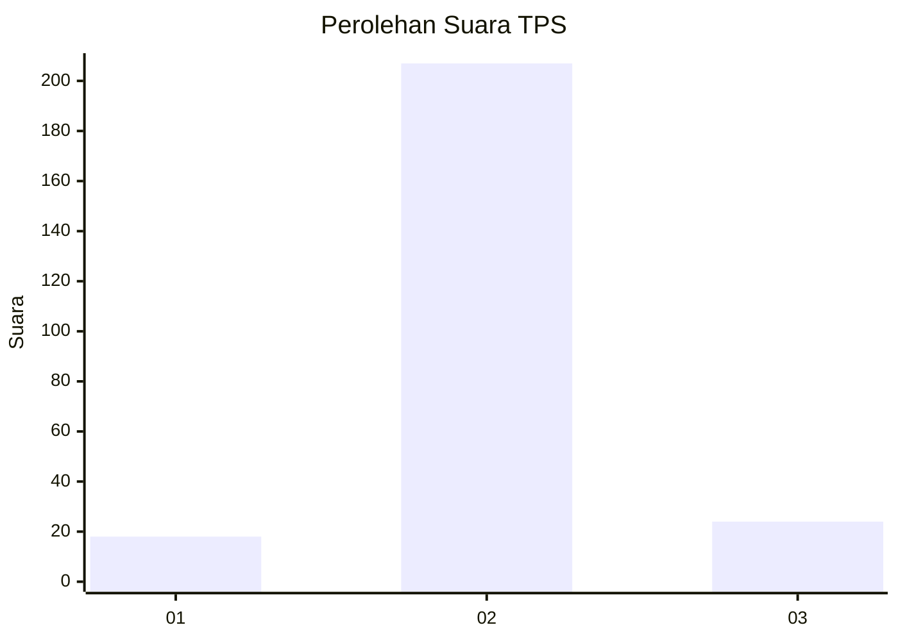
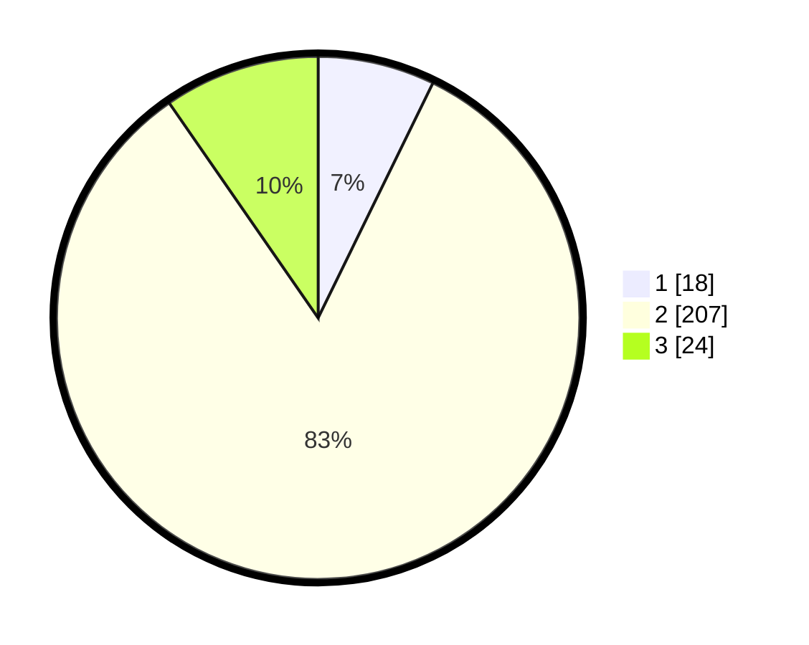

# Hasil

## Grafik

## Tabel

| No. | Nama Paslon    | Suara | Suara (raw) | Persentase |
|:--- |:-------------- | -----:| -----------:| ----------:|
| 1   | ANIES MUHAIMIN | 18    | [18][p-1]   | 7,23       |
| 2   | PRABOWO GIBRAN | 207   | [207][p-2]  | 83,13      |
| 3   | GANJAR MAHFUD  | 24    | [24][p-3]   | 9,64       |

[p-1]: https://github.com/gigit-pemilu/pemilu-2024-61-kalimantan-barat/blob/main/pilpres/hitung-suara/sub/61-kalimantan-barat/sub/10-melawi/sub/01-belimbing/sub/2010-batu-buil/sub/004-tps/sub/paslon-1.txt
[p-2]: https://github.com/gigit-pemilu/pemilu-2024-61-kalimantan-barat/blob/main/pilpres/hitung-suara/sub/61-kalimantan-barat/sub/10-melawi/sub/01-belimbing/sub/2010-batu-buil/sub/004-tps/sub/paslon-2.txt
[p-3]: https://github.com/gigit-pemilu/pemilu-2024-61-kalimantan-barat/blob/main/pilpres/hitung-suara/sub/61-kalimantan-barat/sub/10-melawi/sub/01-belimbing/sub/2010-batu-buil/sub/004-tps/sub/paslon-3.txt

## Foto C Plano

https://sirekap-obj-formc.kpu.go.id/01f5/pemilu/ppwp/61/10/01/20/10/6110012010004-20240215-164723--246477a6-f8c3-49b3-8591-e72db6344520.jpg

https://sirekap-obj-formc.kpu.go.id/01f5/pemilu/ppwp/61/10/01/20/10/6110012010004-20240215-164857--adb4105f-88af-4931-b91f-e77549ea9c4b.jpg

https://sirekap-obj-formc.kpu.go.id/01f5/pemilu/ppwp/61/10/01/20/10/6110012010004-20240215-165055--5b7b2dca-12a0-4b44-a357-ea886eb10b09.jpg

## Metadata

| Key        | Value               |
| ---------- | ------------------- |
| Time Stamp | 2024-02-19 19:00:00 |

## DATA PEMILIH TETAP

Jumlah pemilih dalam DPT: **284**.
 * L: **0**.
 * P: **0**.

## DATA PENGGUNA HAK PILIH

Jumlah pengguna hak pilih dalam DPT: **546**.
 * L: **555**.
 * P: **555**.

Jumlah pengguna hak pilih dalam DPTb: **666**.
 * L: **664**.
 * P: **666**.

Jumlah pengguna hak pilih dalam DPK: **0**.
 * L: **600**.
 * P: **0**.

Jumlah pengguna hak pilih: **253**.
 * L: **231**.
 * P: **122**.

## JUMLAH SUARA SAH DAN TIDAK SAH

JUMLAH SELURUH SUARA SAH: **249**.

JUMLAH SUARA TIDAK SAH: **3**.

JUMLAH SELURUH SUARA SAH DAN SUARA TIDAK SAH: **252**.

