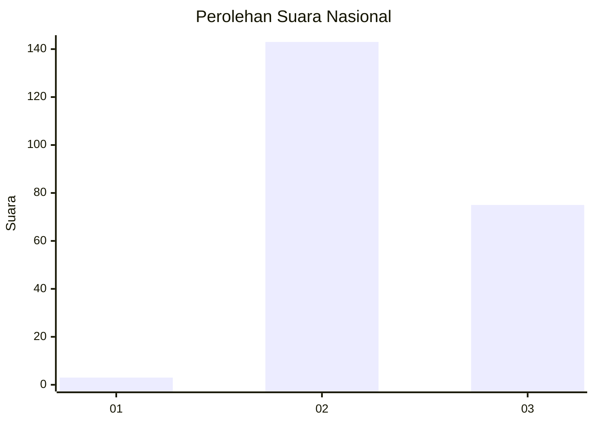
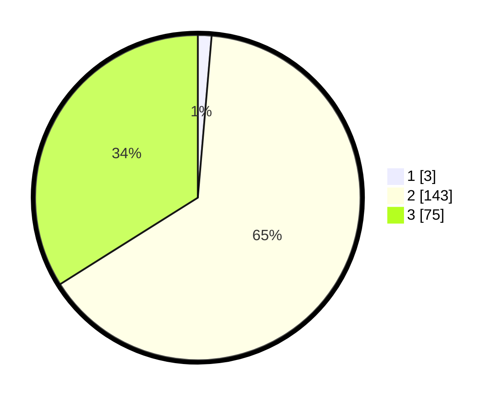

# Hasil

## Grafik

## Tabel

| No. | Nama Paslon    | Suara | Suara (raw) | Persentase |
|:--- |:-------------- | -----:| -----------:| ----------:|
| 1   | ANIES MUHAIMIN | 3     | [3][p-1]    | 1,36       |
| 2   | PRABOWO GIBRAN | 143   | [143][p-2]  | 64,71      |
| 3   | GANJAR MAHFUD  | 75    | [75][p-3]   | 33,94      |

[p-1]: https://github.com/gigit-pemilu/pemilu-2024/blob/main/pilpres/hitung-suara/sub/61-kalimantan-barat/sub/10-melawi/sub/01-belimbing/sub/2013-batu-nanta/sub/002-tps/sub/paslon-1.txt
[p-2]: https://github.com/gigit-pemilu/pemilu-2024/blob/main/pilpres/hitung-suara/sub/61-kalimantan-barat/sub/10-melawi/sub/01-belimbing/sub/2013-batu-nanta/sub/002-tps/sub/paslon-2.txt
[p-3]: https://github.com/gigit-pemilu/pemilu-2024/blob/main/pilpres/hitung-suara/sub/61-kalimantan-barat/sub/10-melawi/sub/01-belimbing/sub/2013-batu-nanta/sub/002-tps/sub/paslon-3.txt

## Foto C Plano

https://sirekap-obj-formc.kpu.go.id/cd34/pemilu/ppwp/61/10/01/20/13/6110012013002-20240215-014411--1b6fc425-8a6c-4f44-a9c7-4e461052dc58.jpg

https://sirekap-obj-formc.kpu.go.id/cd34/pemilu/ppwp/61/10/01/20/13/6110012013002-20240215-014807--3470edad-0b94-4a52-a95a-e210fd8ce0b9.jpg

https://sirekap-obj-formc.kpu.go.id/cd34/pemilu/ppwp/61/10/01/20/13/6110012013002-20240215-014931--7eccd155-7375-493c-891e-eca7735b81cb.jpg

## Metadata

| Key        | Value               |
| ---------- | ------------------- |
| Time Stamp | 2024-02-15 18:00:26 |

