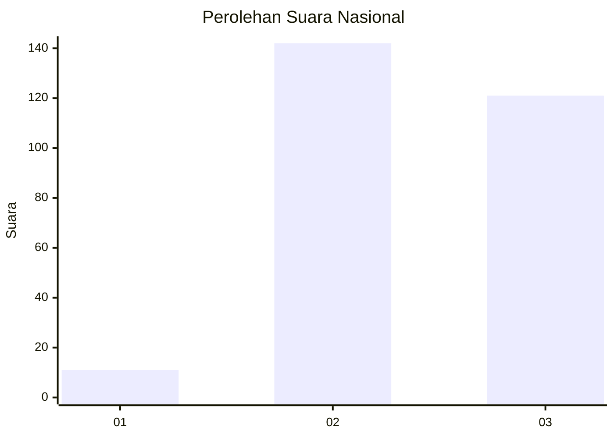
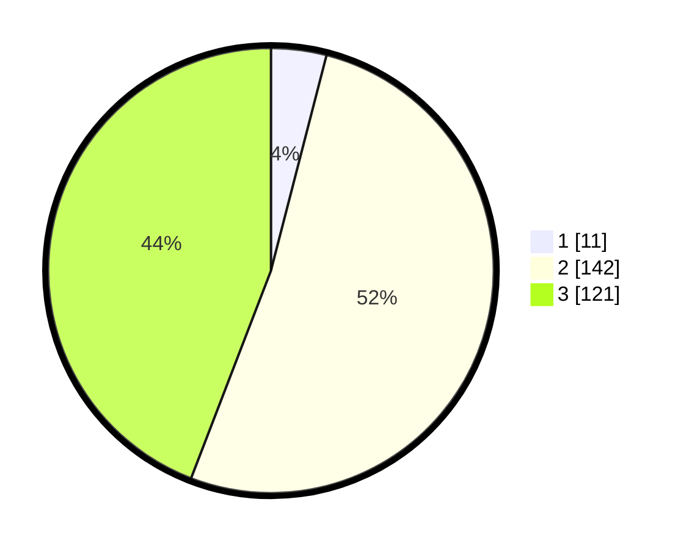

# Hasil

## Grafik

## Tabel

| No. | Nama Paslon    | Suara | Suara (raw) | Persentase |
|:--- |:-------------- | -----:| -----------:| ----------:|
| 1   | ANIES MUHAIMIN | 11    | [11][p-1]   | 4,01       |
| 2   | PRABOWO GIBRAN | 142   | [142][p-2]  | 51,82      |
| 3   | GANJAR MAHFUD  | 121   | [121][p-3]  | 44,16      |

[p-1]: https://github.com/gigit-pemilu/pemilu-2024/blob/main/pilpres/hitung-suara/sub/61-kalimantan-barat/sub/10-melawi/sub/01-belimbing/sub/2013-batu-nanta/sub/003-tps/sub/paslon-1.txt
[p-2]: https://github.com/gigit-pemilu/pemilu-2024/blob/main/pilpres/hitung-suara/sub/61-kalimantan-barat/sub/10-melawi/sub/01-belimbing/sub/2013-batu-nanta/sub/003-tps/sub/paslon-2.txt
[p-3]: https://github.com/gigit-pemilu/pemilu-2024/blob/main/pilpres/hitung-suara/sub/61-kalimantan-barat/sub/10-melawi/sub/01-belimbing/sub/2013-batu-nanta/sub/003-tps/sub/paslon-3.txt

## Foto C Plano

https://sirekap-obj-formc.kpu.go.id/96b9/pemilu/ppwp/61/10/01/20/13/6110012013003-20240215-033329--63de331d-87d4-4cdc-9b9b-e03f0d474117.jpg

https://sirekap-obj-formc.kpu.go.id/96b9/pemilu/ppwp/61/10/01/20/13/6110012013003-20240215-033423--28e058a2-ac54-4b3b-973d-0d595a59c029.jpg

https://sirekap-obj-formc.kpu.go.id/96b9/pemilu/ppwp/61/10/01/20/13/6110012013003-20240215-033522--e0423bbb-d510-4b24-a6da-7ff28ae8307a.jpg

## Metadata

| Key        | Value               |
| ---------- | ------------------- |
| Time Stamp | 2024-02-16 21:01:00 |

