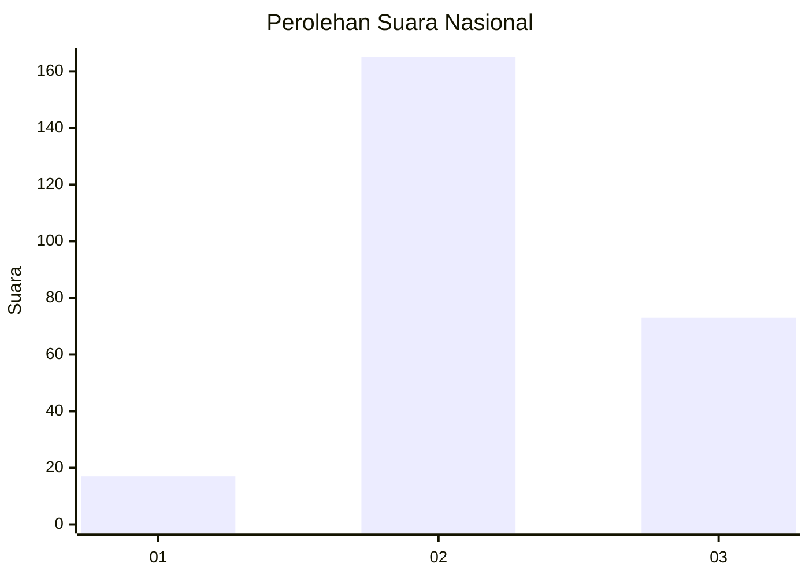
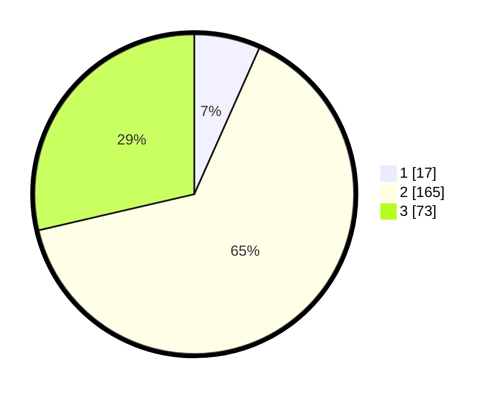

# Hasil

## Grafik

## Tabel

| No. | Nama Paslon    | Suara | Suara (raw) | Persentase |
|:--- |:-------------- | -----:| -----------:| ----------:|
| 1   | ANIES MUHAIMIN | 17    | [17][p-1]   | 6,67       |
| 2   | PRABOWO GIBRAN | 165   | [165][p-2]  | 64,71      |
| 3   | GANJAR MAHFUD  | 73    | [73][p-3]   | 28,63      |

[p-1]: https://github.com/gigit-pemilu/pemilu-2024/blob/main/pilpres/hitung-suara/sub/61-kalimantan-barat/sub/10-melawi/sub/01-belimbing/sub/2013-batu-nanta/sub/005-tps/sub/paslon-1.txt
[p-2]: https://github.com/gigit-pemilu/pemilu-2024/blob/main/pilpres/hitung-suara/sub/61-kalimantan-barat/sub/10-melawi/sub/01-belimbing/sub/2013-batu-nanta/sub/005-tps/sub/paslon-2.txt
[p-3]: https://github.com/gigit-pemilu/pemilu-2024/blob/main/pilpres/hitung-suara/sub/61-kalimantan-barat/sub/10-melawi/sub/01-belimbing/sub/2013-batu-nanta/sub/005-tps/sub/paslon-3.txt

## Foto C Plano

https://sirekap-obj-formc.kpu.go.id/95b0/pemilu/ppwp/61/10/01/20/13/6110012013005-20240215-003329--e256cf5d-0d5a-4242-83a8-1722590c26a3.jpg

https://sirekap-obj-formc.kpu.go.id/95b0/pemilu/ppwp/61/10/01/20/13/6110012013005-20240215-003514--bd6adf7c-96ba-4147-bc74-c3adb686a9a1.jpg

https://sirekap-obj-formc.kpu.go.id/95b0/pemilu/ppwp/61/10/01/20/13/6110012013005-20240215-003734--56e5be56-ac66-44f4-ac50-67995cdbea49.jpg

## Metadata

| Key        | Value               |
| ---------- | ------------------- |
| Time Stamp | 2024-02-15 18:00:26 |

