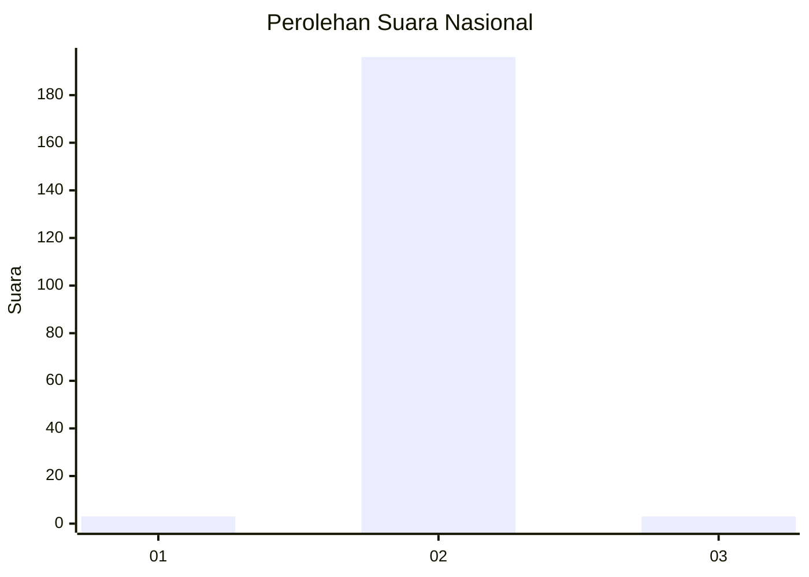
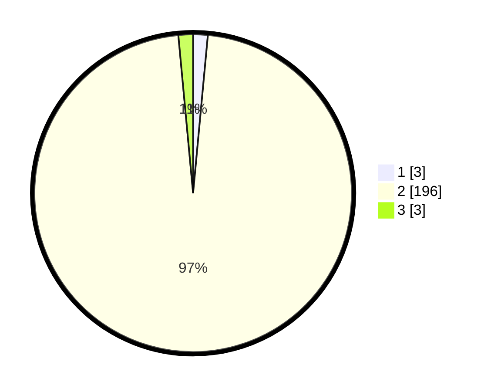

# Hasil

## Grafik

## Tabel

| No. | Nama Paslon    | Suara | Suara (raw) | Persentase |
|:--- |:-------------- | -----:| -----------:| ----------:|
| 1   | ANIES MUHAIMIN | 3     | [3][p-1]    | 1,49       |
| 2   | PRABOWO GIBRAN | 196   | [196][p-2]  | 97,03      |
| 3   | GANJAR MAHFUD  | 3     | [3][p-3]    | 1,49       |

[p-1]: https://github.com/gigit-pemilu/pemilu-2024/blob/main/pilpres/hitung-suara/sub/61-kalimantan-barat/sub/10-melawi/sub/01-belimbing/sub/2017-tekaban/sub/001-tps/sub/paslon-1.txt
[p-2]: https://github.com/gigit-pemilu/pemilu-2024/blob/main/pilpres/hitung-suara/sub/61-kalimantan-barat/sub/10-melawi/sub/01-belimbing/sub/2017-tekaban/sub/001-tps/sub/paslon-2.txt
[p-3]: https://github.com/gigit-pemilu/pemilu-2024/blob/main/pilpres/hitung-suara/sub/61-kalimantan-barat/sub/10-melawi/sub/01-belimbing/sub/2017-tekaban/sub/001-tps/sub/paslon-3.txt

## Foto C Plano

https://sirekap-obj-formc.kpu.go.id/de57/pemilu/ppwp/61/10/01/20/17/6110012017001-20240215-171306--ffa83c5c-db6c-4662-a9a4-f5559f3ab2eb.jpg

https://sirekap-obj-formc.kpu.go.id/de57/pemilu/ppwp/61/10/01/20/17/6110012017001-20240215-171333--1f2fcc66-f958-4c2a-8645-8e201faa31b6.jpg

https://sirekap-obj-formc.kpu.go.id/de57/pemilu/ppwp/61/10/01/20/17/6110012017001-20240215-171353--1912aadd-2c96-46f8-b497-e19589489a80.jpg

## Metadata

| Key        | Value               |
| ---------- | ------------------- |
| Time Stamp | 2024-02-15 22:30:27 |

