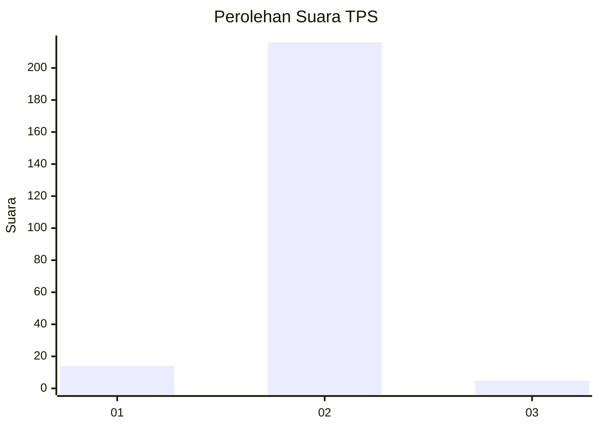
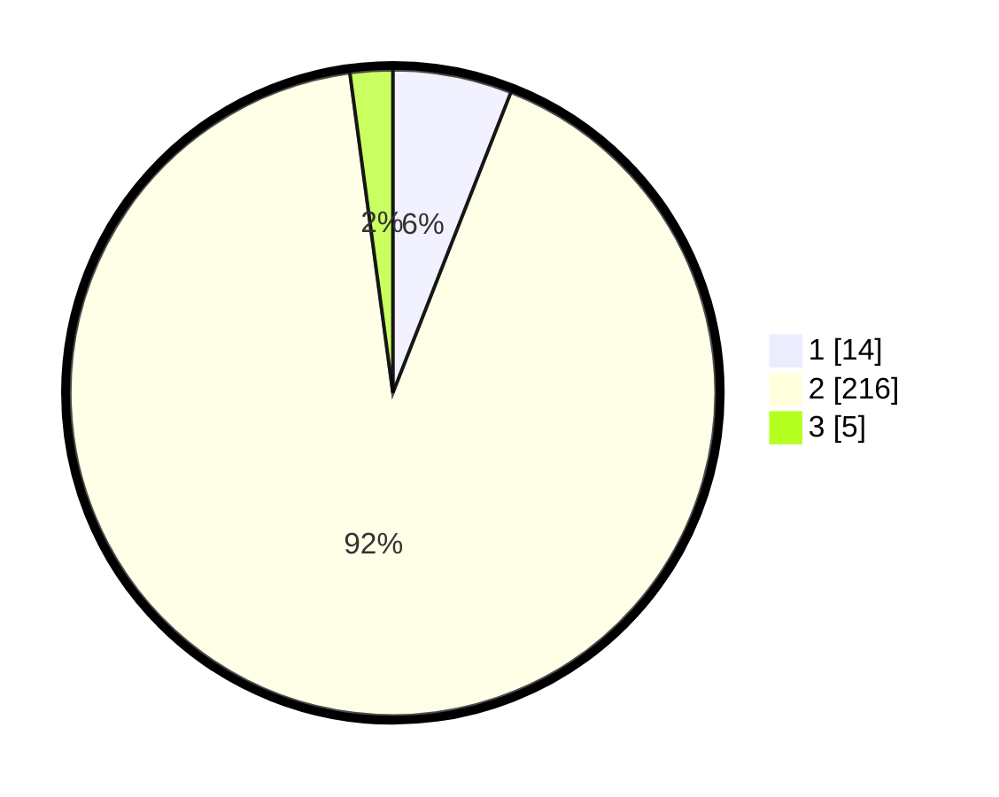

# Hasil

## Grafik

## Tabel

| No. | Nama Paslon    | Suara | Suara (raw) | Persentase |
|:--- |:-------------- | -----:| -----------:| ----------:|
| 1   | ANIES MUHAIMIN | 14    | [14][p-1]   | 5,96       |
| 2   | PRABOWO GIBRAN | 216   | [216][p-2]  | 91,91      |
| 3   | GANJAR MAHFUD  | 5     | [5][p-3]    | 2,13       |

[p-1]: https://github.com/gigit-pemilu/pemilu-2024-61-kalimantan-barat/blob/main/pilpres/hitung-suara/sub/61-kalimantan-barat/sub/10-melawi/sub/01-belimbing/sub/2017-tekaban/sub/002-tps/sub/paslon-1.txt
[p-2]: https://github.com/gigit-pemilu/pemilu-2024-61-kalimantan-barat/blob/main/pilpres/hitung-suara/sub/61-kalimantan-barat/sub/10-melawi/sub/01-belimbing/sub/2017-tekaban/sub/002-tps/sub/paslon-2.txt
[p-3]: https://github.com/gigit-pemilu/pemilu-2024-61-kalimantan-barat/blob/main/pilpres/hitung-suara/sub/61-kalimantan-barat/sub/10-melawi/sub/01-belimbing/sub/2017-tekaban/sub/002-tps/sub/paslon-3.txt

## Foto C Plano

https://sirekap-obj-formc.kpu.go.id/1962/pemilu/ppwp/61/10/01/20/17/6110012017002-20240215-085049--f3bf2aa9-bc6e-40aa-9bd8-32f3f1638609.jpg

https://sirekap-obj-formc.kpu.go.id/1962/pemilu/ppwp/61/10/01/20/17/6110012017002-20240215-120725--0e047eb9-e0a8-4585-a2ca-8aabacc3641d.jpg

https://sirekap-obj-formc.kpu.go.id/1962/pemilu/ppwp/61/10/01/20/17/6110012017002-20240215-103056--5ea46092-72b8-4f93-b854-7ebd129d4f74.jpg

## Metadata

| Key        | Value               |
| ---------- | ------------------- |
| Time Stamp | 2024-02-19 06:16:00 |

