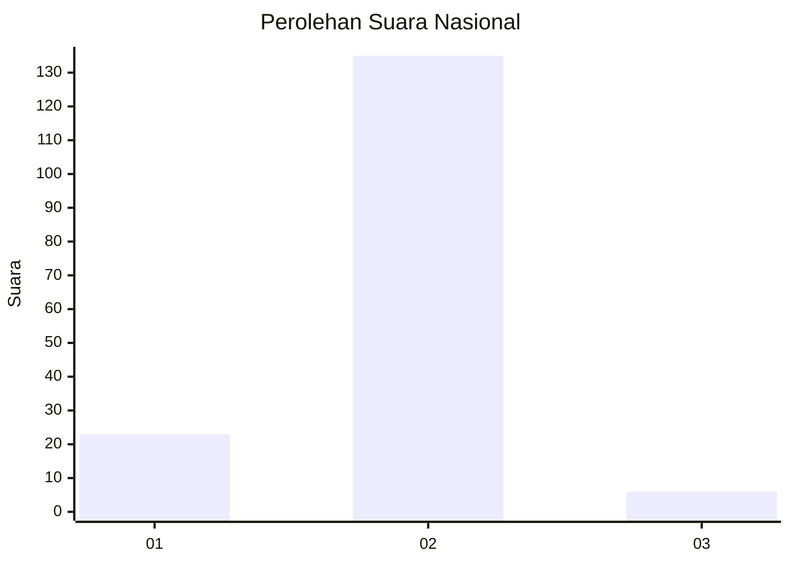
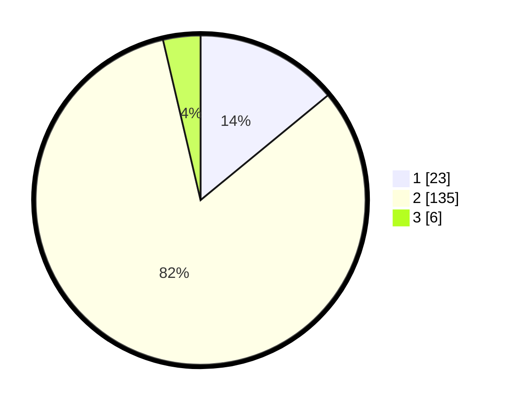

# Hasil

## Grafik

## Tabel

| No. | Nama Paslon    | Suara | Suara (raw) | Persentase |
|:--- |:-------------- | -----:| -----------:| ----------:|
| 1   | ANIES MUHAIMIN | 23    | [23][p-1]   | 14,02      |
| 2   | PRABOWO GIBRAN | 135   | [135][p-2]  | 82,32      |
| 3   | GANJAR MAHFUD  | 6     | [6][p-3]    | 3,66       |

[p-1]: https://github.com/gigit-pemilu/pemilu-2024/blob/main/pilpres/hitung-suara/sub/61-kalimantan-barat/sub/10-melawi/sub/01-belimbing/sub/2023-nanga-menunuk/sub/001-tps/sub/paslon-1.txt
[p-2]: https://github.com/gigit-pemilu/pemilu-2024/blob/main/pilpres/hitung-suara/sub/61-kalimantan-barat/sub/10-melawi/sub/01-belimbing/sub/2023-nanga-menunuk/sub/001-tps/sub/paslon-2.txt
[p-3]: https://github.com/gigit-pemilu/pemilu-2024/blob/main/pilpres/hitung-suara/sub/61-kalimantan-barat/sub/10-melawi/sub/01-belimbing/sub/2023-nanga-menunuk/sub/001-tps/sub/paslon-3.txt

## Foto C Plano

https://sirekap-obj-formc.kpu.go.id/c5e4/pemilu/ppwp/61/10/01/20/23/6110012023001-20240215-171616--9d01f941-574c-4c14-ba48-c6b5ac8dc7c0.jpg

https://sirekap-obj-formc.kpu.go.id/c5e4/pemilu/ppwp/61/10/01/20/23/6110012023001-20240215-060325--5a1e99c6-86b0-484d-aac3-e45ff22b0815.jpg

https://sirekap-obj-formc.kpu.go.id/c5e4/pemilu/ppwp/61/10/01/20/23/6110012023001-20240215-012920--b5f03cd8-938f-45c9-a339-0be9cfa559aa.jpg

## Metadata

| Key        | Value               |
| ---------- | ------------------- |
| Time Stamp | 2024-02-15 18:30:25 |

