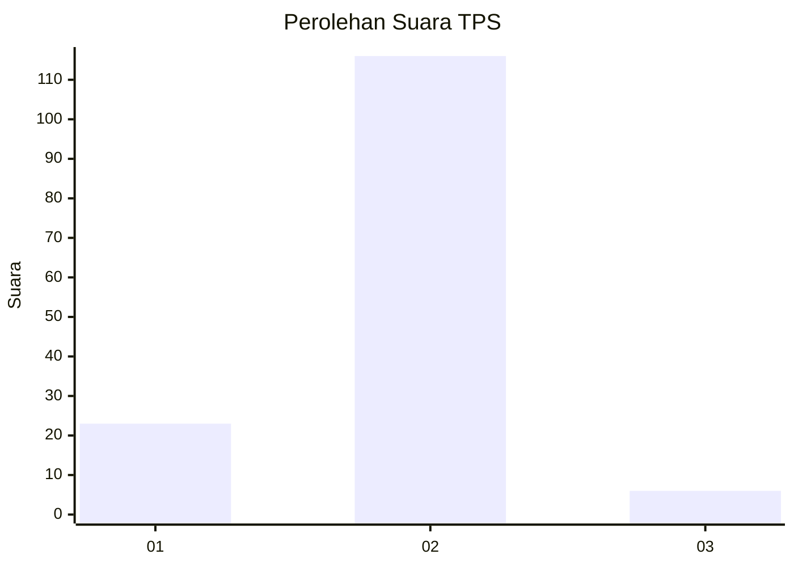
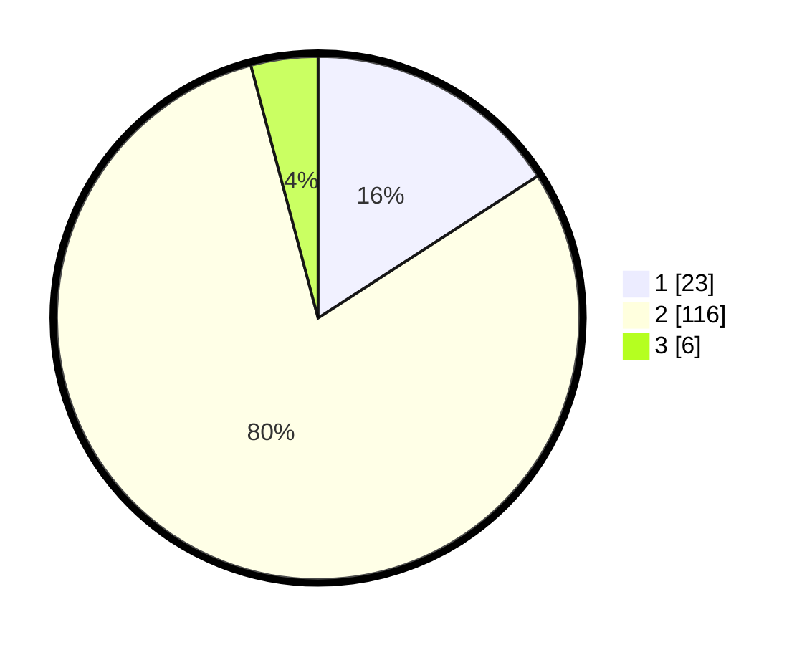

# Hasil

## Grafik

## Tabel

| No. | Nama Paslon    | Suara | Suara (raw) | Persentase |
|:--- |:-------------- | -----:| -----------:| ----------:|
| 1   | ANIES MUHAIMIN | 23    | [23][p-1]   | 15,86      |
| 2   | PRABOWO GIBRAN | 116   | [116][p-2]  | 80,00      |
| 3   | GANJAR MAHFUD  | 6     | [6][p-3]    | 4,14       |

[p-1]: https://github.com/gigit-pemilu/pemilu-2024-61-kalimantan-barat/blob/main/pilpres/hitung-suara/sub/61-kalimantan-barat/sub/10-melawi/sub/01-belimbing/sub/2023-nanga-menunuk/sub/003-tps/sub/paslon-1.txt
[p-2]: https://github.com/gigit-pemilu/pemilu-2024-61-kalimantan-barat/blob/main/pilpres/hitung-suara/sub/61-kalimantan-barat/sub/10-melawi/sub/01-belimbing/sub/2023-nanga-menunuk/sub/003-tps/sub/paslon-2.txt
[p-3]: https://github.com/gigit-pemilu/pemilu-2024-61-kalimantan-barat/blob/main/pilpres/hitung-suara/sub/61-kalimantan-barat/sub/10-melawi/sub/01-belimbing/sub/2023-nanga-menunuk/sub/003-tps/sub/paslon-3.txt

## Foto C Plano

https://sirekap-obj-formc.kpu.go.id/74aa/pemilu/ppwp/61/10/01/20/23/6110012023003-20240215-024537--d24b9315-ca1d-45d4-8ba6-2415289e6c4c.jpg

https://sirekap-obj-formc.kpu.go.id/74aa/pemilu/ppwp/61/10/01/20/23/6110012023003-20240215-023548--03b4f8a5-dabc-4280-9b0e-f5875a38888a.jpg

https://sirekap-obj-formc.kpu.go.id/74aa/pemilu/ppwp/61/10/01/20/23/6110012023003-20240215-041554--41da26a1-09f5-4ab0-8b93-611bc301abda.jpg

## Metadata

| Key        | Value               |
| ---------- | ------------------- |
| Time Stamp | 2024-02-15 18:00:26 |

