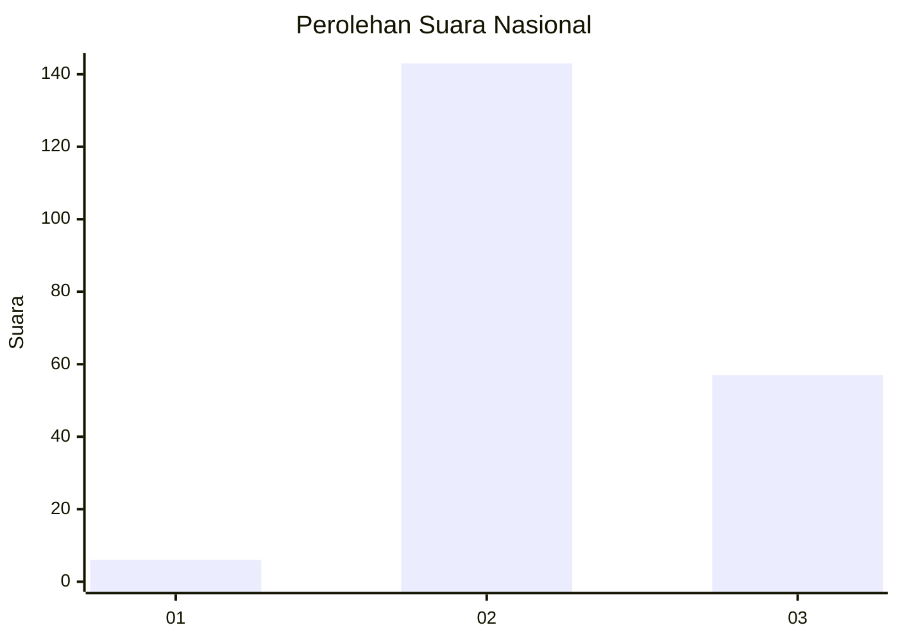
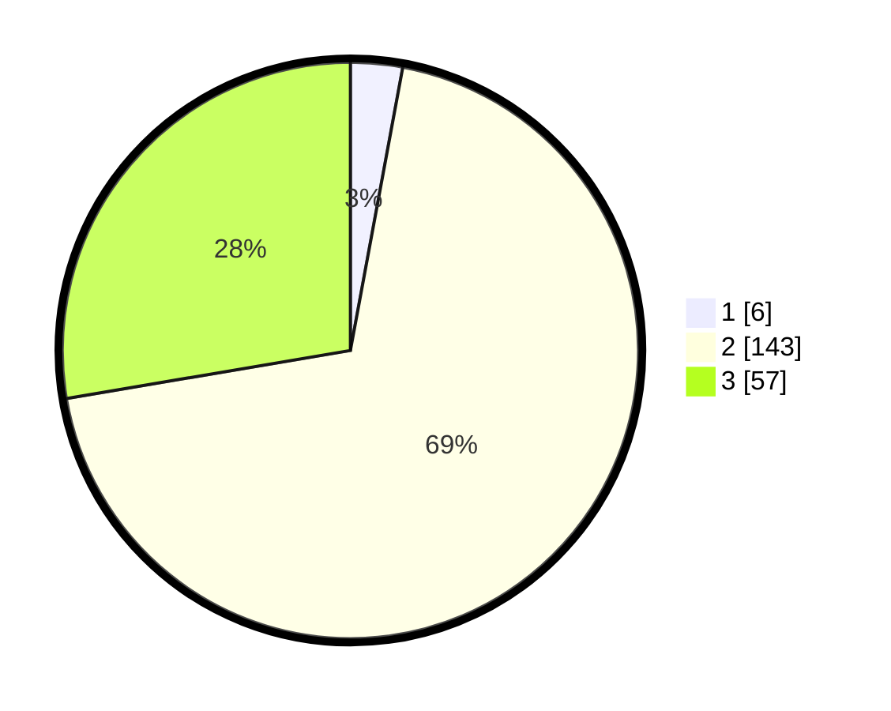

# Hasil

## Grafik

## Tabel

| No. | Nama Paslon    | Suara | Suara (raw) | Persentase |
|:--- |:-------------- | -----:| -----------:| ----------:|
| 1   | ANIES MUHAIMIN | 6     | [6][p-1]    | 2,91       |
| 2   | PRABOWO GIBRAN | 143   | [143][p-2]  | 69,42      |
| 3   | GANJAR MAHFUD  | 57    | [57][p-3]   | 27,67      |

[p-1]: https://github.com/gigit-pemilu/pemilu-2024/blob/main/pilpres/hitung-suara/sub/61-kalimantan-barat/sub/10-melawi/sub/02-nanga-pinoh/sub/2001-tanjung-niaga/sub/001-tps/sub/paslon-1.txt
[p-2]: https://github.com/gigit-pemilu/pemilu-2024/blob/main/pilpres/hitung-suara/sub/61-kalimantan-barat/sub/10-melawi/sub/02-nanga-pinoh/sub/2001-tanjung-niaga/sub/001-tps/sub/paslon-2.txt
[p-3]: https://github.com/gigit-pemilu/pemilu-2024/blob/main/pilpres/hitung-suara/sub/61-kalimantan-barat/sub/10-melawi/sub/02-nanga-pinoh/sub/2001-tanjung-niaga/sub/001-tps/sub/paslon-3.txt

## Foto C Plano

https://sirekap-obj-formc.kpu.go.id/48f2/pemilu/ppwp/61/10/02/20/01/6110022001001-20240215-003004--921158fb-aeeb-41d2-b253-7df851418d04.jpg

https://sirekap-obj-formc.kpu.go.id/48f2/pemilu/ppwp/61/10/02/20/01/6110022001001-20240215-024741--19b067f7-e122-4b99-8ac2-e356b562fe01.jpg

https://sirekap-obj-formc.kpu.go.id/48f2/pemilu/ppwp/61/10/02/20/01/6110022001001-20240215-003523--14c2b593-530c-4275-82fa-3559b7df8c28.jpg

## Metadata

| Key        | Value               |
| ---------- | ------------------- |
| Time Stamp | 2024-02-19 06:16:00 |

