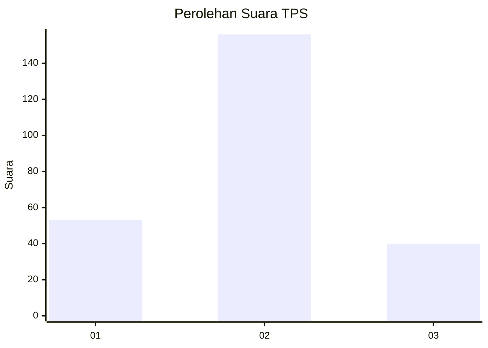

# Hasil

## Grafik

## Tabel

| No. | Nama Paslon    | Suara | Suara (raw) | Persentase |
|:--- |:-------------- | -----:| -----------:| ----------:|
| 1   | ANIES MUHAIMIN | 53    | [53][p-1]   | 21,29      |
| 2   | PRABOWO GIBRAN | 156   | [156][p-2]  | 62,65      |
| 3   | GANJAR MAHFUD  | 40    | [40][p-3]   | 16,06      |

[p-1]: https://github.com/gigit-pemilu/pemilu-2024-61-kalimantan-barat/blob/main/pilpres/hitung-suara/sub/61-kalimantan-barat/sub/10-melawi/sub/02-nanga-pinoh/sub/2001-tanjung-niaga/sub/003-tps/sub/paslon-1.txt
[p-2]: https://github.com/gigit-pemilu/pemilu-2024-61-kalimantan-barat/blob/main/pilpres/hitung-suara/sub/61-kalimantan-barat/sub/10-melawi/sub/02-nanga-pinoh/sub/2001-tanjung-niaga/sub/003-tps/sub/paslon-2.txt
[p-3]: https://github.com/gigit-pemilu/pemilu-2024-61-kalimantan-barat/blob/main/pilpres/hitung-suara/sub/61-kalimantan-barat/sub/10-melawi/sub/02-nanga-pinoh/sub/2001-tanjung-niaga/sub/003-tps/sub/paslon-3.txt

## Foto C Plano

https://sirekap-obj-formc.kpu.go.id/c331/pemilu/ppwp/61/10/02/20/01/6110022001003-20240215-054016--6a9668a8-e6bc-4918-9f60-4edbb2dd84c2.jpg

https://sirekap-obj-formc.kpu.go.id/c331/pemilu/ppwp/61/10/02/20/01/6110022001003-20240215-054202--f509798c-54a0-4d72-bf4f-bb5d4205488c.jpg

https://sirekap-obj-formc.kpu.go.id/c331/pemilu/ppwp/61/10/02/20/01/6110022001003-20240215-054431--a9a00429-cc44-433f-acc1-2260325a63b7.jpg

## Metadata

| Key        | Value               |
| ---------- | ------------------- |
| Time Stamp | 2024-02-15 21:30:27 |

