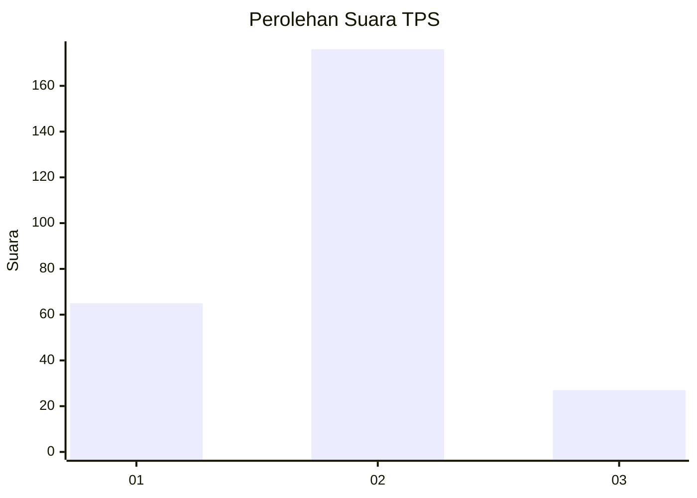

# Hasil

## Grafik

## Tabel

| No. | Nama Paslon    | Suara | Suara (raw) | Persentase |
|:--- |:-------------- | -----:| -----------:| ----------:|
| 1   | ANIES MUHAIMIN | 65    | [65][p-1]   | 24,25      |
| 2   | PRABOWO GIBRAN | 176   | [176][p-2]  | 65,67      |
| 3   | GANJAR MAHFUD  | 27    | [27][p-3]   | 10,07      |

[p-1]: https://github.com/gigit-pemilu/pemilu-2024-61-kalimantan-barat/blob/main/pilpres/hitung-suara/sub/61-kalimantan-barat/sub/10-melawi/sub/02-nanga-pinoh/sub/2001-tanjung-niaga/sub/004-tps/sub/paslon-1.txt
[p-2]: https://github.com/gigit-pemilu/pemilu-2024-61-kalimantan-barat/blob/main/pilpres/hitung-suara/sub/61-kalimantan-barat/sub/10-melawi/sub/02-nanga-pinoh/sub/2001-tanjung-niaga/sub/004-tps/sub/paslon-2.txt
[p-3]: https://github.com/gigit-pemilu/pemilu-2024-61-kalimantan-barat/blob/main/pilpres/hitung-suara/sub/61-kalimantan-barat/sub/10-melawi/sub/02-nanga-pinoh/sub/2001-tanjung-niaga/sub/004-tps/sub/paslon-3.txt

## Foto C Plano

https://sirekap-obj-formc.kpu.go.id/e05f/pemilu/ppwp/61/10/02/20/01/6110022001004-20240215-061524--661f5009-ce0a-4950-831e-fc49a74f1634.jpg

https://sirekap-obj-formc.kpu.go.id/e05f/pemilu/ppwp/61/10/02/20/01/6110022001004-20240215-061734--8bd0dcc3-4345-4d45-af30-85c2b073f10a.jpg

https://sirekap-obj-formc.kpu.go.id/e05f/pemilu/ppwp/61/10/02/20/01/6110022001004-20240215-061905--d615cbe9-7e31-49c4-9ee5-2d12a703502f.jpg

## Metadata

| Key        | Value               |
| ---------- | ------------------- |
| Time Stamp | 2024-02-25 16:00:00 |

