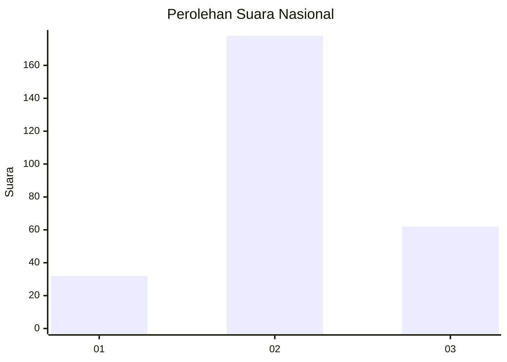
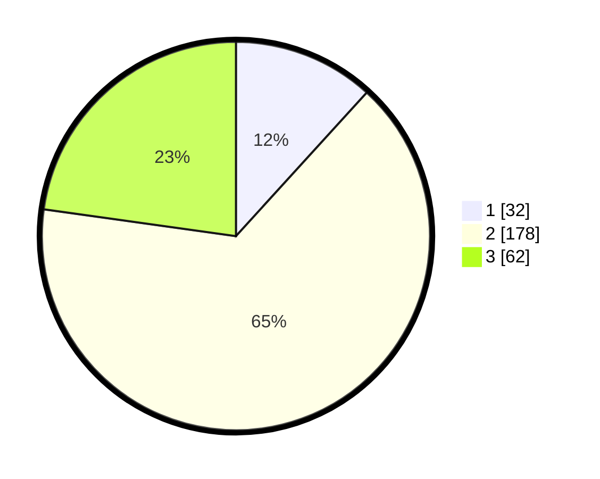

# Hasil

## Grafik

## Tabel

| No. | Nama Paslon    | Suara | Suara (raw) | Persentase |
|:--- |:-------------- | -----:| -----------:| ----------:|
| 1   | ANIES MUHAIMIN | 32    | [32][p-1]   | 11,76      |
| 2   | PRABOWO GIBRAN | 178   | [178][p-2]  | 65,44      |
| 3   | GANJAR MAHFUD  | 62    | [62][p-3]   | 22,79      |

[p-1]: https://github.com/gigit-pemilu/pemilu-2024/blob/main/pilpres/hitung-suara/sub/61-kalimantan-barat/sub/10-melawi/sub/02-nanga-pinoh/sub/2001-tanjung-niaga/sub/006-tps/sub/paslon-1.txt
[p-2]: https://github.com/gigit-pemilu/pemilu-2024/blob/main/pilpres/hitung-suara/sub/61-kalimantan-barat/sub/10-melawi/sub/02-nanga-pinoh/sub/2001-tanjung-niaga/sub/006-tps/sub/paslon-2.txt
[p-3]: https://github.com/gigit-pemilu/pemilu-2024/blob/main/pilpres/hitung-suara/sub/61-kalimantan-barat/sub/10-melawi/sub/02-nanga-pinoh/sub/2001-tanjung-niaga/sub/006-tps/sub/paslon-3.txt

## Foto C Plano

https://sirekap-obj-formc.kpu.go.id/75ed/pemilu/ppwp/61/10/02/20/01/6110022001006-20240215-093010--b7b4491a-202e-4079-b477-229d131811b8.jpg

https://sirekap-obj-formc.kpu.go.id/75ed/pemilu/ppwp/61/10/02/20/01/6110022001006-20240215-093207--4b9cbc4d-81e8-4406-bfd9-ff7feaeeaa5f.jpg

https://sirekap-obj-formc.kpu.go.id/75ed/pemilu/ppwp/61/10/02/20/01/6110022001006-20240215-093240--e183b2f9-ae7e-4bc3-bece-1659cee0a457.jpg

## Metadata

| Key        | Value               |
| ---------- | ------------------- |
| Time Stamp | 2024-02-24 23:00:00 |

