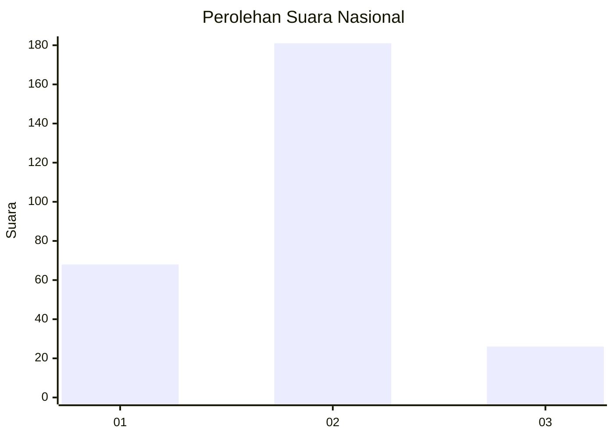

# Hasil

## Grafik

## Tabel

| No. | Nama Paslon    | Suara | Suara (raw) | Persentase |
|:--- |:-------------- | -----:| -----------:| ----------:|
| 1   | ANIES MUHAIMIN | 68    | [68][p-1]   | 24,73      |
| 2   | PRABOWO GIBRAN | 181   | [181][p-2]  | 65,82      |
| 3   | GANJAR MAHFUD  | 26    | [26][p-3]   | 9,45       |

[p-1]: https://github.com/gigit-pemilu/pemilu-2024/blob/main/pilpres/hitung-suara/sub/61-kalimantan-barat/sub/10-melawi/sub/02-nanga-pinoh/sub/2001-tanjung-niaga/sub/015-tps/sub/paslon-1.txt
[p-2]: https://github.com/gigit-pemilu/pemilu-2024/blob/main/pilpres/hitung-suara/sub/61-kalimantan-barat/sub/10-melawi/sub/02-nanga-pinoh/sub/2001-tanjung-niaga/sub/015-tps/sub/paslon-2.txt
[p-3]: https://github.com/gigit-pemilu/pemilu-2024/blob/main/pilpres/hitung-suara/sub/61-kalimantan-barat/sub/10-melawi/sub/02-nanga-pinoh/sub/2001-tanjung-niaga/sub/015-tps/sub/paslon-3.txt

## Foto C Plano

https://sirekap-obj-formc.kpu.go.id/faf9/pemilu/ppwp/61/10/02/20/01/6110022001015-20240214-202409--6cc2a562-029a-4561-b990-6cd7f649837e.jpg

https://sirekap-obj-formc.kpu.go.id/faf9/pemilu/ppwp/61/10/02/20/01/6110022001015-20240214-184909--d85d1862-7be7-45a3-90c3-23c6c7b22718.jpg

https://sirekap-obj-formc.kpu.go.id/faf9/pemilu/ppwp/61/10/02/20/01/6110022001015-20240214-185009--60911d60-87c8-4314-bba9-d435f266d048.jpg

## Metadata

| Key        | Value               |
| ---------- | ------------------- |
| Time Stamp | 2024-02-14 21:46:01 |

