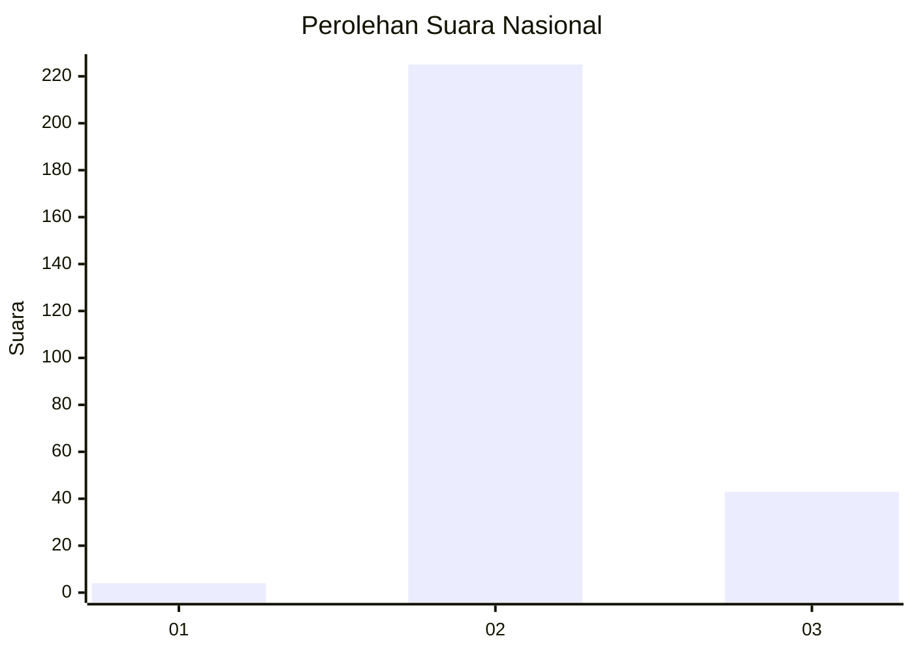
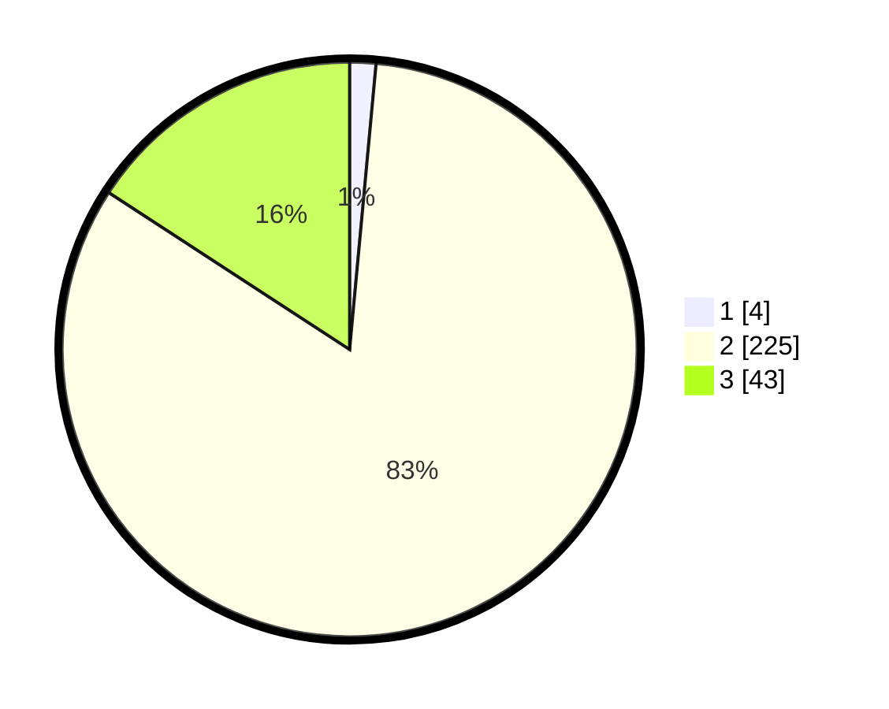

# Hasil

## Grafik

## Tabel

| No. | Nama Paslon    | Suara | Suara (raw) | Persentase |
|:--- |:-------------- | -----:| -----------:| ----------:|
| 1   | ANIES MUHAIMIN | 4     | [4][p-1]    | 1,47       |
| 2   | PRABOWO GIBRAN | 225   | [225][p-2]  | 82,72      |
| 3   | GANJAR MAHFUD  | 43    | [43][p-3]   | 15,81      |

[p-1]: https://github.com/gigit-pemilu/pemilu-2024/blob/main/pilpres/hitung-suara/sub/61-kalimantan-barat/sub/10-melawi/sub/02-nanga-pinoh/sub/2005-poring/sub/002-tps/sub/paslon-1.txt
[p-2]: https://github.com/gigit-pemilu/pemilu-2024/blob/main/pilpres/hitung-suara/sub/61-kalimantan-barat/sub/10-melawi/sub/02-nanga-pinoh/sub/2005-poring/sub/002-tps/sub/paslon-2.txt
[p-3]: https://github.com/gigit-pemilu/pemilu-2024/blob/main/pilpres/hitung-suara/sub/61-kalimantan-barat/sub/10-melawi/sub/02-nanga-pinoh/sub/2005-poring/sub/002-tps/sub/paslon-3.txt

## Foto C Plano

https://sirekap-obj-formc.kpu.go.id/3447/pemilu/ppwp/61/10/02/20/05/6110022005002-20240221-160708--008c5887-1510-4abe-bd25-3ee8fc13d163.jpg

https://sirekap-obj-formc.kpu.go.id/3447/pemilu/ppwp/61/10/02/20/05/6110022005002-20240221-160753--704256b8-d0ca-4391-8a0a-947c93993aa1.jpg

https://sirekap-obj-formc.kpu.go.id/3447/pemilu/ppwp/61/10/02/20/05/6110022005002-20240221-160835--b28c2b2a-4c11-44df-9476-e8a7a6c6ba3b.jpg

## Metadata

| Key        | Value               |
| ---------- | ------------------- |
| Time Stamp | 2024-02-25 18:00:00 |

