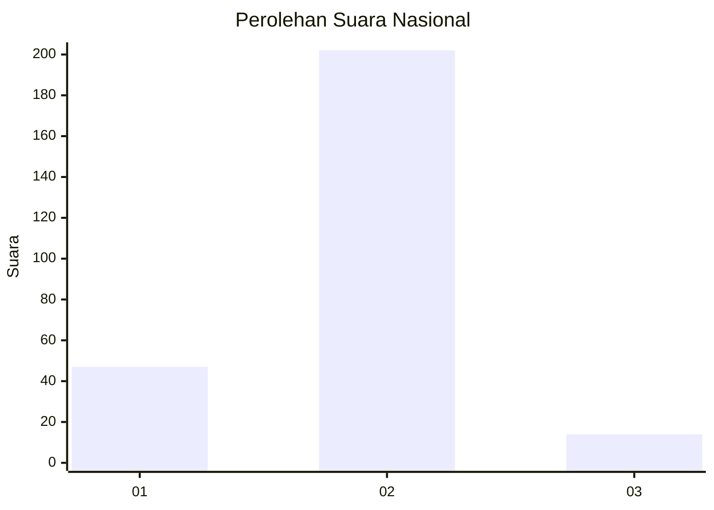
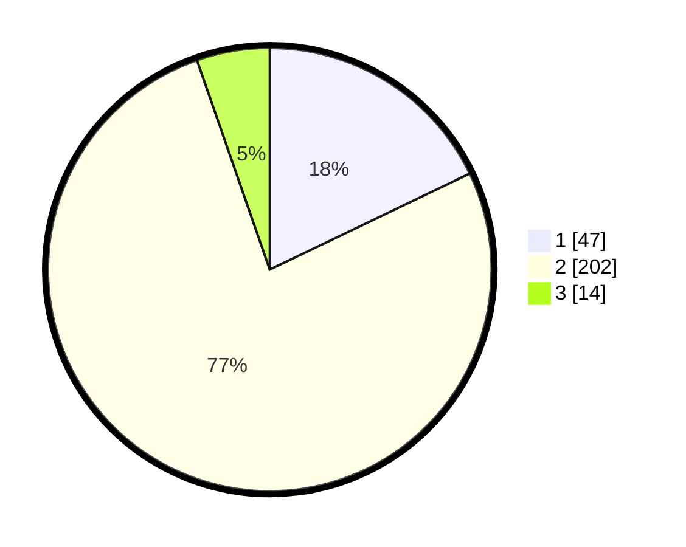

# Hasil

## Grafik

## Tabel

| No. | Nama Paslon    | Suara | Suara (raw) | Persentase |
|:--- |:-------------- | -----:| -----------:| ----------:|
| 1   | ANIES MUHAIMIN | 47    | [47][p-1]   | 17,87      |
| 2   | PRABOWO GIBRAN | 202   | [202][p-2]  | 76,81      |
| 3   | GANJAR MAHFUD  | 14    | [14][p-3]   | 5,32       |

[p-1]: https://github.com/gigit-pemilu/pemilu-2024/blob/main/pilpres/hitung-suara/sub/61-kalimantan-barat/sub/10-melawi/sub/02-nanga-pinoh/sub/2007-nanga-kebebu/sub/001-tps/sub/paslon-1.txt
[p-2]: https://github.com/gigit-pemilu/pemilu-2024/blob/main/pilpres/hitung-suara/sub/61-kalimantan-barat/sub/10-melawi/sub/02-nanga-pinoh/sub/2007-nanga-kebebu/sub/001-tps/sub/paslon-2.txt
[p-3]: https://github.com/gigit-pemilu/pemilu-2024/blob/main/pilpres/hitung-suara/sub/61-kalimantan-barat/sub/10-melawi/sub/02-nanga-pinoh/sub/2007-nanga-kebebu/sub/001-tps/sub/paslon-3.txt

## Foto C Plano

https://sirekap-obj-formc.kpu.go.id/c8bf/pemilu/ppwp/61/10/02/20/07/6110022007001-20240215-085345--f0d19521-2838-48f8-816a-63088d690613.jpg

https://sirekap-obj-formc.kpu.go.id/c8bf/pemilu/ppwp/61/10/02/20/07/6110022007001-20240215-085612--3553d5f9-c1a9-4641-b096-95416d82240b.jpg

https://sirekap-obj-formc.kpu.go.id/c8bf/pemilu/ppwp/61/10/02/20/07/6110022007001-20240215-085711--58043e66-0b14-40fa-9fc3-2729f50e8f68.jpg

## Metadata

| Key        | Value               |
| ---------- | ------------------- |
| Time Stamp | 2024-02-15 22:00:27 |

