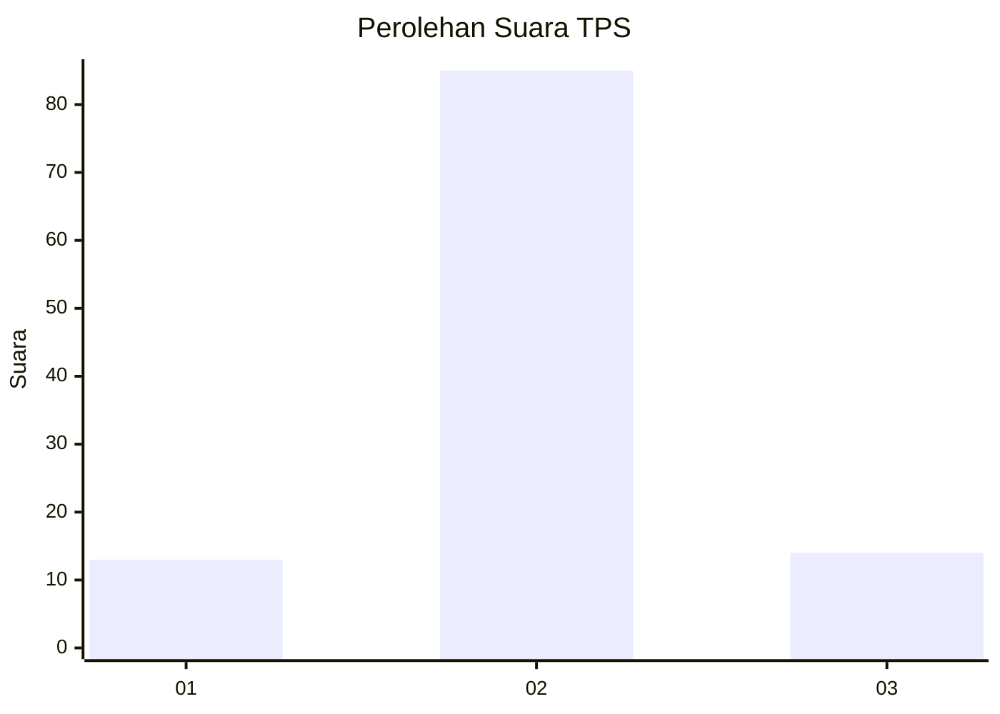
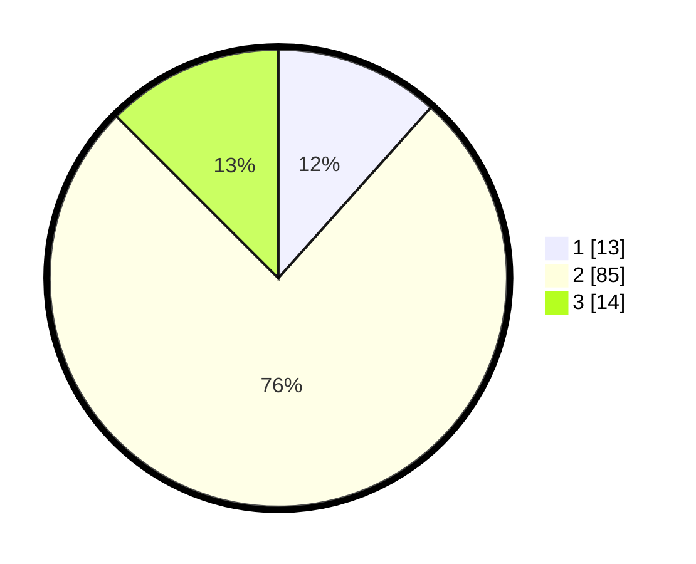

# Hasil

## Grafik

## Tabel

| No. | Nama Paslon    | Suara | Suara (raw) | Persentase |
|:--- |:-------------- | -----:| -----------:| ----------:|
| 1   | ANIES MUHAIMIN | 13    | [13][p-1]   | 11,61      |
| 2   | PRABOWO GIBRAN | 85    | [85][p-2]   | 75,89      |
| 3   | GANJAR MAHFUD  | 14    | [14][p-3]   | 12,50      |

[p-1]: https://github.com/gigit-pemilu/pemilu-2024-61-kalimantan-barat/blob/main/pilpres/hitung-suara/sub/61-kalimantan-barat/sub/10-melawi/sub/02-nanga-pinoh/sub/2007-nanga-kebebu/sub/003-tps/sub/paslon-1.txt
[p-2]: https://github.com/gigit-pemilu/pemilu-2024-61-kalimantan-barat/blob/main/pilpres/hitung-suara/sub/61-kalimantan-barat/sub/10-melawi/sub/02-nanga-pinoh/sub/2007-nanga-kebebu/sub/003-tps/sub/paslon-2.txt
[p-3]: https://github.com/gigit-pemilu/pemilu-2024-61-kalimantan-barat/blob/main/pilpres/hitung-suara/sub/61-kalimantan-barat/sub/10-melawi/sub/02-nanga-pinoh/sub/2007-nanga-kebebu/sub/003-tps/sub/paslon-3.txt

## Foto C Plano

https://sirekap-obj-formc.kpu.go.id/2ff7/pemilu/ppwp/61/10/02/20/07/6110022007003-20240221-093258--0669d7a8-b0ec-481d-9400-ac93df33c8c8.jpg

https://sirekap-obj-formc.kpu.go.id/2ff7/pemilu/ppwp/61/10/02/20/07/6110022007003-20240221-093356--4caa628c-f65d-4037-92ef-ffa71c04a5a9.jpg

https://sirekap-obj-formc.kpu.go.id/2ff7/pemilu/ppwp/61/10/02/20/07/6110022007003-20240221-093425--dab1a0f6-1287-452e-a93b-2f788b61025c.jpg

## Metadata

| Key        | Value               |
| ---------- | ------------------- |
| Time Stamp | 2024-02-25 08:00:00 |

