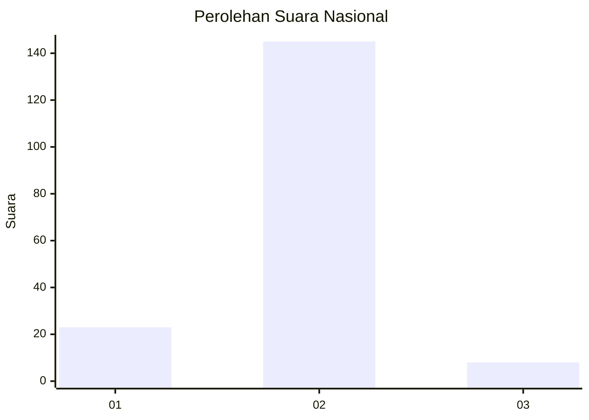
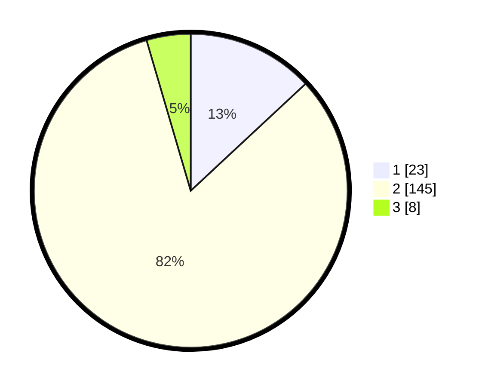

# Hasil

## Grafik

## Tabel

| No. | Nama Paslon    | Suara | Suara (raw) | Persentase |
|:--- |:-------------- | -----:| -----------:| ----------:|
| 1   | ANIES MUHAIMIN | 23    | [23][p-1]   | 13,07      |
| 2   | PRABOWO GIBRAN | 145   | [145][p-2]  | 82,39      |
| 3   | GANJAR MAHFUD  | 8     | [8][p-3]    | 4,55       |

[p-1]: https://github.com/gigit-pemilu/pemilu-2024/blob/main/pilpres/hitung-suara/sub/61-kalimantan-barat/sub/10-melawi/sub/02-nanga-pinoh/sub/2007-nanga-kebebu/sub/004-tps/sub/paslon-1.txt
[p-2]: https://github.com/gigit-pemilu/pemilu-2024/blob/main/pilpres/hitung-suara/sub/61-kalimantan-barat/sub/10-melawi/sub/02-nanga-pinoh/sub/2007-nanga-kebebu/sub/004-tps/sub/paslon-2.txt
[p-3]: https://github.com/gigit-pemilu/pemilu-2024/blob/main/pilpres/hitung-suara/sub/61-kalimantan-barat/sub/10-melawi/sub/02-nanga-pinoh/sub/2007-nanga-kebebu/sub/004-tps/sub/paslon-3.txt

## Foto C Plano

https://sirekap-obj-formc.kpu.go.id/f2a9/pemilu/ppwp/61/10/02/20/07/6110022007004-20240221-101327--67ce9730-1809-4c7d-889d-617de8427869.jpg

https://sirekap-obj-formc.kpu.go.id/f2a9/pemilu/ppwp/61/10/02/20/07/6110022007004-20240221-101402--a8f9d62a-2402-48de-bd07-4b4ddcc5cf9d.jpg

https://sirekap-obj-formc.kpu.go.id/f2a9/pemilu/ppwp/61/10/02/20/07/6110022007004-20240221-101430--b1c080f7-5564-460e-a217-86bbc5741c63.jpg

## Metadata

| Key        | Value               |
| ---------- | ------------------- |
| Time Stamp | 2024-02-25 15:00:00 |

