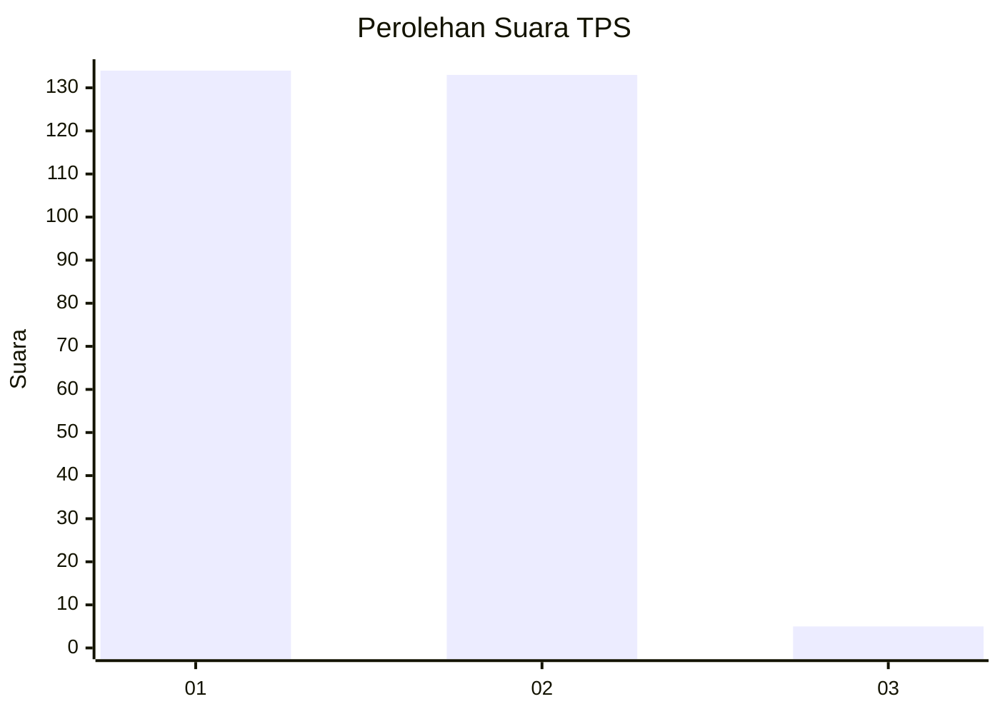
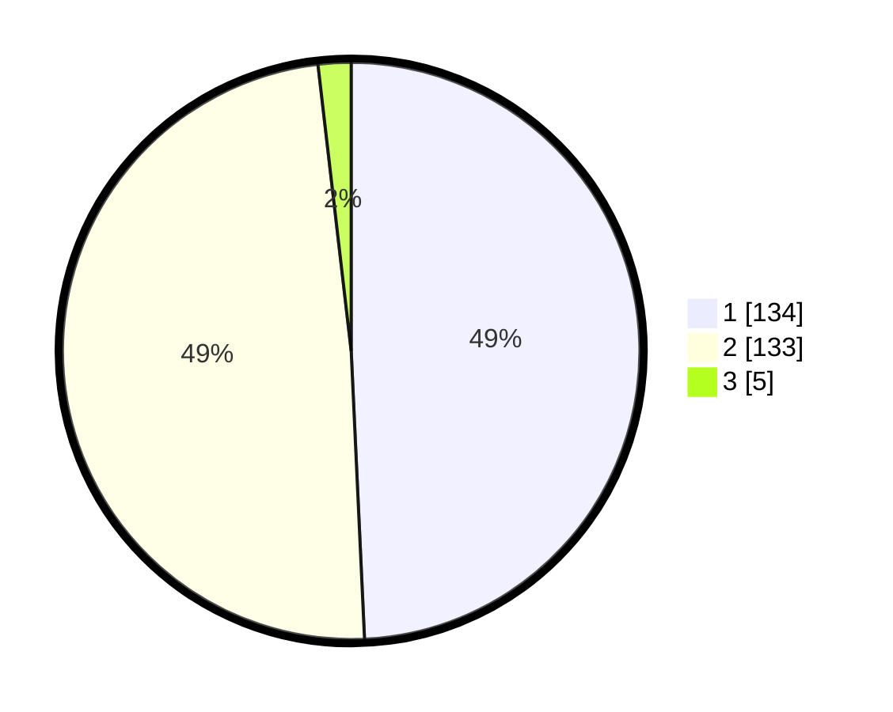

# Hasil

## Grafik

## Tabel

| No. | Nama Paslon    | Suara | Suara (raw) | Persentase |
|:--- |:-------------- | -----:| -----------:| ----------:|
| 1   | ANIES MUHAIMIN | 134   | [134][p-1]  | 49,26      |
| 2   | PRABOWO GIBRAN | 133   | [133][p-2]  | 48,90      |
| 3   | GANJAR MAHFUD  | 5     | [5][p-3]    | 1,84       |

[p-1]: https://github.com/gigit-pemilu/pemilu-2024-61-kalimantan-barat/blob/main/pilpres/hitung-suara/sub/61-kalimantan-barat/sub/10-melawi/sub/02-nanga-pinoh/sub/2008-nanga-kayan/sub/001-tps/sub/paslon-1.txt
[p-2]: https://github.com/gigit-pemilu/pemilu-2024-61-kalimantan-barat/blob/main/pilpres/hitung-suara/sub/61-kalimantan-barat/sub/10-melawi/sub/02-nanga-pinoh/sub/2008-nanga-kayan/sub/001-tps/sub/paslon-2.txt
[p-3]: https://github.com/gigit-pemilu/pemilu-2024-61-kalimantan-barat/blob/main/pilpres/hitung-suara/sub/61-kalimantan-barat/sub/10-melawi/sub/02-nanga-pinoh/sub/2008-nanga-kayan/sub/001-tps/sub/paslon-3.txt

## Foto C Plano

https://sirekap-obj-formc.kpu.go.id/250e/pemilu/ppwp/61/10/02/20/08/6110022008001-20240222-103533--5d1e652d-1b71-4b82-915c-91ebb607b668.jpg

https://sirekap-obj-formc.kpu.go.id/250e/pemilu/ppwp/61/10/02/20/08/6110022008001-20240222-103610--10f4cc92-0583-471a-b25b-f4a15020840c.jpg

https://sirekap-obj-formc.kpu.go.id/250e/pemilu/ppwp/61/10/02/20/08/6110022008001-20240222-103651--abe537cf-7edf-4f8a-a5ee-e14d4e8ec0c2.jpg

## Metadata

| Key        | Value               |
| ---------- | ------------------- |
| Time Stamp | 2024-02-25 17:00:00 |

