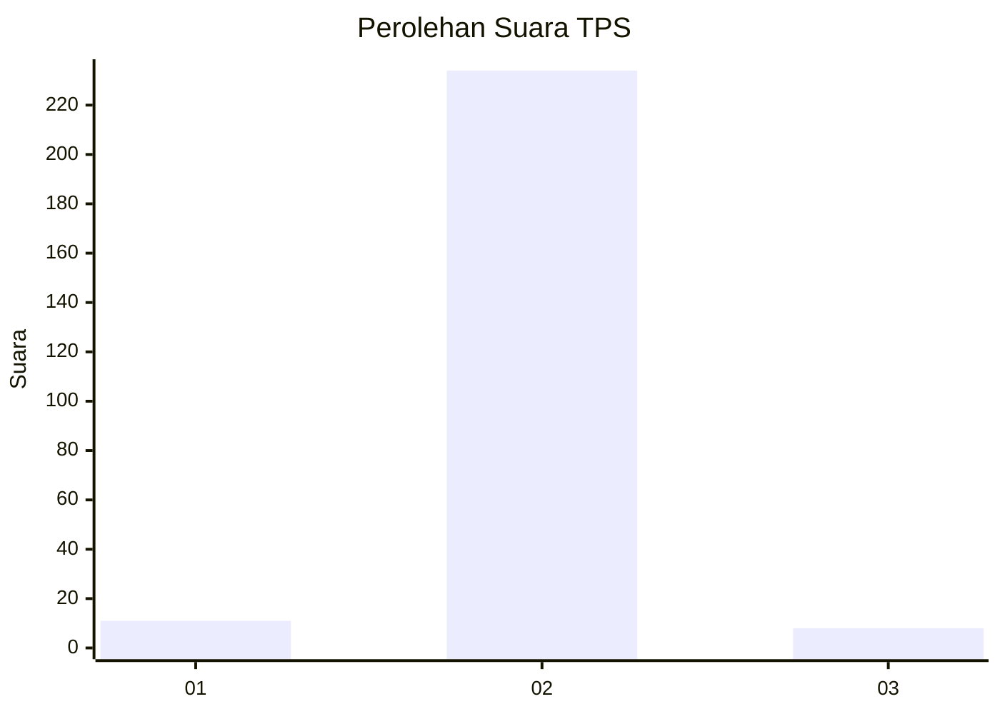
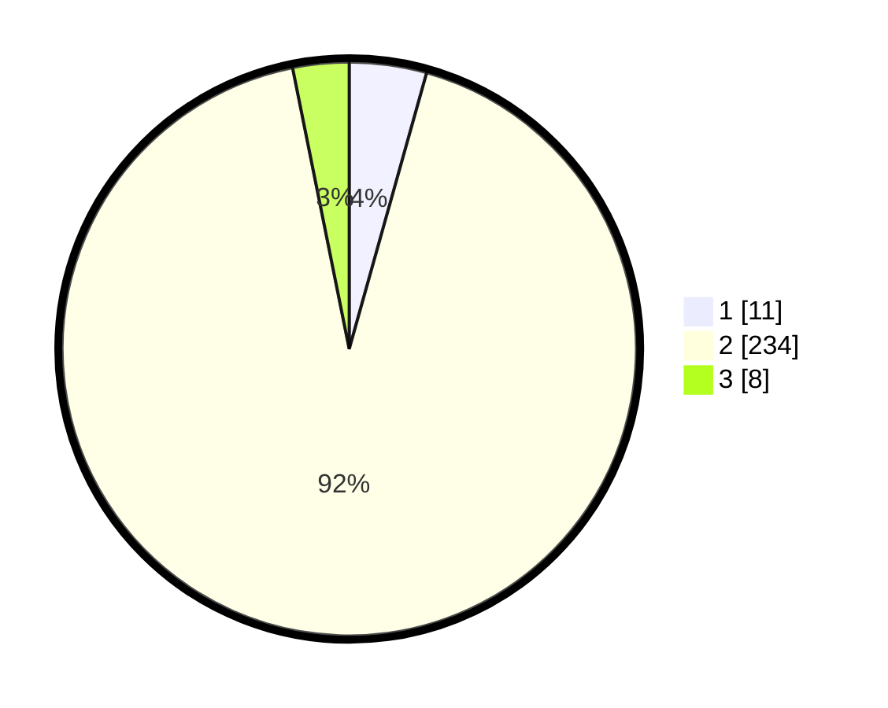

# Hasil

## Grafik

## Tabel

| No. | Nama Paslon    | Suara | Suara (raw) | Persentase |
|:--- |:-------------- | -----:| -----------:| ----------:|
| 1   | ANIES MUHAIMIN | 11    | [11][p-1]   | 4,35       |
| 2   | PRABOWO GIBRAN | 234   | [234][p-2]  | 92,49      |
| 3   | GANJAR MAHFUD  | 8     | [8][p-3]    | 3,16       |

[p-1]: https://github.com/gigit-pemilu/pemilu-2024-61-kalimantan-barat/blob/main/pilpres/hitung-suara/sub/61-kalimantan-barat/sub/10-melawi/sub/02-nanga-pinoh/sub/2008-nanga-kayan/sub/008-tps/sub/paslon-1.txt
[p-2]: https://github.com/gigit-pemilu/pemilu-2024-61-kalimantan-barat/blob/main/pilpres/hitung-suara/sub/61-kalimantan-barat/sub/10-melawi/sub/02-nanga-pinoh/sub/2008-nanga-kayan/sub/008-tps/sub/paslon-2.txt
[p-3]: https://github.com/gigit-pemilu/pemilu-2024-61-kalimantan-barat/blob/main/pilpres/hitung-suara/sub/61-kalimantan-barat/sub/10-melawi/sub/02-nanga-pinoh/sub/2008-nanga-kayan/sub/008-tps/sub/paslon-3.txt

## Foto C Plano

https://sirekap-obj-formc.kpu.go.id/7d8b/pemilu/ppwp/61/10/02/20/08/6110022008008-20240222-160234--5e9d013d-9b7e-4e54-b013-1804fa31a286.jpg

https://sirekap-obj-formc.kpu.go.id/7d8b/pemilu/ppwp/61/10/02/20/08/6110022008008-20240222-160306--be6a37f2-cc72-4dd8-b981-4931d1517852.jpg

https://sirekap-obj-formc.kpu.go.id/7d8b/pemilu/ppwp/61/10/02/20/08/6110022008008-20240222-160332--e7125d5b-f371-4330-9f2c-d7a1fe2028db.jpg

## Metadata

| Key        | Value               |
| ---------- | ------------------- |
| Time Stamp | 2024-02-24 22:31:28 |

