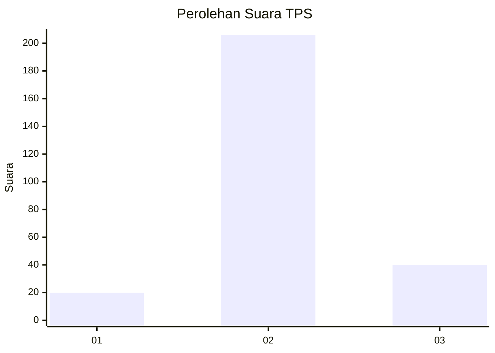

# Hasil

## Grafik

## Tabel

| No. | Nama Paslon    | Suara | Suara (raw) | Persentase |
|:--- |:-------------- | -----:| -----------:| ----------:|
| 1   | ANIES MUHAIMIN | 20    | [20][p-1]   | 7,52       |
| 2   | PRABOWO GIBRAN | 206   | [206][p-2]  | 77,44      |
| 3   | GANJAR MAHFUD  | 40    | [40][p-3]   | 15,04      |

[p-1]: https://github.com/gigit-pemilu/pemilu-2024-61-kalimantan-barat/blob/main/pilpres/hitung-suara/sub/61-kalimantan-barat/sub/10-melawi/sub/02-nanga-pinoh/sub/2021-tanjung-sari/sub/003-tps/sub/paslon-1.txt
[p-2]: https://github.com/gigit-pemilu/pemilu-2024-61-kalimantan-barat/blob/main/pilpres/hitung-suara/sub/61-kalimantan-barat/sub/10-melawi/sub/02-nanga-pinoh/sub/2021-tanjung-sari/sub/003-tps/sub/paslon-2.txt
[p-3]: https://github.com/gigit-pemilu/pemilu-2024-61-kalimantan-barat/blob/main/pilpres/hitung-suara/sub/61-kalimantan-barat/sub/10-melawi/sub/02-nanga-pinoh/sub/2021-tanjung-sari/sub/003-tps/sub/paslon-3.txt

## Foto C Plano

https://sirekap-obj-formc.kpu.go.id/7a88/pemilu/ppwp/61/10/02/20/21/6110022021003-20240220-211905--ef412f8b-91bd-43c2-848a-830ed9130763.jpg

https://sirekap-obj-formc.kpu.go.id/7a88/pemilu/ppwp/61/10/02/20/21/6110022021003-20240220-211932--1d7c830e-bad7-4573-83e8-4e51c6969156.jpg

https://sirekap-obj-formc.kpu.go.id/7a88/pemilu/ppwp/61/10/02/20/21/6110022021003-20240220-211953--65de85e7-f8ef-4924-932f-c9af0d8dcd63.jpg

## Metadata

| Key        | Value               |
| ---------- | ------------------- |
| Time Stamp | 2024-02-24 22:31:28 |

