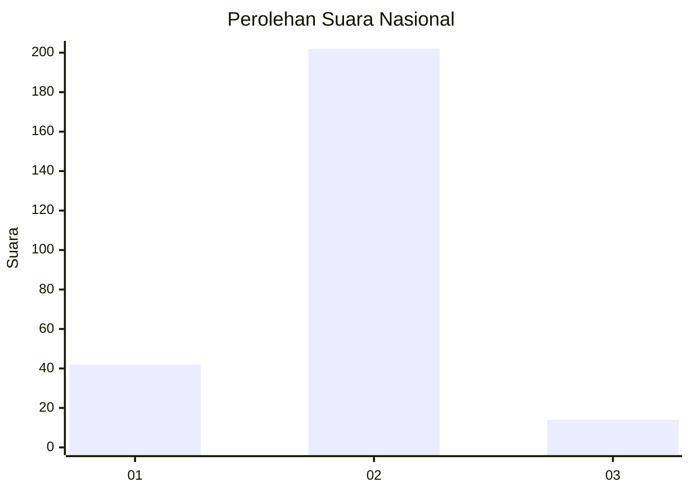
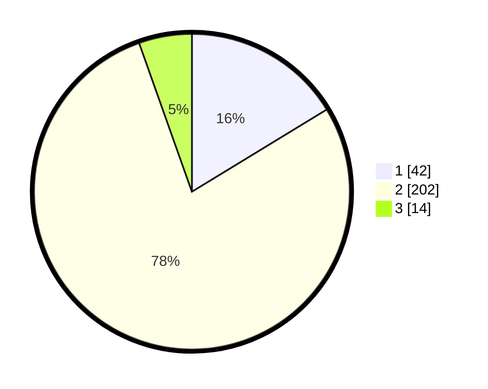

# Hasil

## Grafik

## Tabel

| No. | Nama Paslon    | Suara | Suara (raw) | Persentase |
|:--- |:-------------- | -----:| -----------:| ----------:|
| 1   | ANIES MUHAIMIN | 42    | [42][p-1]   | 16,28      |
| 2   | PRABOWO GIBRAN | 202   | [202][p-2]  | 78,29      |
| 3   | GANJAR MAHFUD  | 14    | [14][p-3]   | 5,43       |

[p-1]: https://github.com/gigit-pemilu/pemilu-2024/blob/main/pilpres/hitung-suara/sub/61-kalimantan-barat/sub/10-melawi/sub/02-nanga-pinoh/sub/2023-tanjung-lay/sub/002-tps/sub/paslon-1.txt
[p-2]: https://github.com/gigit-pemilu/pemilu-2024/blob/main/pilpres/hitung-suara/sub/61-kalimantan-barat/sub/10-melawi/sub/02-nanga-pinoh/sub/2023-tanjung-lay/sub/002-tps/sub/paslon-2.txt
[p-3]: https://github.com/gigit-pemilu/pemilu-2024/blob/main/pilpres/hitung-suara/sub/61-kalimantan-barat/sub/10-melawi/sub/02-nanga-pinoh/sub/2023-tanjung-lay/sub/002-tps/sub/paslon-3.txt

## Foto C Plano

https://sirekap-obj-formc.kpu.go.id/3309/pemilu/ppwp/61/10/02/20/23/6110022023002-20240221-211902--7967d574-ddc2-4394-99f5-dfd546f4a2aa.jpg

https://sirekap-obj-formc.kpu.go.id/3309/pemilu/ppwp/61/10/02/20/23/6110022023002-20240221-211934--39835434-98a6-4125-b294-9463efb36b6a.jpg

https://sirekap-obj-formc.kpu.go.id/3309/pemilu/ppwp/61/10/02/20/23/6110022023002-20240221-212008--0a5cbf2e-a1c9-40ff-b78e-d447c797f84d.jpg

## Metadata

| Key        | Value               |
| ---------- | ------------------- |
| Time Stamp | 2024-02-25 16:00:00 |

