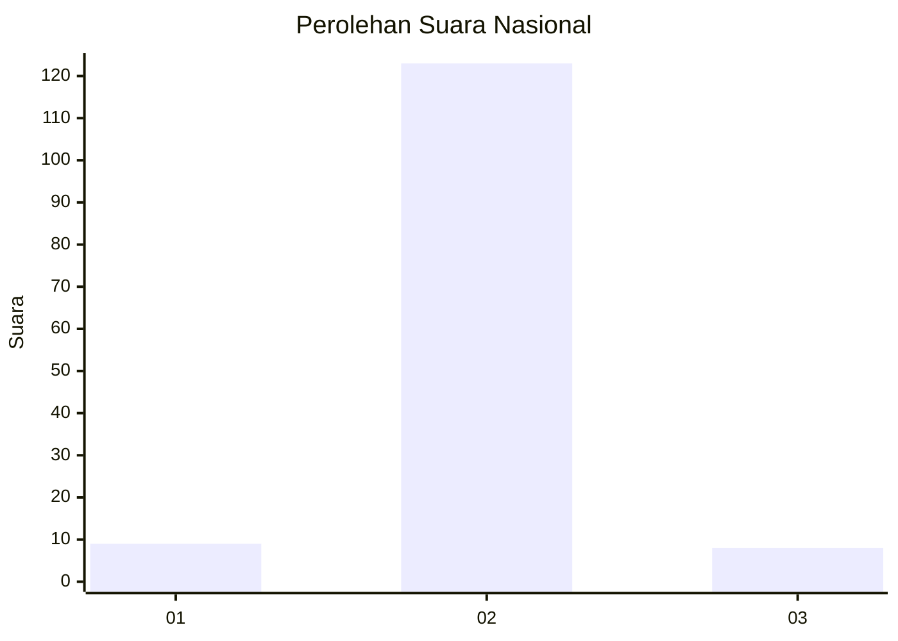
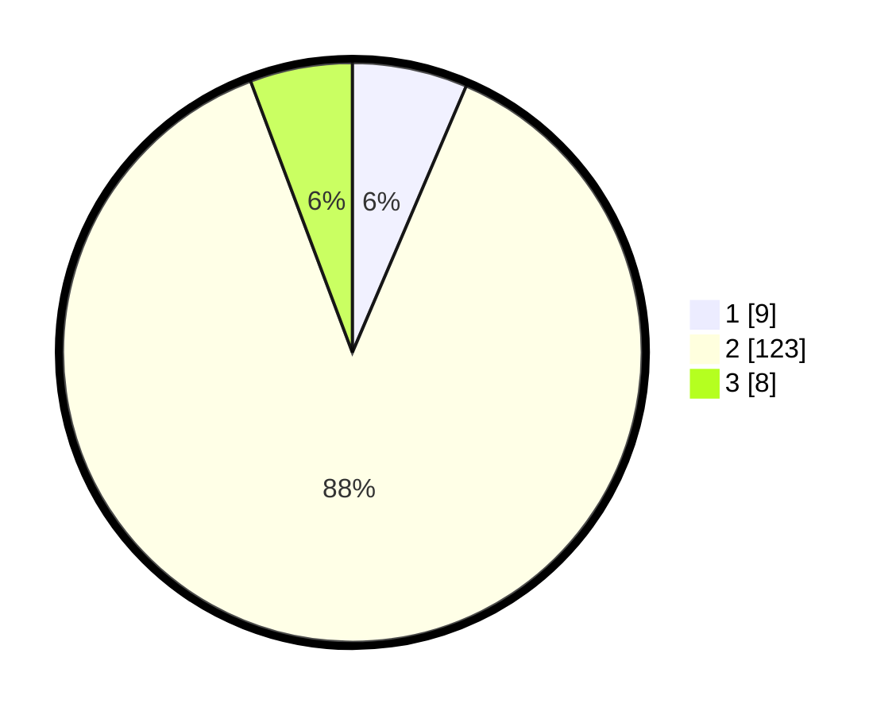

# Hasil

## Grafik

## Tabel

| No. | Nama Paslon    | Suara | Suara (raw) | Persentase |
|:--- |:-------------- | -----:| -----------:| ----------:|
| 1   | ANIES MUHAIMIN | 9     | [9][p-1]    | 6,43       |
| 2   | PRABOWO GIBRAN | 123   | [123][p-2]  | 87,86      |
| 3   | GANJAR MAHFUD  | 8     | [8][p-3]    | 5,71       |

[p-1]: https://github.com/gigit-pemilu/pemilu-2024/blob/main/pilpres/hitung-suara/sub/61-kalimantan-barat/sub/10-melawi/sub/02-nanga-pinoh/sub/2024-labai-mandiri/sub/002-tps/sub/paslon-1.txt
[p-2]: https://github.com/gigit-pemilu/pemilu-2024/blob/main/pilpres/hitung-suara/sub/61-kalimantan-barat/sub/10-melawi/sub/02-nanga-pinoh/sub/2024-labai-mandiri/sub/002-tps/sub/paslon-2.txt
[p-3]: https://github.com/gigit-pemilu/pemilu-2024/blob/main/pilpres/hitung-suara/sub/61-kalimantan-barat/sub/10-melawi/sub/02-nanga-pinoh/sub/2024-labai-mandiri/sub/002-tps/sub/paslon-3.txt

## Foto C Plano

https://sirekap-obj-formc.kpu.go.id/447c/pemilu/ppwp/61/10/02/20/24/6110022024002-20240221-142154--d0af79b1-7b67-4d82-bc4a-036d240dfb72.jpg

https://sirekap-obj-formc.kpu.go.id/447c/pemilu/ppwp/61/10/02/20/24/6110022024002-20240221-142216--300a3e7e-e302-455b-b010-a0c5b1b7f895.jpg

https://sirekap-obj-formc.kpu.go.id/447c/pemilu/ppwp/61/10/02/20/24/6110022024002-20240221-142243--673da7e6-ab69-4906-a9e4-3f727431a912.jpg

## Metadata

| Key        | Value               |
| ---------- | ------------------- |
| Time Stamp | 2024-02-24 22:31:28 |

