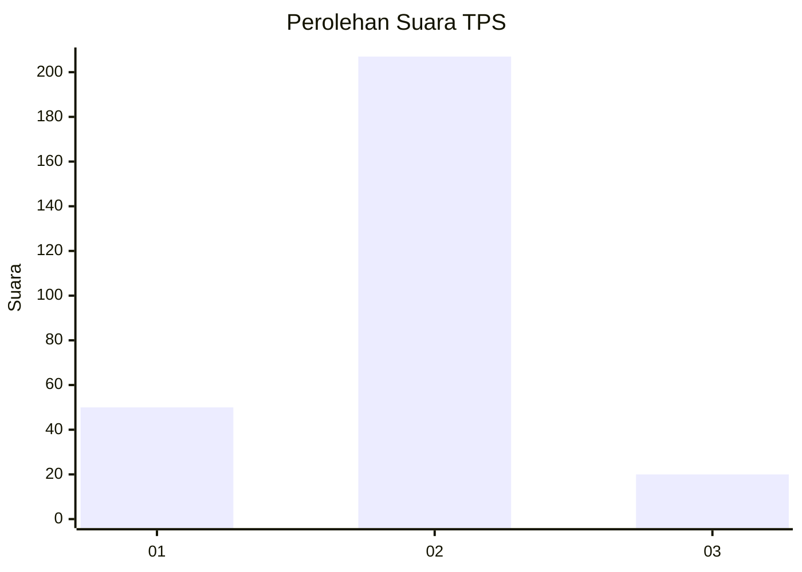
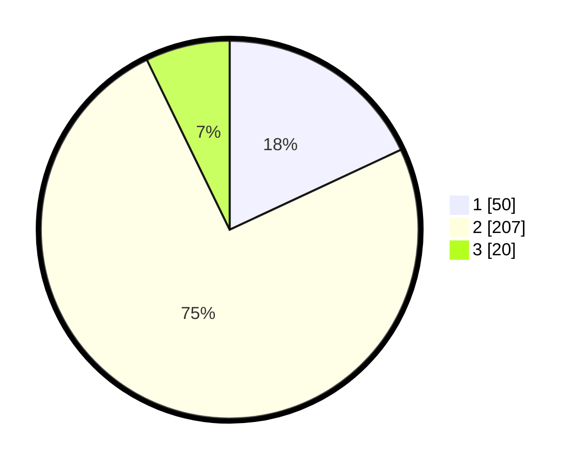

# Hasil

## Grafik

## Tabel

| No. | Nama Paslon    | Suara | Suara (raw) | Persentase |
|:--- |:-------------- | -----:| -----------:| ----------:|
| 1   | ANIES MUHAIMIN | 50    | [50][p-1]   | 18,05      |
| 2   | PRABOWO GIBRAN | 207   | [207][p-2]  | 74,73      |
| 3   | GANJAR MAHFUD  | 20    | [20][p-3]   | 7,22       |

[p-1]: https://github.com/gigit-pemilu/pemilu-2024-61-kalimantan-barat/blob/main/pilpres/hitung-suara/sub/61-kalimantan-barat/sub/10-melawi/sub/02-nanga-pinoh/sub/2024-labai-mandiri/sub/003-tps/sub/paslon-1.txt
[p-2]: https://github.com/gigit-pemilu/pemilu-2024-61-kalimantan-barat/blob/main/pilpres/hitung-suara/sub/61-kalimantan-barat/sub/10-melawi/sub/02-nanga-pinoh/sub/2024-labai-mandiri/sub/003-tps/sub/paslon-2.txt
[p-3]: https://github.com/gigit-pemilu/pemilu-2024-61-kalimantan-barat/blob/main/pilpres/hitung-suara/sub/61-kalimantan-barat/sub/10-melawi/sub/02-nanga-pinoh/sub/2024-labai-mandiri/sub/003-tps/sub/paslon-3.txt

## Foto C Plano

https://sirekap-obj-formc.kpu.go.id/7cb4/pemilu/ppwp/61/10/02/20/24/6110022024003-20240221-153631--d8911d4b-9c06-4856-9c0f-68743021c7c8.jpg

https://sirekap-obj-formc.kpu.go.id/7cb4/pemilu/ppwp/61/10/02/20/24/6110022024003-20240221-153714--ee2528c4-9914-449b-ad8c-5a0a05231e9d.jpg

https://sirekap-obj-formc.kpu.go.id/7cb4/pemilu/ppwp/61/10/02/20/24/6110022024003-20240221-153812--6fbf7c9a-b16b-4746-8a4e-4ce4375a149e.jpg

## Metadata

| Key        | Value               |
| ---------- | ------------------- |
| Time Stamp | 2024-02-25 13:00:00 |

