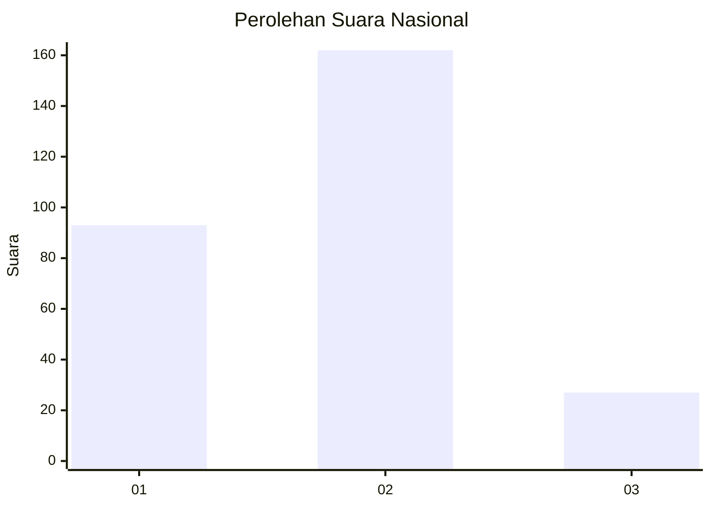
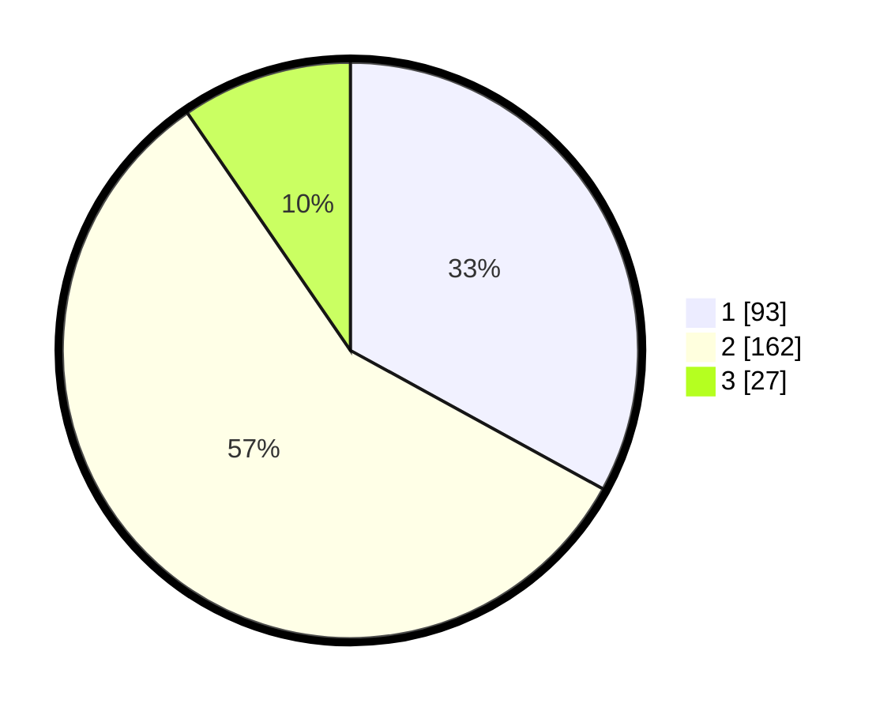

# Hasil

## Grafik

## Tabel

| No. | Nama Paslon    | Suara | Suara (raw) | Persentase |
|:--- |:-------------- | -----:| -----------:| ----------:|
| 1   | ANIES MUHAIMIN | 93    | [93][p-1]   | 32,98      |
| 2   | PRABOWO GIBRAN | 162   | [162][p-2]  | 57,45      |
| 3   | GANJAR MAHFUD  | 27    | [27][p-3]   | 9,57       |

[p-1]: https://github.com/gigit-pemilu/pemilu-2024/blob/main/pilpres/hitung-suara/sub/61-kalimantan-barat/sub/10-melawi/sub/02-nanga-pinoh/sub/2026-nusa-pandau/sub/001-tps/sub/paslon-1.txt
[p-2]: https://github.com/gigit-pemilu/pemilu-2024/blob/main/pilpres/hitung-suara/sub/61-kalimantan-barat/sub/10-melawi/sub/02-nanga-pinoh/sub/2026-nusa-pandau/sub/001-tps/sub/paslon-2.txt
[p-3]: https://github.com/gigit-pemilu/pemilu-2024/blob/main/pilpres/hitung-suara/sub/61-kalimantan-barat/sub/10-melawi/sub/02-nanga-pinoh/sub/2026-nusa-pandau/sub/001-tps/sub/paslon-3.txt

## Foto C Plano

https://sirekap-obj-formc.kpu.go.id/1752/pemilu/ppwp/61/10/02/20/26/6110022026001-20240220-150602--dc70ab9d-a222-478b-acad-c2b5170751a8.jpg

https://sirekap-obj-formc.kpu.go.id/1752/pemilu/ppwp/61/10/02/20/26/6110022026001-20240220-150731--a61ff59b-0ac9-4062-8716-35c3ae429bd8.jpg

https://sirekap-obj-formc.kpu.go.id/1752/pemilu/ppwp/61/10/02/20/26/6110022026001-20240220-150753--ac4c13a9-607c-4b6e-9169-2c0102399feb.jpg

## Metadata

| Key        | Value               |
| ---------- | ------------------- |
| Time Stamp | 2024-02-25 15:00:00 |

