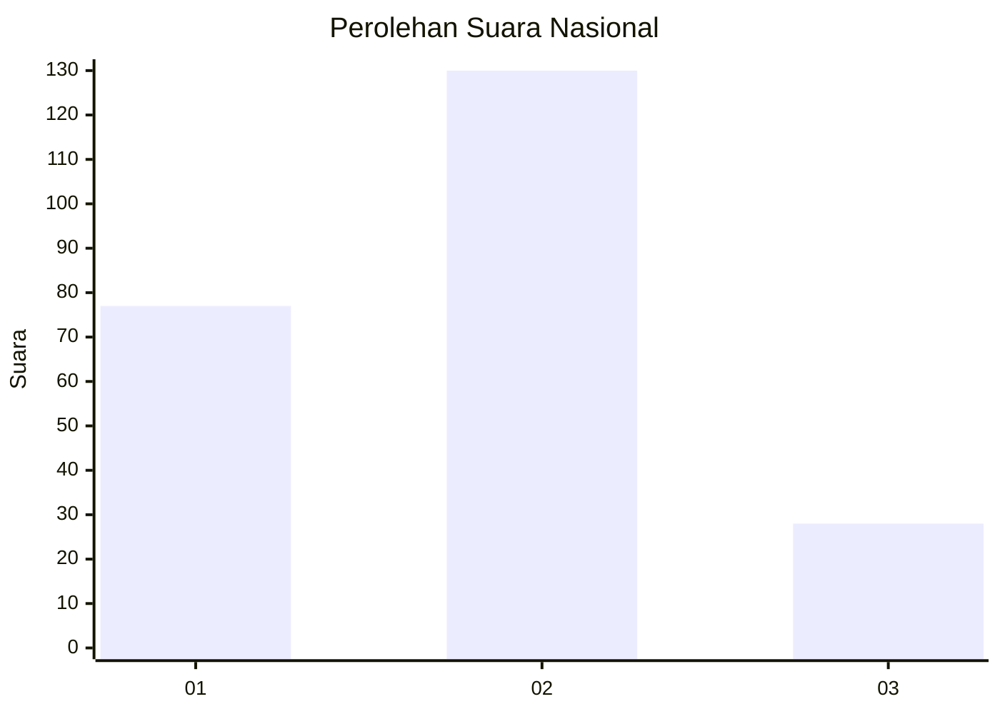
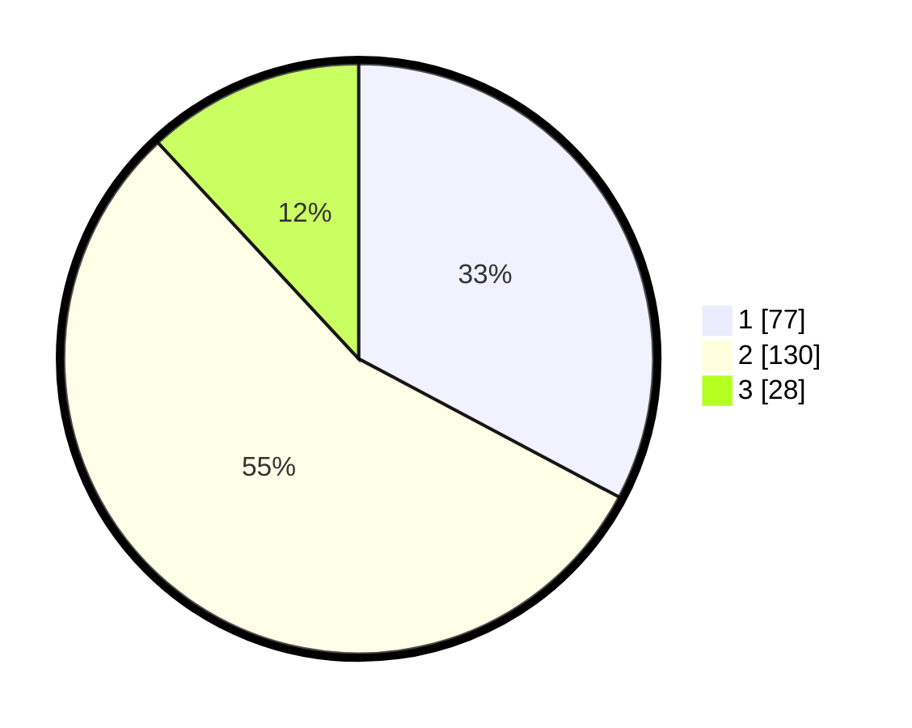

# Hasil

## Grafik

## Tabel

| No. | Nama Paslon    | Suara | Suara (raw) | Persentase |
|:--- |:-------------- | -----:| -----------:| ----------:|
| 1   | ANIES MUHAIMIN | 77    | [77][p-1]   | 32,77      |
| 2   | PRABOWO GIBRAN | 130   | [130][p-2]  | 55,32      |
| 3   | GANJAR MAHFUD  | 28    | [28][p-3]   | 11,91      |

[p-1]: https://github.com/gigit-pemilu/pemilu-2024/blob/main/pilpres/hitung-suara/sub/61-kalimantan-barat/sub/10-melawi/sub/02-nanga-pinoh/sub/2042-tanjung-tengang/sub/001-tps/sub/paslon-1.txt
[p-2]: https://github.com/gigit-pemilu/pemilu-2024/blob/main/pilpres/hitung-suara/sub/61-kalimantan-barat/sub/10-melawi/sub/02-nanga-pinoh/sub/2042-tanjung-tengang/sub/001-tps/sub/paslon-2.txt
[p-3]: https://github.com/gigit-pemilu/pemilu-2024/blob/main/pilpres/hitung-suara/sub/61-kalimantan-barat/sub/10-melawi/sub/02-nanga-pinoh/sub/2042-tanjung-tengang/sub/001-tps/sub/paslon-3.txt

## Foto C Plano

https://sirekap-obj-formc.kpu.go.id/784e/pemilu/ppwp/61/10/02/20/42/6110022042001-20240220-141002--0d73c4da-0ebb-47f0-a3ad-2d45f3aff365.jpg

https://sirekap-obj-formc.kpu.go.id/784e/pemilu/ppwp/61/10/02/20/42/6110022042001-20240220-141302--6eba3f5a-f235-4d3d-a880-6082b1435716.jpg

https://sirekap-obj-formc.kpu.go.id/784e/pemilu/ppwp/61/10/02/20/42/6110022042001-20240220-141337--71c9bb7a-f5a5-44db-bf2a-9012aa2cd0b3.jpg

## Metadata

| Key        | Value               |
| ---------- | ------------------- |
| Time Stamp | 2024-02-24 22:31:28 |

