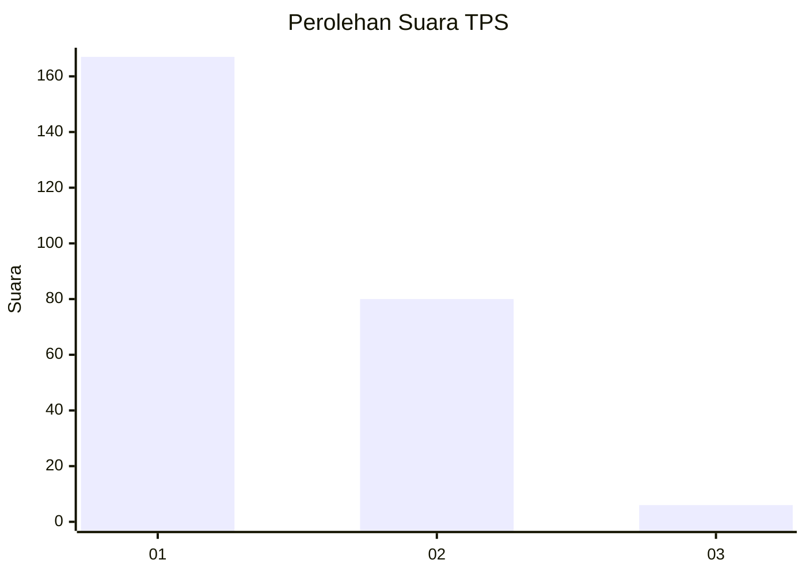
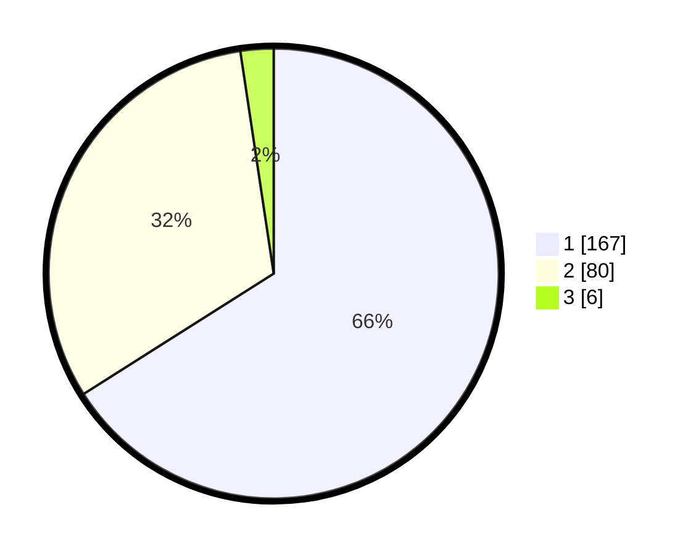

# Hasil

## Grafik

## Tabel

| No. | Nama Paslon    | Suara | Suara (raw) | Persentase |
|:--- |:-------------- | -----:| -----------:| ----------:|
| 1   | ANIES MUHAIMIN | 167   | [167][p-1]  | 66,01      |
| 2   | PRABOWO GIBRAN | 80    | [80][p-2]   | 31,62      |
| 3   | GANJAR MAHFUD  | 6     | [6][p-3]    | 2,37       |

[p-1]: https://github.com/gigit-pemilu/pemilu-2024-61-kalimantan-barat/blob/main/pilpres/hitung-suara/sub/61-kalimantan-barat/sub/10-melawi/sub/03-ella-hilir/sub/2001-nanga-ella-hilir/sub/001-tps/sub/paslon-1.txt
[p-2]: https://github.com/gigit-pemilu/pemilu-2024-61-kalimantan-barat/blob/main/pilpres/hitung-suara/sub/61-kalimantan-barat/sub/10-melawi/sub/03-ella-hilir/sub/2001-nanga-ella-hilir/sub/001-tps/sub/paslon-2.txt
[p-3]: https://github.com/gigit-pemilu/pemilu-2024-61-kalimantan-barat/blob/main/pilpres/hitung-suara/sub/61-kalimantan-barat/sub/10-melawi/sub/03-ella-hilir/sub/2001-nanga-ella-hilir/sub/001-tps/sub/paslon-3.txt

## Foto C Plano

https://sirekap-obj-formc.kpu.go.id/9e2b/pemilu/ppwp/61/10/03/20/01/6110032001001-20240215-004217--54ab22eb-b9c0-4502-835e-6ca512ac281d.jpg

https://sirekap-obj-formc.kpu.go.id/9e2b/pemilu/ppwp/61/10/03/20/01/6110032001001-20240215-221750--70743663-6e56-4173-a1eb-eea3f528f974.jpg

https://sirekap-obj-formc.kpu.go.id/9e2b/pemilu/ppwp/61/10/03/20/01/6110032001001-20240215-230059--d20f4e11-632c-45f4-99bc-61a0d529ef5a.jpg

## Metadata

| Key        | Value               |
| ---------- | ------------------- |
| Time Stamp | 2024-02-16 21:01:00 |

