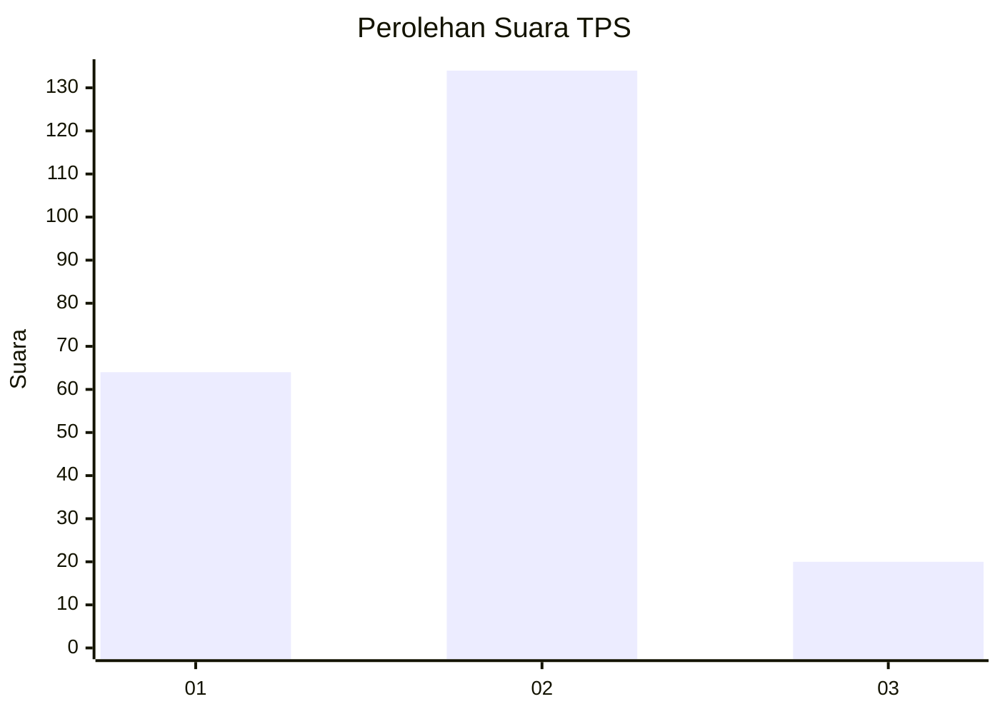
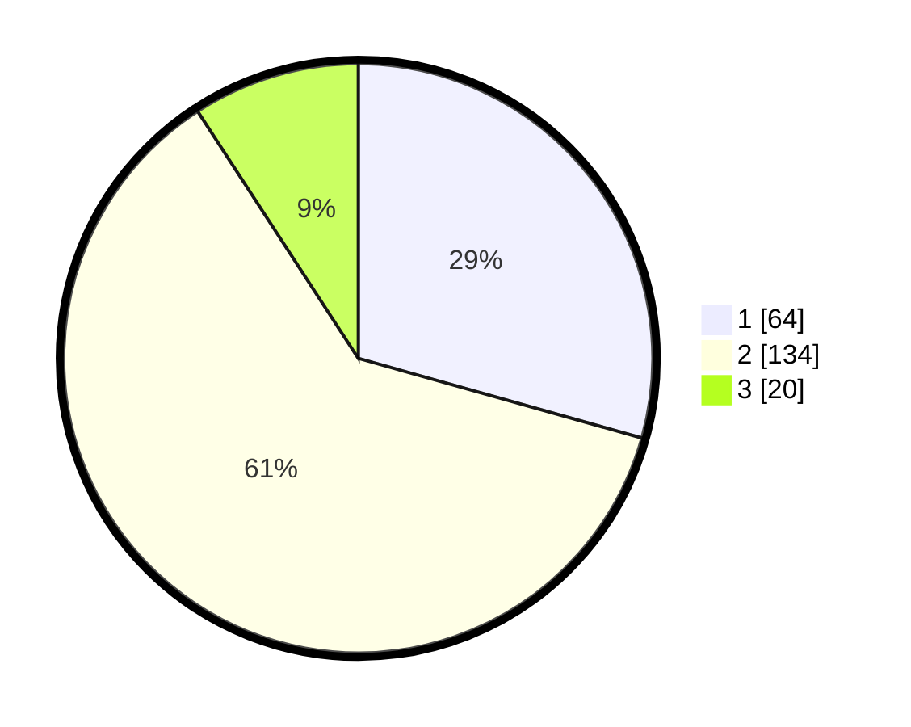

# Hasil

## Grafik

## Tabel

| No. | Nama Paslon    | Suara | Suara (raw) | Persentase |
|:--- |:-------------- | -----:| -----------:| ----------:|
| 1   | ANIES MUHAIMIN | 64    | [64][p-1]   | 29,36      |
| 2   | PRABOWO GIBRAN | 134   | [134][p-2]  | 61,47      |
| 3   | GANJAR MAHFUD  | 20    | [20][p-3]   | 9,17       |

[p-1]: https://github.com/gigit-pemilu/pemilu-2024-61-kalimantan-barat/blob/main/pilpres/hitung-suara/sub/61-kalimantan-barat/sub/10-melawi/sub/03-ella-hilir/sub/2001-nanga-ella-hilir/sub/003-tps/sub/paslon-1.txt
[p-2]: https://github.com/gigit-pemilu/pemilu-2024-61-kalimantan-barat/blob/main/pilpres/hitung-suara/sub/61-kalimantan-barat/sub/10-melawi/sub/03-ella-hilir/sub/2001-nanga-ella-hilir/sub/003-tps/sub/paslon-2.txt
[p-3]: https://github.com/gigit-pemilu/pemilu-2024-61-kalimantan-barat/blob/main/pilpres/hitung-suara/sub/61-kalimantan-barat/sub/10-melawi/sub/03-ella-hilir/sub/2001-nanga-ella-hilir/sub/003-tps/sub/paslon-3.txt

## Foto C Plano

https://sirekap-obj-formc.kpu.go.id/87b9/pemilu/ppwp/61/10/03/20/01/6110032001003-20240215-045915--fe565dd9-b26b-41f3-83d5-dd89917a2401.jpg

https://sirekap-obj-formc.kpu.go.id/87b9/pemilu/ppwp/61/10/03/20/01/6110032001003-20240214-233553--79c170e5-8af0-45c6-aa9e-e715cc947030.jpg

https://sirekap-obj-formc.kpu.go.id/87b9/pemilu/ppwp/61/10/03/20/01/6110032001003-20240214-233612--909cf462-81ee-490e-bd38-d3035fdb2f84.jpg

## Metadata

| Key        | Value               |
| ---------- | ------------------- |
| Time Stamp | 2024-02-16 21:01:00 |

