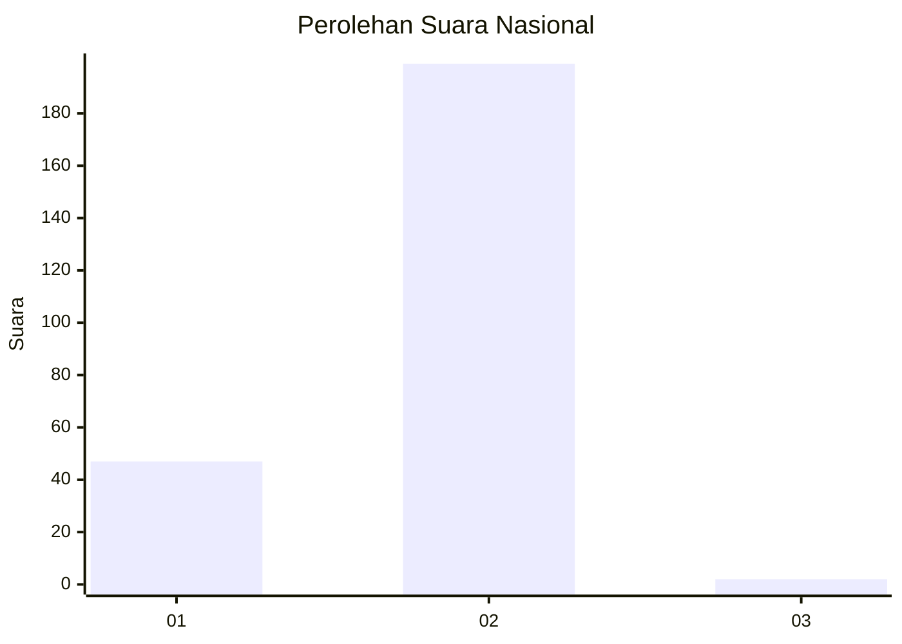
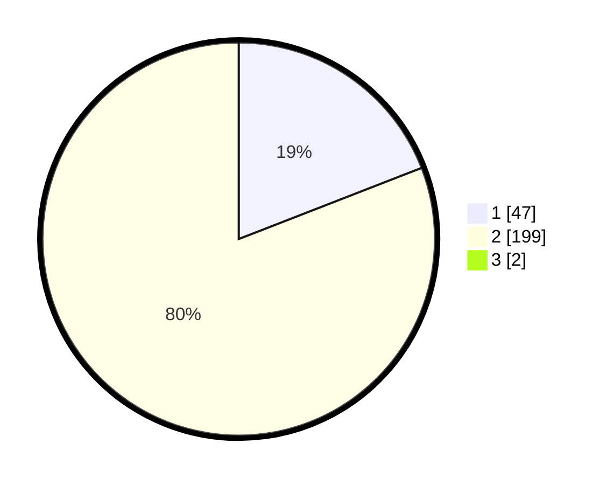

# Hasil

## Grafik

## Tabel

| No. | Nama Paslon    | Suara | Suara (raw) | Persentase |
|:--- |:-------------- | -----:| -----------:| ----------:|
| 1   | ANIES MUHAIMIN | 47    | [47][p-1]   | 18,95      |
| 2   | PRABOWO GIBRAN | 199   | [199][p-2]  | 80,24      |
| 3   | GANJAR MAHFUD  | 2     | [2][p-3]    | 0,81       |

[p-1]: https://github.com/gigit-pemilu/pemilu-2024/blob/main/pilpres/hitung-suara/sub/61-kalimantan-barat/sub/10-melawi/sub/03-ella-hilir/sub/2002-lengkong-nyadom/sub/002-tps/sub/paslon-1.txt
[p-2]: https://github.com/gigit-pemilu/pemilu-2024/blob/main/pilpres/hitung-suara/sub/61-kalimantan-barat/sub/10-melawi/sub/03-ella-hilir/sub/2002-lengkong-nyadom/sub/002-tps/sub/paslon-2.txt
[p-3]: https://github.com/gigit-pemilu/pemilu-2024/blob/main/pilpres/hitung-suara/sub/61-kalimantan-barat/sub/10-melawi/sub/03-ella-hilir/sub/2002-lengkong-nyadom/sub/002-tps/sub/paslon-3.txt

## Foto C Plano

https://sirekap-obj-formc.kpu.go.id/6562/pemilu/ppwp/61/10/03/20/02/6110032002002-20240222-233910--90abd80e-7465-4d4e-9a7f-fa14a8a756f5.jpg

https://sirekap-obj-formc.kpu.go.id/6562/pemilu/ppwp/61/10/03/20/02/6110032002002-20240222-233938--6bd3d8e7-e386-4466-9871-ef24b31a9f1c.jpg

https://sirekap-obj-formc.kpu.go.id/6562/pemilu/ppwp/61/10/03/20/02/6110032002002-20240222-234020--5d53191b-f508-44da-a693-aaff7fc9ab2d.jpg

## Metadata

| Key        | Value               |
| ---------- | ------------------- |
| Time Stamp | 2024-02-25 15:00:00 |

