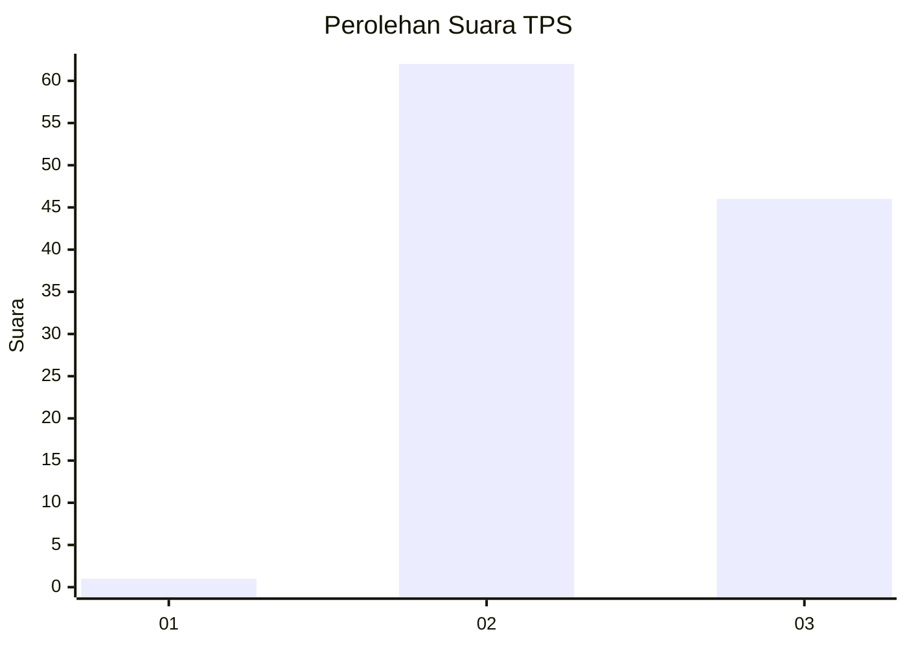
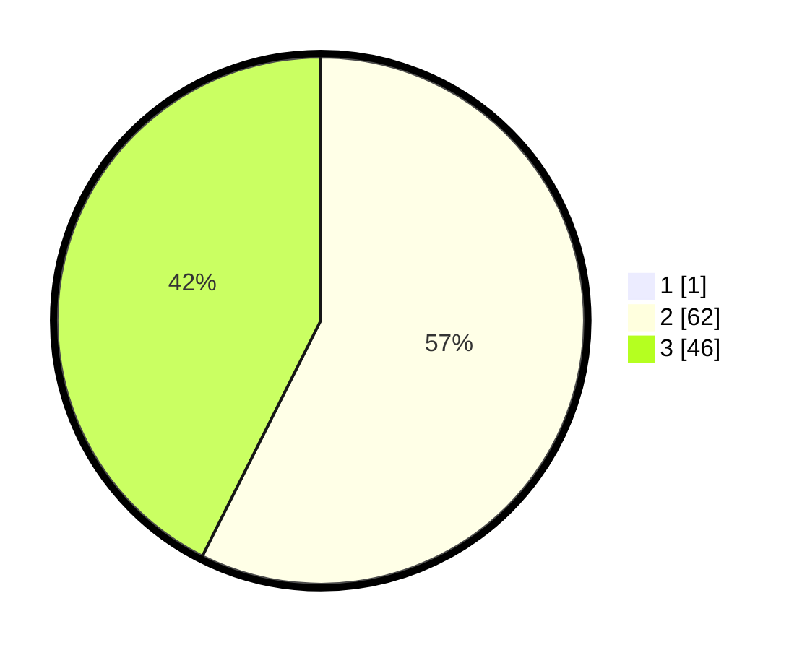

# Hasil

## Grafik

## Tabel

| No. | Nama Paslon    | Suara | Suara (raw) | Persentase |
|:--- |:-------------- | -----:| -----------:| ----------:|
| 1   | ANIES MUHAIMIN | 1     | [1][p-1]    | 0,92       |
| 2   | PRABOWO GIBRAN | 62    | [62][p-2]   | 56,88      |
| 3   | GANJAR MAHFUD  | 46    | [46][p-3]   | 42,20      |

[p-1]: https://github.com/gigit-pemilu/pemilu-2024-61-kalimantan-barat/blob/main/pilpres/hitung-suara/sub/61-kalimantan-barat/sub/10-melawi/sub/03-ella-hilir/sub/2006-nanga-kempangai/sub/001-tps/sub/paslon-1.txt
[p-2]: https://github.com/gigit-pemilu/pemilu-2024-61-kalimantan-barat/blob/main/pilpres/hitung-suara/sub/61-kalimantan-barat/sub/10-melawi/sub/03-ella-hilir/sub/2006-nanga-kempangai/sub/001-tps/sub/paslon-2.txt
[p-3]: https://github.com/gigit-pemilu/pemilu-2024-61-kalimantan-barat/blob/main/pilpres/hitung-suara/sub/61-kalimantan-barat/sub/10-melawi/sub/03-ella-hilir/sub/2006-nanga-kempangai/sub/001-tps/sub/paslon-3.txt

## Foto C Plano

https://sirekap-obj-formc.kpu.go.id/bcbb/pemilu/ppwp/61/10/03/20/06/6110032006001-20240222-203009--925146c6-02ef-43bc-bf72-affc7f024ca5.jpg

https://sirekap-obj-formc.kpu.go.id/bcbb/pemilu/ppwp/61/10/03/20/06/6110032006001-20240222-203039--d380181b-d629-4e5e-aacb-25c5d2894162.jpg

https://sirekap-obj-formc.kpu.go.id/bcbb/pemilu/ppwp/61/10/03/20/06/6110032006001-20240222-203110--5a4c8abf-0c84-44f4-bb95-5a1c1b130843.jpg

## Metadata

| Key        | Value               |
| ---------- | ------------------- |
| Time Stamp | 2024-02-25 11:00:00 |

