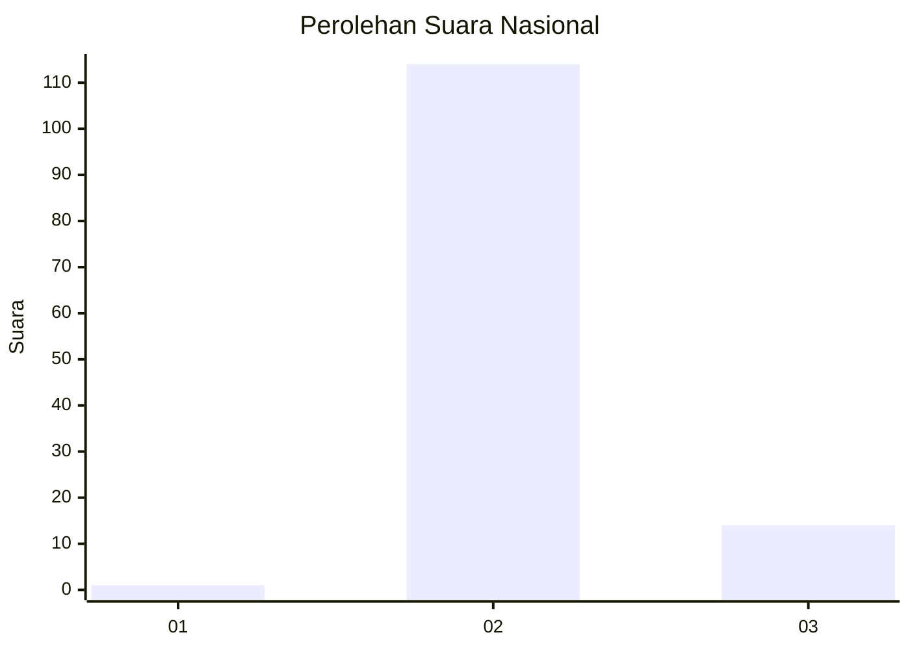
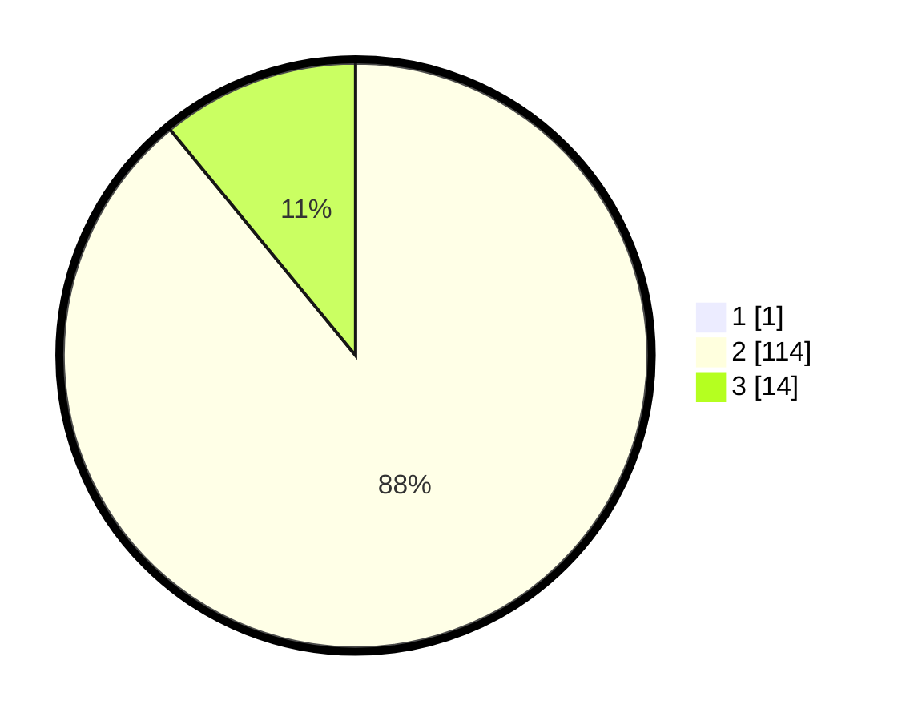

# Hasil

## Grafik

## Tabel

| No. | Nama Paslon    | Suara | Suara (raw) | Persentase |
|:--- |:-------------- | -----:| -----------:| ----------:|
| 1   | ANIES MUHAIMIN | 1     | [1][p-1]    | 0,78       |
| 2   | PRABOWO GIBRAN | 114   | [114][p-2]  | 88,37      |
| 3   | GANJAR MAHFUD  | 14    | [14][p-3]   | 10,85      |

[p-1]: https://github.com/gigit-pemilu/pemilu-2024/blob/main/pilpres/hitung-suara/sub/61-kalimantan-barat/sub/10-melawi/sub/03-ella-hilir/sub/2006-nanga-kempangai/sub/003-tps/sub/paslon-1.txt
[p-2]: https://github.com/gigit-pemilu/pemilu-2024/blob/main/pilpres/hitung-suara/sub/61-kalimantan-barat/sub/10-melawi/sub/03-ella-hilir/sub/2006-nanga-kempangai/sub/003-tps/sub/paslon-2.txt
[p-3]: https://github.com/gigit-pemilu/pemilu-2024/blob/main/pilpres/hitung-suara/sub/61-kalimantan-barat/sub/10-melawi/sub/03-ella-hilir/sub/2006-nanga-kempangai/sub/003-tps/sub/paslon-3.txt

## Foto C Plano

https://sirekap-obj-formc.kpu.go.id/67d8/pemilu/ppwp/61/10/03/20/06/6110032006003-20240222-204250--c626f2e5-a5c0-4f98-aed6-8799f4b445f5.jpg

https://sirekap-obj-formc.kpu.go.id/67d8/pemilu/ppwp/61/10/03/20/06/6110032006003-20240222-204353--3a8db685-74c7-451d-b617-5cee1a94581a.jpg

https://sirekap-obj-formc.kpu.go.id/67d8/pemilu/ppwp/61/10/03/20/06/6110032006003-20240222-204428--8fff5e9d-955c-48f5-90d5-957a52e100d2.jpg

## Metadata

| Key        | Value               |
| ---------- | ------------------- |
| Time Stamp | 2024-02-24 22:31:28 |

