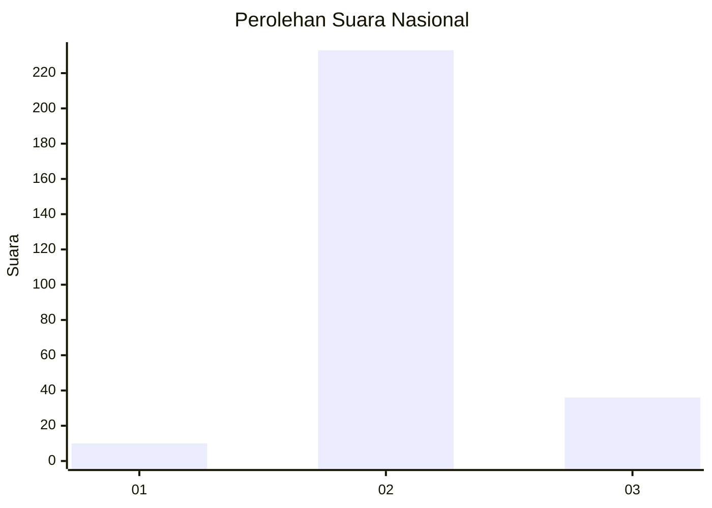
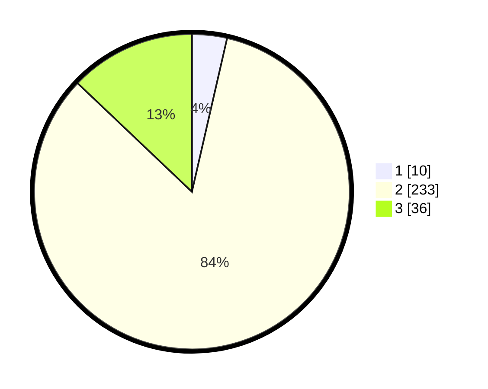

# Hasil

## Grafik

## Tabel

| No. | Nama Paslon    | Suara | Suara (raw) | Persentase |
|:--- |:-------------- | -----:| -----------:| ----------:|
| 1   | ANIES MUHAIMIN | 10    | [10][p-1]   | 3,58       |
| 2   | PRABOWO GIBRAN | 233   | [233][p-2]  | 83,51      |
| 3   | GANJAR MAHFUD  | 36    | [36][p-3]   | 12,90      |

[p-1]: https://github.com/gigit-pemilu/pemilu-2024/blob/main/pilpres/hitung-suara/sub/61-kalimantan-barat/sub/10-melawi/sub/03-ella-hilir/sub/2007-kerangan-kora/sub/001-tps/sub/paslon-1.txt
[p-2]: https://github.com/gigit-pemilu/pemilu-2024/blob/main/pilpres/hitung-suara/sub/61-kalimantan-barat/sub/10-melawi/sub/03-ella-hilir/sub/2007-kerangan-kora/sub/001-tps/sub/paslon-2.txt
[p-3]: https://github.com/gigit-pemilu/pemilu-2024/blob/main/pilpres/hitung-suara/sub/61-kalimantan-barat/sub/10-melawi/sub/03-ella-hilir/sub/2007-kerangan-kora/sub/001-tps/sub/paslon-3.txt

## Foto C Plano

https://sirekap-obj-formc.kpu.go.id/39ab/pemilu/ppwp/61/10/03/20/07/6110032007001-20240224-211410--0b1c51c2-3dd6-4250-bb92-dcac36bb2c22.jpg

https://sirekap-obj-formc.kpu.go.id/39ab/pemilu/ppwp/61/10/03/20/07/6110032007001-20240224-211453--1684cc46-1c3f-4da3-ba09-a4d201563b27.jpg

https://sirekap-obj-formc.kpu.go.id/39ab/pemilu/ppwp/61/10/03/20/07/6110032007001-20240224-211819--96fe411e-defa-4e8e-bd76-9a2a70888da4.jpg

## Metadata

| Key        | Value               |
| ---------- | ------------------- |
| Time Stamp | 2024-02-28 22:00:00 |

