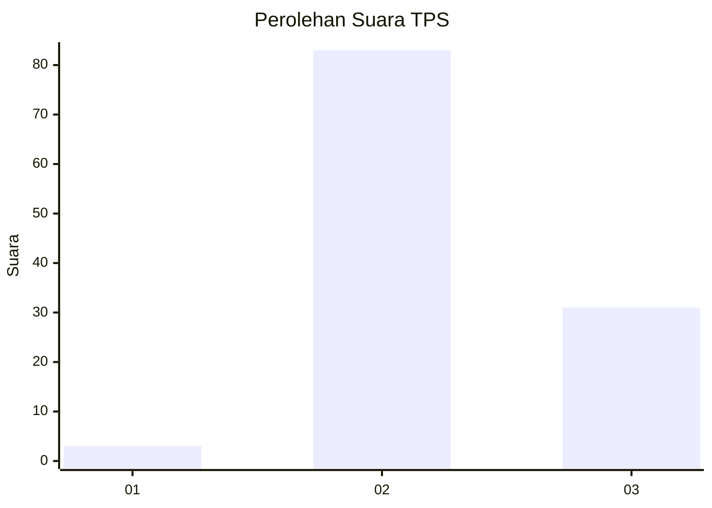
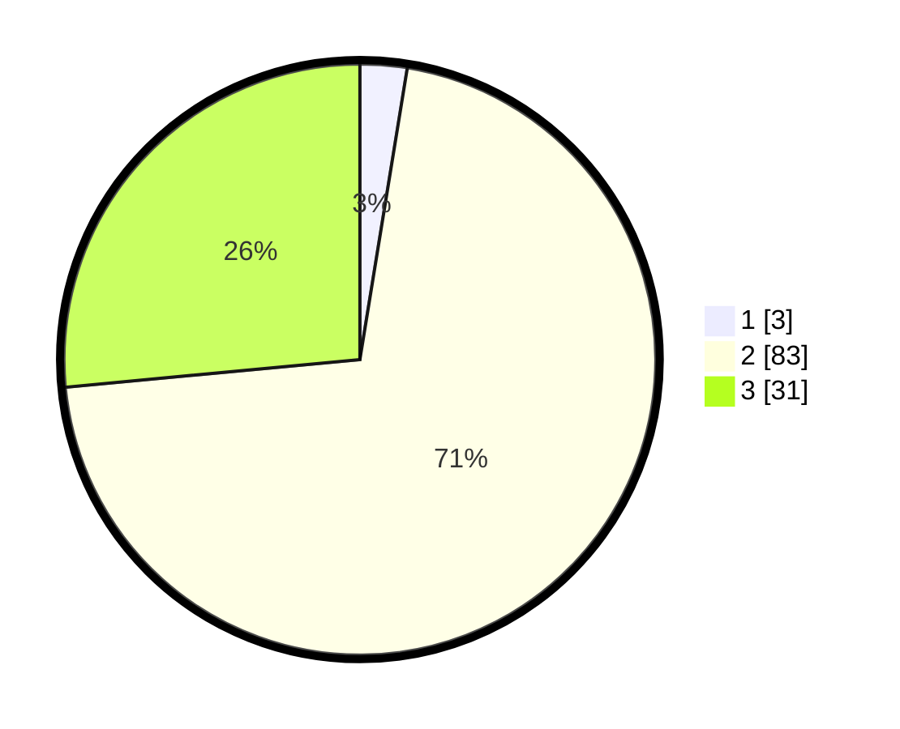

# Hasil

## Grafik

## Tabel

| No. | Nama Paslon    | Suara | Suara (raw) | Persentase |
|:--- |:-------------- | -----:| -----------:| ----------:|
| 1   | ANIES MUHAIMIN | 3     | [3][p-1]    | 2,56       |
| 2   | PRABOWO GIBRAN | 83    | [83][p-2]   | 70,94      |
| 3   | GANJAR MAHFUD  | 31    | [31][p-3]   | 26,50      |

[p-1]: https://github.com/gigit-pemilu/pemilu-2024-61-kalimantan-barat/blob/main/pilpres/hitung-suara/sub/61-kalimantan-barat/sub/10-melawi/sub/03-ella-hilir/sub/2008-penyuguk/sub/001-tps/sub/paslon-1.txt
[p-2]: https://github.com/gigit-pemilu/pemilu-2024-61-kalimantan-barat/blob/main/pilpres/hitung-suara/sub/61-kalimantan-barat/sub/10-melawi/sub/03-ella-hilir/sub/2008-penyuguk/sub/001-tps/sub/paslon-2.txt
[p-3]: https://github.com/gigit-pemilu/pemilu-2024-61-kalimantan-barat/blob/main/pilpres/hitung-suara/sub/61-kalimantan-barat/sub/10-melawi/sub/03-ella-hilir/sub/2008-penyuguk/sub/001-tps/sub/paslon-3.txt

## Foto C Plano

https://sirekap-obj-formc.kpu.go.id/f7cb/pemilu/ppwp/61/10/03/20/08/6110032008001-20240219-155416--4e137727-bdbe-42c4-8e41-b8b3e85b6b65.jpg

https://sirekap-obj-formc.kpu.go.id/f7cb/pemilu/ppwp/61/10/03/20/08/6110032008001-20240219-155443--2d8ef1c8-1e11-4647-9034-daf8dec846ff.jpg

https://sirekap-obj-formc.kpu.go.id/f7cb/pemilu/ppwp/61/10/03/20/08/6110032008001-20240219-155553--082d240a-d6b1-42d6-b1a0-5b9e4e7aa590.jpg

## Metadata

| Key        | Value               |
| ---------- | ------------------- |
| Time Stamp | 2024-02-24 22:31:28 |

