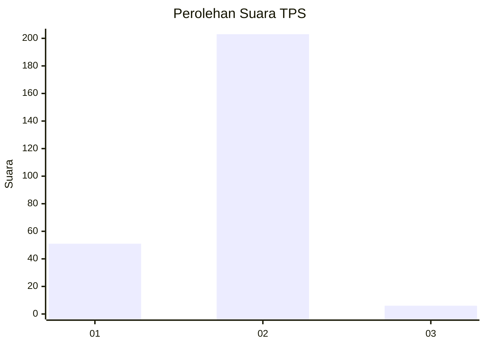
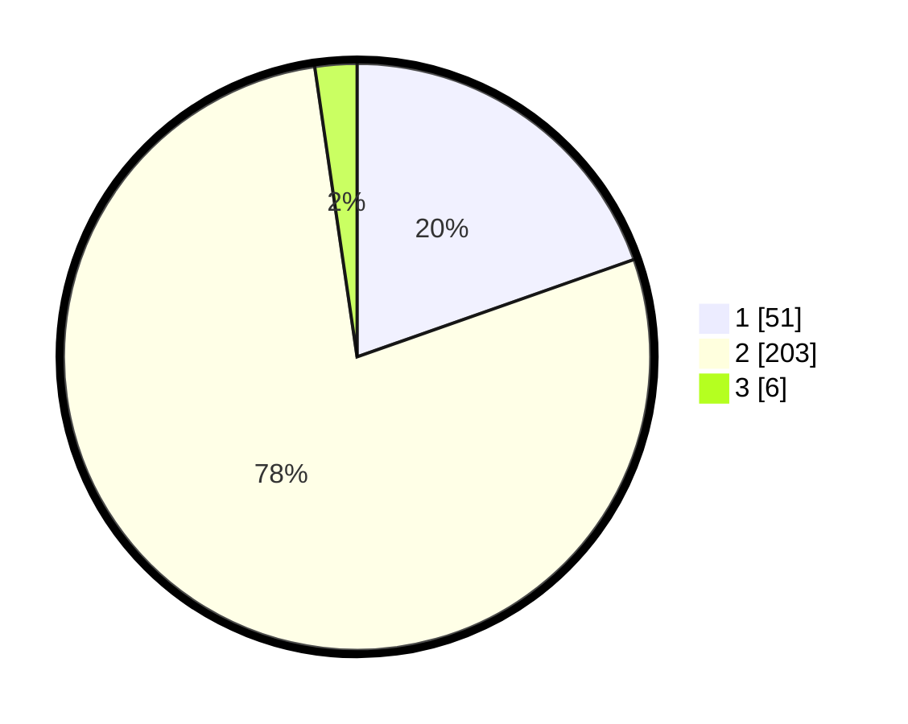

# Hasil

## Grafik

## Tabel

| No. | Nama Paslon    | Suara | Suara (raw) | Persentase |
|:--- |:-------------- | -----:| -----------:| ----------:|
| 1   | ANIES MUHAIMIN | 51    | [51][p-1]   | 19,62      |
| 2   | PRABOWO GIBRAN | 203   | [203][p-2]  | 78,08      |
| 3   | GANJAR MAHFUD  | 6     | [6][p-3]    | 2,31       |

[p-1]: https://github.com/gigit-pemilu/pemilu-2024-61-kalimantan-barat/blob/main/pilpres/hitung-suara/sub/61-kalimantan-barat/sub/10-melawi/sub/03-ella-hilir/sub/2009-popai/sub/002-tps/sub/paslon-1.txt
[p-2]: https://github.com/gigit-pemilu/pemilu-2024-61-kalimantan-barat/blob/main/pilpres/hitung-suara/sub/61-kalimantan-barat/sub/10-melawi/sub/03-ella-hilir/sub/2009-popai/sub/002-tps/sub/paslon-2.txt
[p-3]: https://github.com/gigit-pemilu/pemilu-2024-61-kalimantan-barat/blob/main/pilpres/hitung-suara/sub/61-kalimantan-barat/sub/10-melawi/sub/03-ella-hilir/sub/2009-popai/sub/002-tps/sub/paslon-3.txt

## Foto C Plano

https://sirekap-obj-formc.kpu.go.id/8a63/pemilu/ppwp/61/10/03/20/09/6110032009002-20240222-135211--c4860f85-06a5-4abb-8e67-258cacd6278a.jpg

https://sirekap-obj-formc.kpu.go.id/8a63/pemilu/ppwp/61/10/03/20/09/6110032009002-20240222-135246--fc7cb4a0-b56e-496a-a560-90ebdebdf087.jpg

https://sirekap-obj-formc.kpu.go.id/8a63/pemilu/ppwp/61/10/03/20/09/6110032009002-20240222-135316--0db64391-966e-4d8c-954d-e54dcfa0ed67.jpg

## Metadata

| Key        | Value               |
| ---------- | ------------------- |
| Time Stamp | 2024-02-24 22:31:28 |

