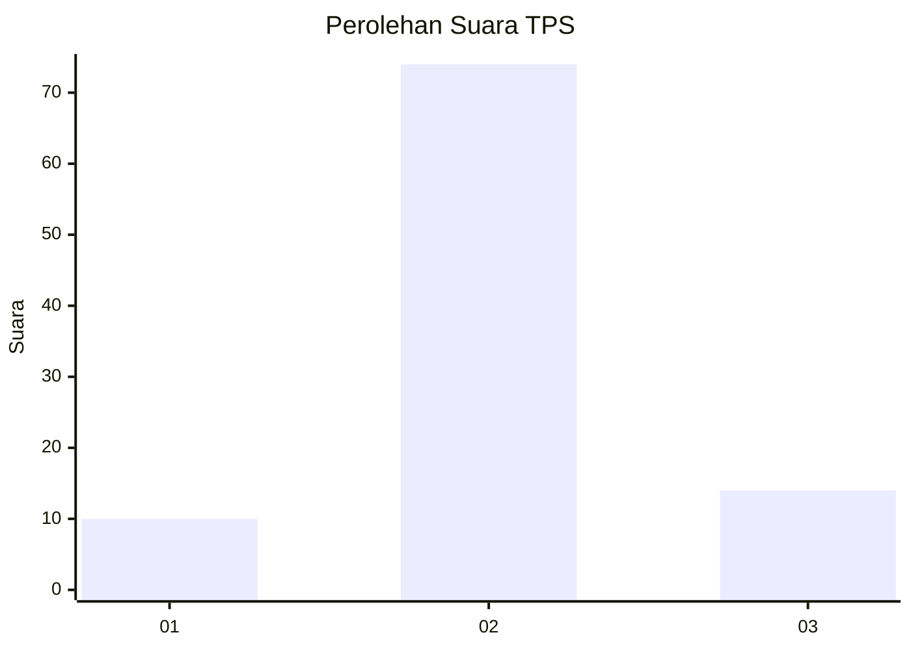
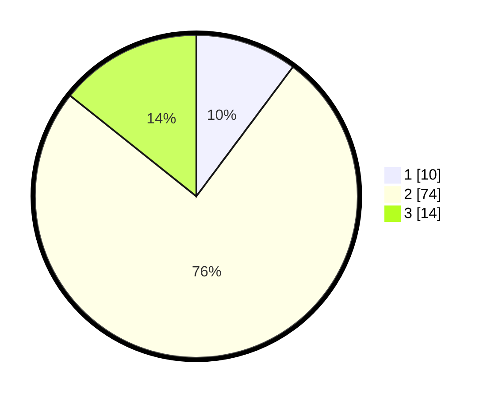

# Hasil

## Grafik

## Tabel

| No. | Nama Paslon    | Suara | Suara (raw) | Persentase |
|:--- |:-------------- | -----:| -----------:| ----------:|
| 1   | ANIES MUHAIMIN | 10    | [10][p-1]   | 10,20      |
| 2   | PRABOWO GIBRAN | 74    | [74][p-2]   | 75,51      |
| 3   | GANJAR MAHFUD  | 14    | [14][p-3]   | 14,29      |

[p-1]: https://github.com/gigit-pemilu/pemilu-2024-61-kalimantan-barat/blob/main/pilpres/hitung-suara/sub/61-kalimantan-barat/sub/10-melawi/sub/03-ella-hilir/sub/2011-bemban-permai/sub/003-tps/sub/paslon-1.txt
[p-2]: https://github.com/gigit-pemilu/pemilu-2024-61-kalimantan-barat/blob/main/pilpres/hitung-suara/sub/61-kalimantan-barat/sub/10-melawi/sub/03-ella-hilir/sub/2011-bemban-permai/sub/003-tps/sub/paslon-2.txt
[p-3]: https://github.com/gigit-pemilu/pemilu-2024-61-kalimantan-barat/blob/main/pilpres/hitung-suara/sub/61-kalimantan-barat/sub/10-melawi/sub/03-ella-hilir/sub/2011-bemban-permai/sub/003-tps/sub/paslon-3.txt

## Foto C Plano

https://sirekap-obj-formc.kpu.go.id/6abc/pemilu/ppwp/61/10/03/20/11/6110032011003-20240220-151515--06509fbe-01f9-46bb-b142-a62c287fc9ce.jpg

https://sirekap-obj-formc.kpu.go.id/6abc/pemilu/ppwp/61/10/03/20/11/6110032011003-20240220-151558--3edfbe18-1816-4798-b494-5c1c6c32f488.jpg

https://sirekap-obj-formc.kpu.go.id/6abc/pemilu/ppwp/61/10/03/20/11/6110032011003-20240220-151712--3edc9e3d-b562-42a7-af5d-b46727c939c0.jpg

## Metadata

| Key        | Value               |
| ---------- | ------------------- |
| Time Stamp | 2024-02-25 12:00:00 |

