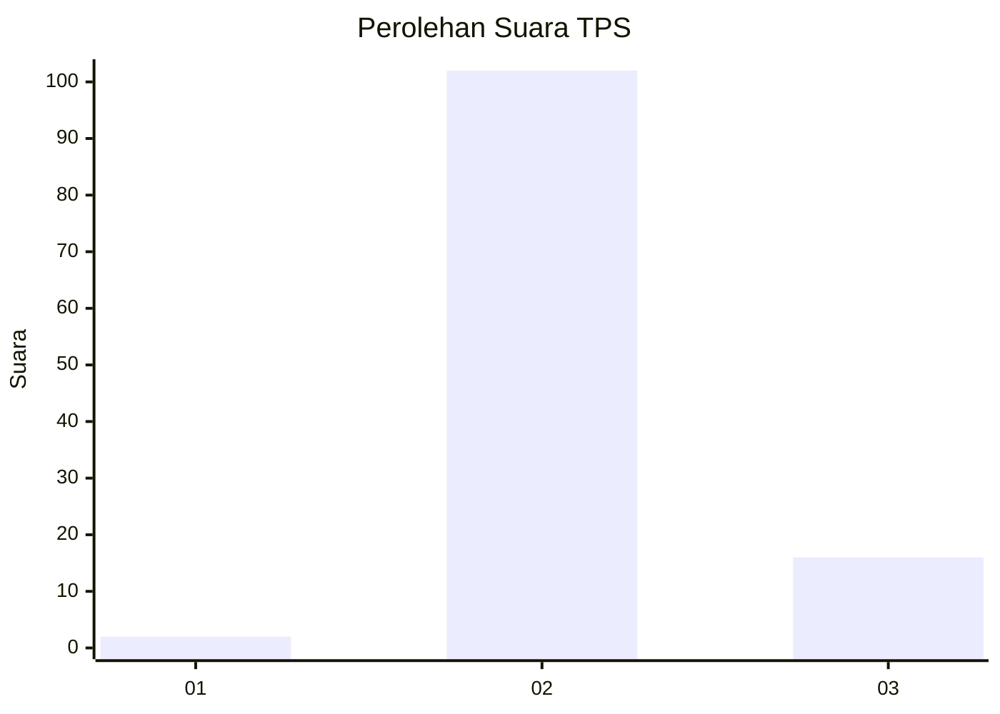
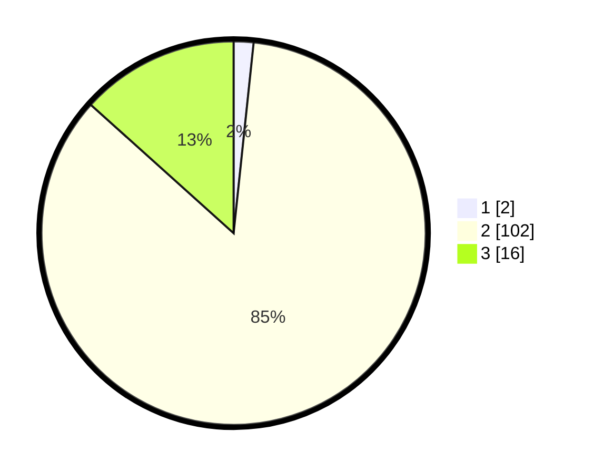

# Hasil

## Grafik

## Tabel

| No. | Nama Paslon    | Suara | Suara (raw) | Persentase |
|:--- |:-------------- | -----:| -----------:| ----------:|
| 1   | ANIES MUHAIMIN | 2     | [2][p-1]    | 1,67       |
| 2   | PRABOWO GIBRAN | 102   | [102][p-2]  | 85,00      |
| 3   | GANJAR MAHFUD  | 16    | [16][p-3]   | 13,33      |

[p-1]: https://github.com/gigit-pemilu/pemilu-2024-61-kalimantan-barat/blob/main/pilpres/hitung-suara/sub/61-kalimantan-barat/sub/10-melawi/sub/03-ella-hilir/sub/2012-perembang-nyuruh/sub/003-tps/sub/paslon-1.txt
[p-2]: https://github.com/gigit-pemilu/pemilu-2024-61-kalimantan-barat/blob/main/pilpres/hitung-suara/sub/61-kalimantan-barat/sub/10-melawi/sub/03-ella-hilir/sub/2012-perembang-nyuruh/sub/003-tps/sub/paslon-2.txt
[p-3]: https://github.com/gigit-pemilu/pemilu-2024-61-kalimantan-barat/blob/main/pilpres/hitung-suara/sub/61-kalimantan-barat/sub/10-melawi/sub/03-ella-hilir/sub/2012-perembang-nyuruh/sub/003-tps/sub/paslon-3.txt

## Foto C Plano

https://sirekap-obj-formc.kpu.go.id/f8a2/pemilu/ppwp/61/10/03/20/12/6110032012003-20240223-141329--37bca14c-865f-4c12-a775-727bd2fd6c5a.jpg

https://sirekap-obj-formc.kpu.go.id/f8a2/pemilu/ppwp/61/10/03/20/12/6110032012003-20240223-141420--0b9481a7-f304-49c6-98a1-f4e9e1455722.jpg

https://sirekap-obj-formc.kpu.go.id/f8a2/pemilu/ppwp/61/10/03/20/12/6110032012003-20240223-141503--b7a34e53-d39f-44a5-bc13-7406994aee3b.jpg

## Metadata

| Key        | Value               |
| ---------- | ------------------- |
| Time Stamp | 2024-02-25 12:00:00 |

