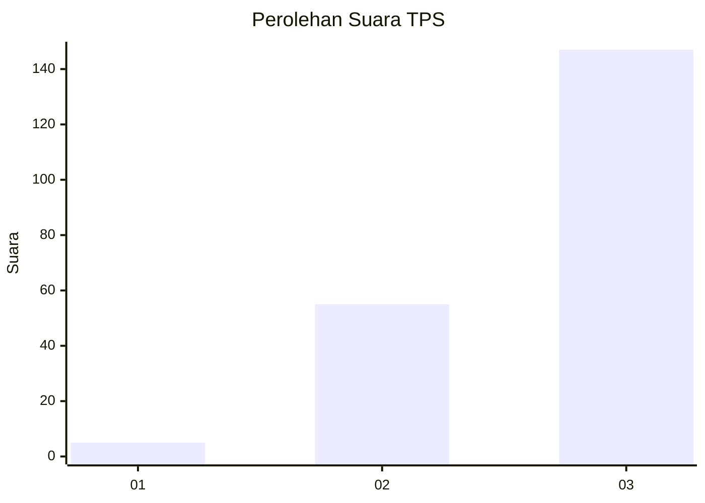
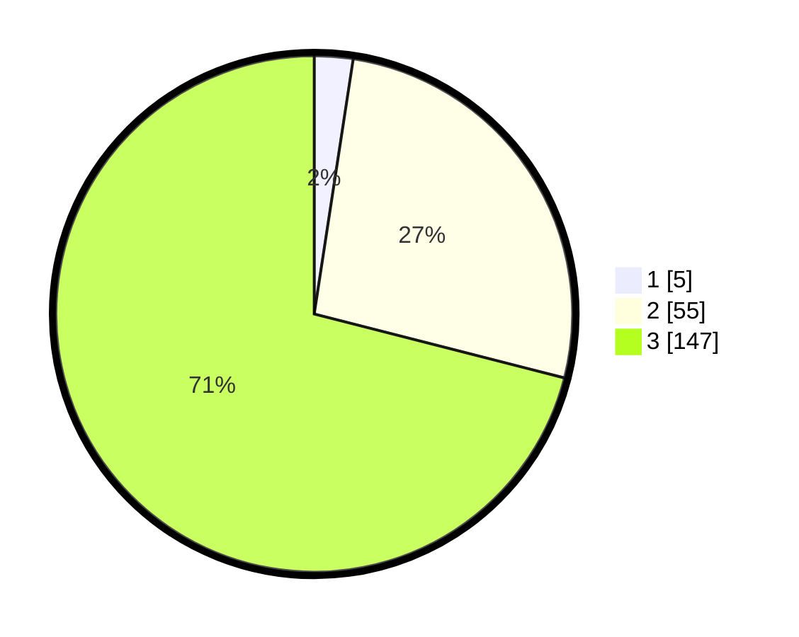

# Hasil

## Grafik

## Tabel

| No. | Nama Paslon    | Suara | Suara (raw) | Persentase |
|:--- |:-------------- | -----:| -----------:| ----------:|
| 1   | ANIES MUHAIMIN | 5     | [5][p-1]    | 2,42       |
| 2   | PRABOWO GIBRAN | 55    | [55][p-2]   | 26,57      |
| 3   | GANJAR MAHFUD  | 147   | [147][p-3]  | 71,01      |

[p-1]: https://github.com/gigit-pemilu/pemilu-2024-61-kalimantan-barat/blob/main/pilpres/hitung-suara/sub/61-kalimantan-barat/sub/10-melawi/sub/03-ella-hilir/sub/2013-sungai-labuk/sub/002-tps/sub/paslon-1.txt
[p-2]: https://github.com/gigit-pemilu/pemilu-2024-61-kalimantan-barat/blob/main/pilpres/hitung-suara/sub/61-kalimantan-barat/sub/10-melawi/sub/03-ella-hilir/sub/2013-sungai-labuk/sub/002-tps/sub/paslon-2.txt
[p-3]: https://github.com/gigit-pemilu/pemilu-2024-61-kalimantan-barat/blob/main/pilpres/hitung-suara/sub/61-kalimantan-barat/sub/10-melawi/sub/03-ella-hilir/sub/2013-sungai-labuk/sub/002-tps/sub/paslon-3.txt

## Foto C Plano

https://sirekap-obj-formc.kpu.go.id/fea5/pemilu/ppwp/61/10/03/20/13/6110032013002-20240224-131731--74332e14-1872-49b3-b978-c1e06bad15d7.jpg

https://sirekap-obj-formc.kpu.go.id/fea5/pemilu/ppwp/61/10/03/20/13/6110032013002-20240224-131824--e04aa54d-1696-4a89-837a-fa0d60a1ce77.jpg

https://sirekap-obj-formc.kpu.go.id/fea5/pemilu/ppwp/61/10/03/20/13/6110032013002-20240224-131917--f04369ff-ccae-44bd-95f4-183d919270de.jpg

## Metadata

| Key        | Value               |
| ---------- | ------------------- |
| Time Stamp | 2024-03-01 17:00:00 |

