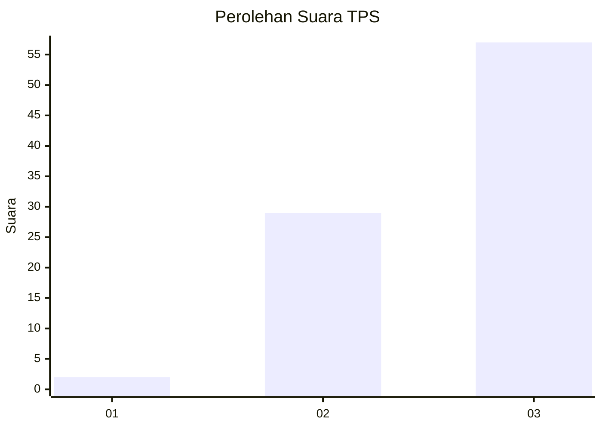
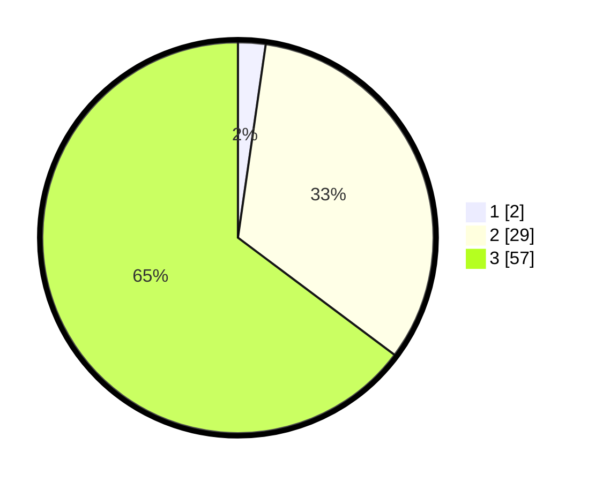

# Hasil

## Grafik

## Tabel

| No. | Nama Paslon    | Suara | Suara (raw) | Persentase |
|:--- |:-------------- | -----:| -----------:| ----------:|
| 1   | ANIES MUHAIMIN | 2     | [2][p-1]    | 2,27       |
| 2   | PRABOWO GIBRAN | 29    | [29][p-2]   | 32,95      |
| 3   | GANJAR MAHFUD  | 57    | [57][p-3]   | 64,77      |

[p-1]: https://github.com/gigit-pemilu/pemilu-2024-61-kalimantan-barat/blob/main/pilpres/hitung-suara/sub/61-kalimantan-barat/sub/10-melawi/sub/03-ella-hilir/sub/2019-jabai/sub/001-tps/sub/paslon-1.txt
[p-2]: https://github.com/gigit-pemilu/pemilu-2024-61-kalimantan-barat/blob/main/pilpres/hitung-suara/sub/61-kalimantan-barat/sub/10-melawi/sub/03-ella-hilir/sub/2019-jabai/sub/001-tps/sub/paslon-2.txt
[p-3]: https://github.com/gigit-pemilu/pemilu-2024-61-kalimantan-barat/blob/main/pilpres/hitung-suara/sub/61-kalimantan-barat/sub/10-melawi/sub/03-ella-hilir/sub/2019-jabai/sub/001-tps/sub/paslon-3.txt

## Foto C Plano

https://sirekap-obj-formc.kpu.go.id/f523/pemilu/ppwp/61/10/03/20/19/6110032019001-20240221-094927--d9f2e98f-c551-4431-9a39-489e10c23b3d.jpg

https://sirekap-obj-formc.kpu.go.id/f523/pemilu/ppwp/61/10/03/20/19/6110032019001-20240221-095006--60951af7-5442-4e97-8912-79c44460f2b7.jpg

https://sirekap-obj-formc.kpu.go.id/f523/pemilu/ppwp/61/10/03/20/19/6110032019001-20240221-095033--c2adee7e-8a9b-43e1-8136-492ab1d0d68f.jpg

## Metadata

| Key        | Value               |
| ---------- | ------------------- |
| Time Stamp | 2024-02-25 16:00:00 |

