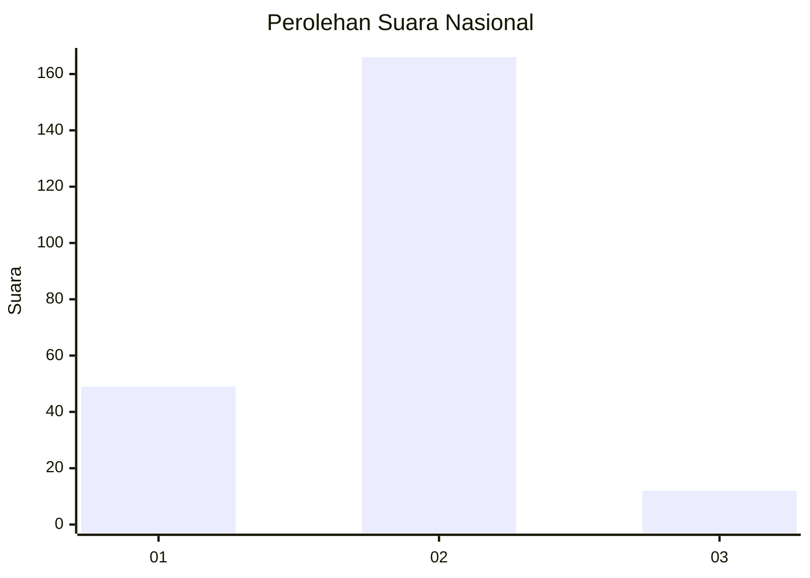
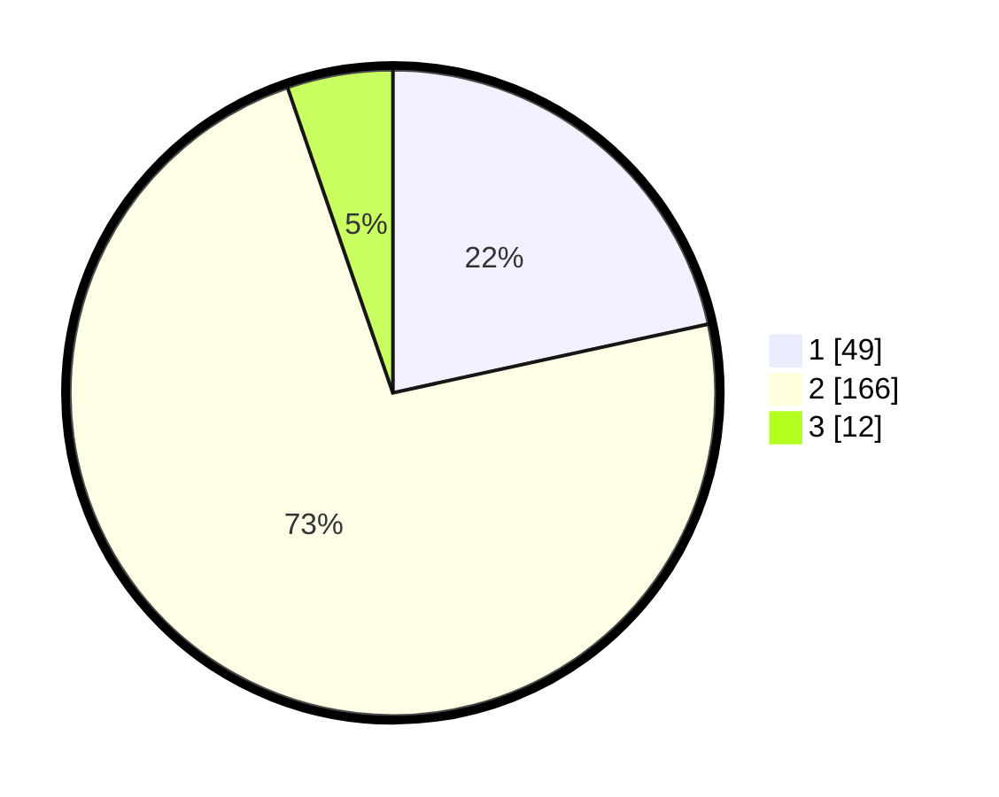

# Hasil

## Grafik

## Tabel

| No. | Nama Paslon    | Suara | Suara (raw) | Persentase |
|:--- |:-------------- | -----:| -----------:| ----------:|
| 1   | ANIES MUHAIMIN | 49    | [49][p-1]   | 21,59      |
| 2   | PRABOWO GIBRAN | 166   | [166][p-2]  | 73,13      |
| 3   | GANJAR MAHFUD  | 12    | [12][p-3]   | 5,29       |

[p-1]: https://github.com/gigit-pemilu/pemilu-2024/blob/main/pilpres/hitung-suara/sub/61-kalimantan-barat/sub/10-melawi/sub/04-menukung/sub/2001-menukung-kota/sub/002-tps/sub/paslon-1.txt
[p-2]: https://github.com/gigit-pemilu/pemilu-2024/blob/main/pilpres/hitung-suara/sub/61-kalimantan-barat/sub/10-melawi/sub/04-menukung/sub/2001-menukung-kota/sub/002-tps/sub/paslon-2.txt
[p-3]: https://github.com/gigit-pemilu/pemilu-2024/blob/main/pilpres/hitung-suara/sub/61-kalimantan-barat/sub/10-melawi/sub/04-menukung/sub/2001-menukung-kota/sub/002-tps/sub/paslon-3.txt

## Foto C Plano

https://sirekap-obj-formc.kpu.go.id/ffdd/pemilu/ppwp/61/10/04/20/01/6110042001002-20240215-111816--f65372a1-20dc-4887-8350-21348d40822c.jpg

https://sirekap-obj-formc.kpu.go.id/ffdd/pemilu/ppwp/61/10/04/20/01/6110042001002-20240215-111938--93d15569-b1f2-40aa-9637-033f6f0068df.jpg

https://sirekap-obj-formc.kpu.go.id/ffdd/pemilu/ppwp/61/10/04/20/01/6110042001002-20240215-112054--7be8d82c-16e7-47d1-a49e-ed656a4ca5d3.jpg

## Metadata

| Key        | Value               |
| ---------- | ------------------- |
| Time Stamp | 2024-02-16 14:30:33 |

