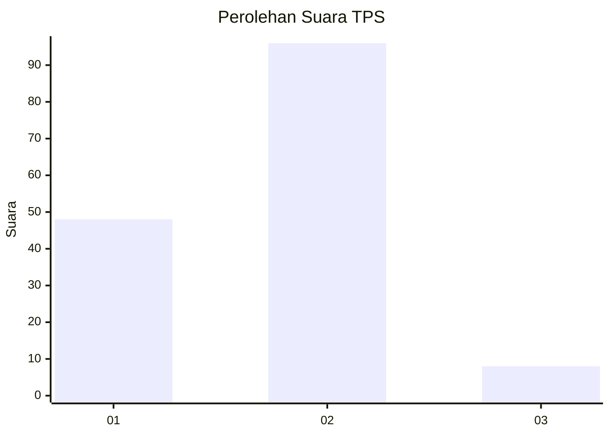
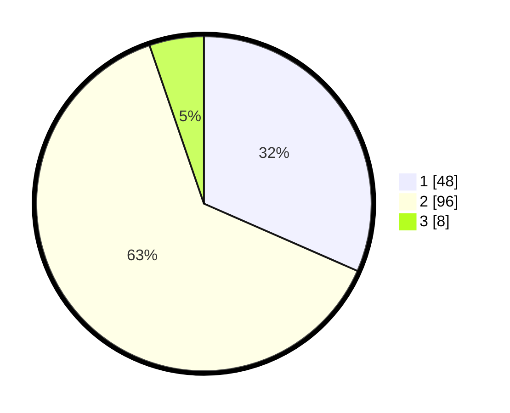

# Hasil

## Grafik

## Tabel

| No. | Nama Paslon    | Suara | Suara (raw) | Persentase |
|:--- |:-------------- | -----:| -----------:| ----------:|
| 1   | ANIES MUHAIMIN | 48    | [48][p-1]   | 31,58      |
| 2   | PRABOWO GIBRAN | 96    | [96][p-2]   | 63,16      |
| 3   | GANJAR MAHFUD  | 8     | [8][p-3]    | 5,26       |

[p-1]: https://github.com/gigit-pemilu/pemilu-2024-61-kalimantan-barat/blob/main/pilpres/hitung-suara/sub/61-kalimantan-barat/sub/10-melawi/sub/04-menukung/sub/2001-menukung-kota/sub/004-tps/sub/paslon-1.txt
[p-2]: https://github.com/gigit-pemilu/pemilu-2024-61-kalimantan-barat/blob/main/pilpres/hitung-suara/sub/61-kalimantan-barat/sub/10-melawi/sub/04-menukung/sub/2001-menukung-kota/sub/004-tps/sub/paslon-2.txt
[p-3]: https://github.com/gigit-pemilu/pemilu-2024-61-kalimantan-barat/blob/main/pilpres/hitung-suara/sub/61-kalimantan-barat/sub/10-melawi/sub/04-menukung/sub/2001-menukung-kota/sub/004-tps/sub/paslon-3.txt

## Foto C Plano

https://sirekap-obj-formc.kpu.go.id/fdc9/pemilu/ppwp/61/10/04/20/01/6110042001004-20240215-093529--e351f7dc-4554-4d77-b9c1-ec035c9a03ee.jpg

https://sirekap-obj-formc.kpu.go.id/fdc9/pemilu/ppwp/61/10/04/20/01/6110042001004-20240215-093856--0a6eb678-22f5-4056-9c06-e5c876e9db02.jpg

https://sirekap-obj-formc.kpu.go.id/fdc9/pemilu/ppwp/61/10/04/20/01/6110042001004-20240215-094137--d6a86e79-34af-4707-9952-e210cbabe0f6.jpg

## Metadata

| Key        | Value               |
| ---------- | ------------------- |
| Time Stamp | 2024-02-15 18:00:26 |

